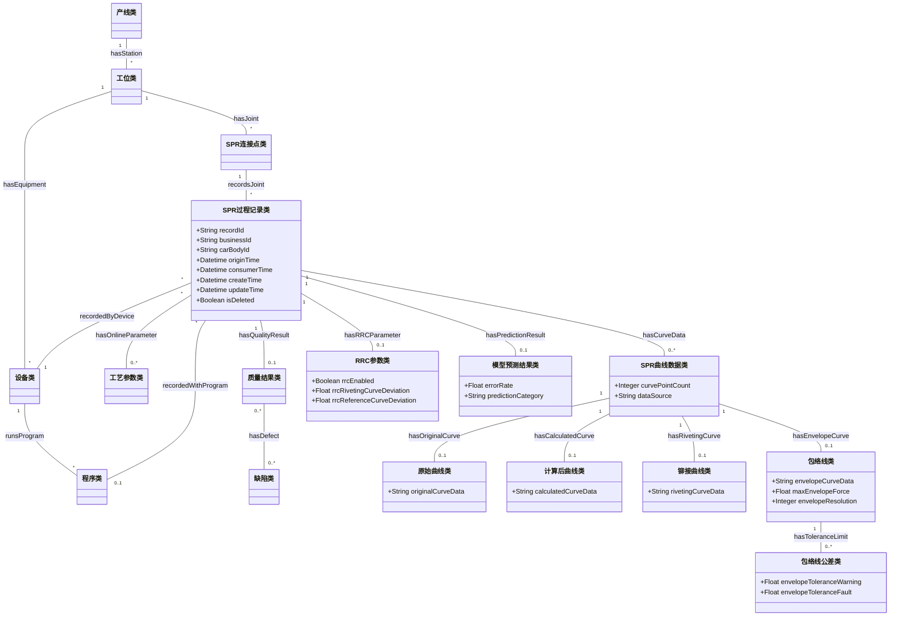

# SPR 本体更新最终交付文档

## 文档说明

本文档是本次 SPR 本体更新工作的最终汇总版，完整收录前面生成的任务说明、更新版本体方案、字段映射表、变更记录、顶层补充建议、待确认问题清单、汇报 PPT 提纲和交付物索引。

## 最终交付文件

| 文件 | 用途 |
| --- | --- |
| `SPR本体更新最终交付文档.md` | 包含所有完整内容的最终交付文档 |
| `SPR本体更新工作汇报.pptx` | 汇报本次做了哪些工作的 PowerPoint 文件 |

## 核心结论

本次更新在保持 `工艺本体v2.md` 既有 SPR 核心实体、关系、规则和 Action 主链路不变的前提下，依据数据库字段补充了在线过程记录、曲线/包络线、预测判定、系统时间、RRC/PECV2 和公差阈值等数据映射能力。主数据库 16 个字段与 RIP_ROP 42 个字段均已纳入映射。

---

# 任务说明

> 来源文件：`SPR本体更新任务说明.md`

# SPR 本体更新任务说明

## 1. 任务背景


- **顶层工艺本体**：前两周已完成一版顶层工艺本体建设方案，目标是尽量覆盖不同工艺中可能出现的通用概念。未来新的工艺本体接入时，可以继承顶层工艺本体中的部分类，并补充工艺专属属性。
- **SPR 工艺本体**：当前应以《工艺本体 v2》作为 SPR 本体基础版本。顶层工艺本体建设方案 v0.2 的第八点为 SPR 本体继承方案，可作为后续 SPR 本体对齐顶层本体的参考。

本次任务的核心不是从零设计本体，而是 **在现有 SPR 本体基础上，根据数据库原始字段和样例数据做字段映射、结构校正、属性补充和变更记录**。最终目标是让 SPR 本体能够更准确地表达数据库中真实存在的工艺对象、设备对象、过程参数、曲线数据、判定结果和时间信息。

## 2. 任务目标

本次任务需要完成以下目标：

1. **梳理现有数据字段**
   - 阅读数据库字段说明和 Excel 样例数据。
   - 明确每个字段的业务含义、数据类型、取值范围、唯一性和是否可为空。
   - 区分哪些字段属于主键/业务 ID，哪些字段属于工艺过程信息、设备信息、质量判定信息、曲线数据或系统时间信息。

2. **建立数据库字段与 SPR 本体元素之间的映射**
   - 将数据库字段逐一对应到现有 SPR 本体中的类、对象属性或数据属性。
   - 标注字段是已覆盖、需改名、需补充、需拆分，还是暂不纳入本体。
   - 对没有直接对应关系的字段，提出新增类或新增属性建议。

3. **检查 SPR 本体与顶层工艺本体的继承关系**
   - 依据顶层工艺本体的设计思路，判断 SPR 本体中哪些类应继承顶层工艺本体的通用类。
   - 检查 SPR 专属概念是否放在合理的顶层类之下。
   - 避免把通用工艺概念重复建在 SPR 专属层中。

4. **补充数据库中存在但当前本体缺失的概念和属性**
   - 如果数据库存在现有本体未覆盖的过程参数、判定结果、曲线数据、包络线、公差、RRC、PECV2 等字段，需要补充到 SPR 本体中。
   - 补充时应尽量复用顶层工艺本体中的通用类和属性。
   - 对确实只属于 SPR 的字段，设计为 SPR 专属类或属性。

5. **形成可汇报的变更记录**
   - 记录修改了哪些类、属性、关系或字段映射。
   - 记录新增了哪些内容，新增原因是什么，对应哪些数据库字段。
   - 记录暂未处理或需要师兄进一步确认的问题。
   - 输出结果应方便后续整理成 PPT。

## 3. 当前项目文件与数据基础

当前文件夹内与任务相关的文件如下：

| 文件名 | 内容定位 | 本次用途 |
| --- | --- | --- |
| `1.txt` | 师兄口述任务要求 | 提炼任务背景、工作目标和交付要求 |
| `spr数据库原始内容字段说明.txt` | 数据库字段说明摘要 | 确认数据库字段含义、数据规模和初步分组 |
| `pmc_body_shop_prod-d7lcbg96ulq0qrl37o2g.xlsx` | 数据库导出样例，共 666 条、16 字段 | 作为 SPR 数据库字段映射的主要依据 |
| `spr data2(1).xlsx` | RIP_ROP 表，共 177 条、42 字段 | 作为 SPR 详细工艺参数、曲线、包络线、公差和故障信息的补充依据 |
| `工艺本体v2.md` | 蔚来 SPR 工艺本体建设方案 v0.2 | 作为当前 SPR 本体的基础设计依据 |
| `顶层工艺本体建设方案_v0.2.md` | 顶层工艺本体建设方案 v0.2 | 作为 SPR 本体继承顶层工艺本体的约束依据 |

当前已补充《工艺本体 v2》和《顶层工艺本体建设方案 v0.2》两个文档，因此本任务不再只停留在字段补充层面，而应同时对照 **现有 SPR 本体核心实体、关系、规则** 与 **顶层工艺本体继承方案** 来更新任务边界。

### 3.1 现有 SPR 本体方案要点

`工艺本体v2.md` 将 SPR 工艺本体定位为生产侧工艺语义底座，不只是实体关系表，而是连接 **工艺知识、主数据、工艺规则、质量结果与现场经验** 的统一模型。其设计采用“概念层、关系层、规则层、实例层、应用动作层”的结构。

现有 SPR 本体已经定义了以下核心实体：

| 实体类别 | 已有核心实体 | 说明 |
| --- | --- | --- |
| 产线与资源 | 产线类、工位类、设备类、程序类 | 描述 SPR 工艺执行位置、执行设备与设备程序 |
| 产品与材料 | 零件类、材料类 | 描述连接点涉及的零件与基材 |
| SPR 专属对象 | SPR连接点类、SPR铆钉类、铆模类 | 描述自冲铆点位、连接件和铆模资源 |
| 工艺参数 | 工艺参数类 | 描述预压力、铆接力、铆接行程、进给速度、参数版本等 |
| 质量闭环 | 检测计划类、质量结果类、缺陷类、根因类 | 支撑检测、缺陷识别和根因分析 |
| 变更管理 | 工艺变更类 | 支撑参数、程序、连接点等变更影响分析 |

现有 SPR 本体已经定义的主要关系包括：

- 产线包含工位：`hasStation`。
- SPR 连接点归属工位：`belongsToStation`。
- 工位配置设备：`hasEquipment`。
- 设备运行程序：`runsProgram`。
- 工位包含连接点：`hasJoint`。
- 连接点连接零件：`joinsPart`。
- 零件使用材料：`usesMaterial`。
- 连接点使用 SPR 铆钉：`usesSPR`。
- 连接点使用铆模：`usesDie`。
- 连接点对应工艺参数：`hasParameter`。
- 连接点由程序执行：`executedByProgram`。
- 连接点挂接检测计划：`hasInspectionPlan`。
- 连接点产生质量结果：`hasQualityResult`。
- 质量结果关联缺陷：`hasDefect`。
- 缺陷关联根因：`causedBy`。
- 工艺变更影响连接点、参数或程序：`affectsJoint`、`affectsParameter`、`affectsProgram`。

这说明现有 SPR 本体的核心骨架已经覆盖“连接点-工位-设备-程序-零件-材料-SPR铆钉-铆模-参数-质量结果-缺陷-根因-变更”的主链路。本次数据库字段更新不应推翻这个骨架，而应重点补充 **数据记录层、在线过程数据、曲线/包络线数据、预测判定字段、系统时间字段**。

### 3.2 顶层工艺本体继承方案要点

`顶层工艺本体建设方案_v0.2.md` 的核心定位是建立一套跨工艺共享的“制造工艺统一语义骨架”。该方案明确要求：

- 顶层本体只定义稳定的跨工艺父类和公共关系。
- SPR、点焊、FDS、涂胶、滚边等具体工艺作为工艺扩展层接入。
- 兼容现有 SPR 本体，原则上保持 SPR 本体内部实体、关系、规则和 Action 定义不变。
- 对 SPR 的处理方式是补充父类归属关系，使其成为顶层工艺本体下的一个工艺扩展层。

顶层方案给出的 SPR 到顶层本体继承映射如下：

| SPR 实体类 | 顶层父类 | 本次任务含义 |
| --- | --- | --- |
| 产线类 | 产线类 | 数据库 `line_name` 应优先映射到产线/线体实例 |
| 工位类 | 工位类 | 若后续字段能区分工位，应挂到工位类 |
| 设备类 | 设备类 | `device_name`、`Devicename` 映射到设备实例或设备编号 |
| 程序类 | 程序类 | `prog_no`、`程序` 映射到程序类 |
| 零件类 | 零件类 | 若数据库补充零件字段，应映射到零件类 |
| 材料类 | 基材类 | `钢板厚度` 等材料参数应优先挂到基材/材料属性 |
| SPR连接点类 | 连接特征类 | `rivet_id` 应作为 SPR 连接点或点位标识 |
| SPR铆钉类 | 连接件类 | `铆钉长度` 应作为 SPR 铆钉规格属性 |
| 铆模类 | 工装夹具类 | 包络线、铆模参数若与模具相关，可追溯到铆模 |
| 工艺参数类 | 参数集类 | 铆接力、冲压行程等字段应进入工艺参数或参数集 |
| 检测计划类 | 检测计划类 | 若后续有抽检/判定标准字段，应挂接检测计划 |
| 质量结果类 | 检测结果类 | `error_rate`、`pre`、故障代码等应进入质量结果/检测结果 |
| 缺陷类 | 缺陷模式类 | “曲线高于包络线”“冲压行程过大”等可建为缺陷或异常模式 |
| 根因类 | 根因类 | 根因需由业务确认或规则推理后补充 |
| 工艺变更类 | 工艺变更类 | 参数、程序、设备变更仍沿用现有变更链路 |

因此，本次更新应遵循一个基本原则：**SPR 核心本体保持原有主链路，数据库新增字段通过补充属性、实例映射、过程记录类或质量结果扩展来接入；只有跨工艺通用的新抽象，才作为顶层本体补充建议。**

## 4. 数据库导出表字段理解

`pmc_body_shop_prod-d7lcbg96ulq0qrl37o2g.xlsx` 包含 666 条记录、16 个字段。该表应作为本次 SPR 本体与数据库字段映射的第一优先级数据源。

### 4.1 主键与业务标识

| 字段 | 含义 | 数据特征 | 本体处理建议 |
| --- | --- | --- | --- |
| `id` | 数据记录主键 ID | 666 条均非空，唯一标识一条数据库记录 | 可映射为数据记录实例的数据属性，如 `recordId` |
| `biz_id` | 业务 ID / 业务唯一编号 | 666 条均非空，可作为业务层唯一编号 | 可映射为业务记录或检测记录的数据属性，如 `businessId` |

### 4.2 工艺、铆点、车身与设备信息

| 字段 | 含义 | 数据特征 | 本体处理建议 |
| --- | --- | --- | --- |
| `prog_no` | 程序号 | 49 种取值 | 对应现有 SPR 本体中的程序类，可作为程序号属性 |
| `rivet_id` | 铆点编号 / 铆钉点位编号 | 44 种取值 | 对应现有 SPR 本体中的 SPR连接点类，可作为连接点标识属性 |
| `carbody_id` | 车身 ID / 车身编号 | 56 种取值，649 条非空，17 条为空 | 对应产品、车身或结构对象标识，需确认是否新增车身对象或挂到产品/过程记录 |
| `line_name` | 产线 / 线体 / 工位区域名称 | 9 类：RC、UR、UB、HD、AFO、AFI、MC、AHD、FI | 对应生产线、线体或工位区域类 |
| `device_name` | 设备名称 | 53 种取值，如 RC050R02、UR060R03、HD025R04 | 对应设备实例或设备编号属性 |

这组字段反映了 SPR 工艺数据发生的空间和设备上下文。建议本体中至少能表达：

- 某条 SPR 数据记录发生于哪条产线或工位区域。
- 由哪台设备执行。
- 对应哪个车身。
- 使用哪个程序号。
- 作用于哪个铆点或铆钉点位。

### 4.3 曲线数据

| 字段 | 含义 | 数据特征 | 本体处理建议 |
| --- | --- | --- | --- |
| `original_data` | 原始曲线数据 | 每条记录均不同，浮点数序列，长度约 192-235 | 建议建模为曲线数据对象或数据属性，不宜只当普通字符串 |
| `calculate_data` | 计算后曲线数据 / 处理后曲线数据 | 通常保留到 3 位小数，长度与原始曲线一致 | 建议与原始曲线建立“处理后曲线”关系，记录处理方式或精度 |

曲线数据是 SPR 过程质量分析的重要依据。现有 SPR 本体未显式定义曲线对象，因此建议补充“SPR曲线数据类、原始曲线类、计算后曲线类”等概念，或在 SPR 专属层补充数据属性，例如：

- `hasOriginalCurveData`
- `hasCalculatedCurveData`
- `curvePointCount`
- `curvePrecision`

如果后续需要做曲线级推理或质量诊断，建议将曲线从普通字符串字段提升为独立数据对象。

### 4.4 误差、预测和判定字段

| 字段 | 含义 | 数据特征 | 本体处理建议 |
| --- | --- | --- | --- |
| `error_rate` | 误差率 / 异常率 | 0.000 为 599 条，0.010 为 62 条，另有 0.120、0.040、88.040、99.990、95.700 等异常值 | 映射为质量判定或异常检测结果的数据属性 |
| `pre` | 预测结果 / 预判类别 | 1.000 为 548 条，3.000 为 115 条，0.000 为 3 条 | 需要确认类别编码含义，再映射为预测类别或判定结果 |

这组字段说明数据库不仅记录工艺过程，也记录了某种预测或异常判定结果。建议本体补充或核对：

- `QualityEvaluation` / 质量评价结果
- `PredictionResult` / 预测结果
- `ErrorRate` / 误差率
- `AbnormalityIndicator` / 异常指示

其中 `pre` 的 0、1、3 具体含义需要向数据提供方确认，不能直接在本体中武断定义为合格、不合格或异常类型。

### 4.5 系统时间与删除标识

| 字段 | 含义 | 数据特征 | 本体处理建议 |
| --- | --- | --- | --- |
| `consumer_time` | 消费时间 / 数据消费时间 | 非空，时间范围为 2026-04-24 09:16:05 至 09:22:07 | 可映射为数据流转或入库消费时间 |
| `origin_time` | 原始数据时间 / 设备采集时间 | 非空，时间范围为 2026-04-24 09:15:01 至 09:22:05 | 应优先作为工艺事件发生时间或采集时间 |
| `is_deleted` | 是否删除 / 删除标记 | 当前样例均为 0 | 可作为数据记录状态属性 |
| `create_time` | 创建时间 | 非空 | 可作为数据库记录元数据 |
| `update_time` | 更新时间 | 非空 | 可作为数据库记录元数据 |

建议区分 **工艺发生时间** 和 **数据库管理时间**：

- `origin_time` 更接近设备采集时间，应进入工艺事件或过程记录。
- `consumer_time`、`create_time`、`update_time` 更接近数据系统元数据，可放入数据记录层。
- `is_deleted` 不一定属于工艺本体核心语义，但可作为数据库记录管理属性保留。

## 5. RIP_ROP 明细表补充信息

`spr data2(1).xlsx` 中的 `RIP_ROP` 表包含 177 条记录、42 个字段。该表比数据库导出表更细，补充了 SPR 工艺参数、曲线、包络线、公差、RRC 和故障代码等信息。虽然它未必就是最终蔚来数据库导出结构，但可用于判断 SPR 本体需要覆盖的领域概念。

### 5.1 过程与设备字段

| 字段 | 含义 | 样例特征 | 本体处理建议 |
| --- | --- | --- | --- |
| `实物编号` | 记录序号或实物编号 | 177 条非空 | 可对应记录编号或产品件编号，需确认业务含义 |
| `Devicename` | 设备名 | 当前样例均为占位符 `--------------------------------` | 保留设备名称映射，但不以该样例值定义设备实例 |
| `车身标识` | 车身标识 | 当前样例均为占位符 `----------------` | 对应 `carbody_id` 类似概念 |
| `日期/时间` | 工艺发生时间 | 177 条非空 | 对应工艺事件发生时间 |
| `输出` | 输出结果或设备输出状态 | 当前样例均为 1 | 需确认 1 的业务含义 |
| `程序` | 程序名称 | 当前样例均为 `NietProg.Outlet1` | 对应工艺程序 |
| `流程类型` | 工艺流程类型 | 当前样例均为 `冲铆` | 可映射为 SPR 工艺类型或工艺步骤类型 |
| `铆钉计数器` | 铆钉计数或序号 | 连续计数型数据 | 需确认是否等价于铆点编号，暂不直接等同于 `rivet_id` |

### 5.2 关键工艺参数

| 字段 | 含义 | 数据范围 | 本体处理建议 |
| --- | --- | --- | --- |
| `铆接线最大力` | 铆接曲线最大力或实际最大力 | 约 38.63-66.39 | 建议作为 SPR 过程参数 |
| `包络线最大力` | 包络线最大力 | 当前样例均为 52.23 | 建议作为包络线参数 |
| `铆接线冲压行程` | 实际冲压行程 | 约 -0.55 至 0.31 | 建议作为冲压行程参数 |
| `包络线冲压行程` | 包络线冲压行程 | 当前样例均为 0 | 建议作为包络线参数 |
| `钢板厚度` | 被连接板材厚度 | 约 3.60-4.67 | 建议补充材料/板材厚度属性 |
| `铆钉长度` | 铆钉长度 | 约 4.23-5.63 | 建议补充铆钉规格属性 |
| `JIC dVal` | JIC 偏差值或设备指标 | 当前样例均为 0 | 需确认业务含义后再建模 |

这些字段说明 SPR 本体需要不仅能表达“设备执行了某个铆接过程”，还要表达 **工艺过程参数** 和 **材料/铆钉规格参数**。

### 5.3 曲线与包络线字段

| 字段 | 含义 | 数据特征 | 本体处理建议 |
| --- | --- | --- | --- |
| `铆接曲线存在` | 是否存在铆接曲线 | 当前样例均为“是” | 建议作为曲线对象存在性或记录完整性属性 |
| `铆接曲线` | 铆接曲线数据序列 | 长度约 190-255 | 对应过程曲线对象 |
| `铆接曲线最大力` | 铆接曲线最大力 | 约 41-49 | 对应曲线特征值 |
| `最大力铆接曲线（原始数据）` | 最大力铆接曲线原始值 | 当前看似单值 | 需确认是否为曲线最大力原始采样值 |
| `最大力刻度铆接曲线` | 铆接曲线最大力刻度 | 当前样例为 80 | 对应曲线量程/刻度属性 |
| `铆接曲线Y刻度` | 铆接曲线 Y 轴刻度 | 当前样例为 4095 | 对应曲线坐标或采样刻度 |
| `包络线存在` | 是否存在包络线 | 当前样例均为“是” | 建议作为包络线对象存在性属性 |
| `包络线` | 包络线数据序列 | 当前样例长度为 256 | 建议建模为包络线类 |
| `包络线分辨率` | 包络线分辨率 | 当前样例为 45 | 对应包络线采样或分辨率属性 |
| `最大力包络线（原始数据）` | 最大力包络线原始值 | 当前看似单值 | 需确认业务含义 |
| `包络线Y刻度` | 包络线 Y 轴刻度 | 当前样例为 4095 | 对应包络线坐标或采样刻度 |
| `冲压行程包络线` | 冲压行程包络线 | 当前样例为 0 | 可作为行程包络参数 |
| `最小冲压行程公差包络线` | 最小冲压行程公差包络线 | 当前样例为 0 | 建议归入公差或包络线约束 |
| `最大冲压行程公差包络线` | 最大冲压行程公差包络线 | 当前样例为 0 | 建议归入公差或包络线约束 |

建议在 SPR 本体中明确区分：

- **过程曲线**：实际铆接过程产生的曲线。
- **原始曲线**：未经处理的曲线数据。
- **计算后曲线**：数据库中经过计算、压缩、取整或精度处理的数据。
- **包络线**：用于判定实际曲线是否超出工艺允许范围的参考曲线。
- **曲线特征值**：最大力、刻度、分辨率、Y 轴刻度、点数等。

### 5.4 公差、故障与质量判定字段

| 字段 | 含义 | 数据特征 | 本体处理建议 |
| --- | --- | --- | --- |
| `故障代码` | 故障或判定原因 | 主要包括“测得得冲压行程过大”“铆接曲线高于包络线”“铆接曲线低于包络线”，另有 `-` | 建议补充故障代码/异常原因类 |
| `包络线公差警告` | 包络线公差警告阈值 | 当前样例为 10 | 建议作为包络线判定阈值 |
| `包络线公差故障` | 包络线公差故障阈值 | 当前样例为 10 | 建议作为包络线判定阈值 |
| `End force tolerance min.` | 末端力最小公差 | 当前样例为 0 | 建议作为末端力公差下限 |
| `End force tolerance max.` | 末端力最大公差 | 当前样例为 0 | 建议作为末端力公差上限 |
| `Actual end force` | 实际末端力 | 当前样例为 0 | 建议作为过程结果参数 |

当前故障代码分布显示，样例数据重点涉及三类异常：

- 冲压行程过大。
- 铆接曲线高于包络线。
- 铆接曲线低于包络线。

因此，本体中应能表达 “异常类型/故障代码/判定依据/关联参数” 之间的关系。例如：某条 SPR 过程记录由于实际曲线高于包络线而被判定异常。

### 5.5 RRC 与 PECV2 相关字段

| 字段 | 含义 | 数据特征 | 本体处理建议 |
| --- | --- | --- | --- |
| `RRC启用` | RRC 是否启用 | 当前样例均为“是” | 建议补充 RRC 功能开关属性 |
| `RRC 铆接曲线偏差` | RRC 铆接曲线偏差 | 约 423-563 | 建议作为 RRC 质量评价参数 |
| `RRC基准曲线偏差` | RRC 基准曲线偏差 | 当前样例为 535 | 建议作为 RRC 基准参数 |
| `PECV2 activated` | PECV2 是否激活 | 当前样例均为“否” | 建议补充 PECV2 功能开关属性 |
| `Rivet head height positive limit` | 铆钉头高度正向限制 | 当前样例为 0 | 建议作为铆钉头高度约束属性 |
| `Rivet head height negative limit` | 铆钉头高度负向限制 | 当前样例为 0 | 建议作为铆钉头高度约束属性 |

这些字段可能属于设备控制、质量补偿或工艺诊断功能。建议先在本体中设计为可选的 SPR 质量控制参数，不应在未确认业务含义前过度推理。

## 6. 基于现有本体的更新范围

### 6.1 更新边界

结合 `工艺本体v2.md` 和 `顶层工艺本体建设方案_v0.2.md`，本次更新边界应调整为：

- **不重构现有 SPR 本体主链路**：产线、工位、设备、程序、零件、材料、SPR连接点、SPR铆钉、铆模、工艺参数、检测计划、质量结果、缺陷、根因、工艺变更这些核心实体继续保留。
- **优先补充实例数据映射**：数据库字段首先应映射到现有类的实例、标识属性和数据属性。
- **补充运行记录层**：数据库的 `id`、`biz_id`、时间戳、删除标记等更像在线数据记录元信息，建议补充为“SPR过程记录/铆接记录/在线采集记录”类或作为质量结果/检测结果的记录属性。
- **补充曲线与包络线表达**：现有 SPR 本体强调工艺参数和质量结果，但未显式定义在线曲线、计算后曲线、包络线、公差阈值和 RRC/PECV2 等字段，需要扩展。
- **仅将跨工艺通用概念上升到顶层建议**：如曲线数据、在线采集记录、模型预测结果、包络线、公差窗口等，若后续点焊、涂胶、FDS 也需要，应作为顶层本体补充建议；若仅用于 SPR，则作为 SPR 扩展层补充。

### 6.2 已有本体可直接承载的字段

以下数据库字段可以优先映射到现有 SPR 本体，不需要新增核心类：

| 数据字段 | 建议映射到现有实体 | 建议处理 |
| --- | --- | --- |
| `line_name` | 产线类 / 工位类 | 作为产线或工位区域名称，后续需确认 RC、UR、UB、HD 等编码含义 |
| `device_name`、`Devicename` | 设备类 | 作为设备编号或设备名称 |
| `prog_no`、`程序` | 程序类 | `prog_no` 作为程序号，`程序` 作为程序名称或程序标识 |
| `rivet_id` | SPR连接点类 | 作为连接点/铆点编号 |
| `carbody_id`、`车身标识` | 产品类/车身对象/零件类扩展 | 现有 SPR 本体没有单独“车身类”，可先作为产品或结构对象标识处理 |
| `钢板厚度` | 材料类 / 材料属性 | 作为基材厚度属性 |
| `铆钉长度` | SPR铆钉类 | 作为连接件规格属性 |
| `铆接线最大力`、`铆接线冲压行程` | 工艺参数类 | 作为铆接力、铆接行程或过程实测参数 |
| `故障代码` | 质量结果类、缺陷类 | 根据是否为结果描述或异常类型，映射到质量结果或缺陷模式 |
| `error_rate`、`pre` | 质量结果类 | 作为异常率、预测类别或质量状态字段，但编码含义需确认 |
| `origin_time`、`日期/时间` | 质量结果类 / 过程记录类 | 作为设备采集时间或工艺发生时间 |

### 6.3 需要补充的 SPR 扩展内容

以下内容在现有 SPR 本体中没有被明确建模，但数据库已经出现，应作为本次重点补充对象：

| 建议补充对象 | 中文含义 | 对应字段 | 建议归属 |
| --- | --- | --- | --- |
| `SPR过程记录类` | 一次 SPR 在线数据记录或铆接过程记录 | `id`、`biz_id`、`origin_time`、`consumer_time` | 可追溯对象或检测结果扩展，建议作为 SPR 实例层入口 |
| `SPR曲线数据类` | 过程曲线数据对象 | `original_data`、`calculate_data`、`铆接曲线` | SPR 扩展层；若多工艺共用，可建议顶层新增“过程数据/曲线数据类” |
| `原始曲线类` | 未处理的采集曲线 | `original_data`、`最大力铆接曲线（原始数据）` | 曲线数据子类 |
| `计算后曲线类` | 计算、保留精度或处理后的曲线 | `calculate_data` | 曲线数据子类 |
| `包络线类` | 判定实际曲线是否越界的参考曲线 | `包络线`、`包络线最大力`、`包络线分辨率` | 可作为工艺窗口或质量判定规则的一部分 |
| `曲线特征类` | 曲线最大力、刻度、点数、Y 轴刻度等 | `铆接曲线最大力`、`最大力刻度铆接曲线`、`铆接曲线Y刻度` | 曲线数据属性或质量特性 |
| `包络线公差类` | 包络线警告和故障阈值 | `包络线公差警告`、`包络线公差故障` | 可继承或关联工艺窗口类/约束类 |
| `RRC参数类` | RRC 功能开关与偏差指标 | `RRC启用`、`RRC 铆接曲线偏差`、`RRC基准曲线偏差` | SPR 专有质量控制参数 |
| `PECV2状态类` | PECV2 是否激活 | `PECV2 activated` | SPR 专有控制状态属性 |
| `末端力公差类` | 末端力上下限与实际值 | `End force tolerance min.`、`End force tolerance max.`、`Actual end force` | 工艺参数或质量特性扩展 |

### 6.4 建议新增或核对的数据属性

建议围绕现有类和新增扩展类补充以下属性：

| 属性建议 | 中文含义 | 对应字段 | 建议挂载对象 |
| --- | --- | --- | --- |
| `recordId` | 数据记录主键 ID | `id` | SPR过程记录类 |
| `businessId` | 业务唯一编号 | `biz_id` | SPR过程记录类 |
| `programNumber` | 程序号 | `prog_no` | 程序类 |
| `programName` | 程序名称 | `程序` | 程序类 |
| `rivetPointId` | 铆点编号 | `rivet_id` | SPR连接点类 |
| `carBodyId` | 车身编号 | `carbody_id`、`车身标识` | 产品/车身对象或过程记录 |
| `lineName` | 产线名称 | `line_name` | 产线类 |
| `deviceName` | 设备名称 | `device_name`、`Devicename` | 设备类 |
| `originalCurveData` | 原始曲线数据 | `original_data` | 原始曲线类 |
| `calculatedCurveData` | 计算后曲线数据 | `calculate_data` | 计算后曲线类 |
| `rivetingCurveData` | 铆接曲线数据 | `铆接曲线` | SPR曲线数据类 |
| `envelopeCurveData` | 包络线数据 | `包络线` | 包络线类 |
| `curvePointCount` | 曲线点数 | 由曲线序列计算 | 曲线数据类 |
| `errorRate` | 误差率 / 异常率 | `error_rate` | 质量结果类 |
| `predictionCategory` | 预测类别 | `pre` | 质量结果类 |
| `faultCode` | 故障代码 | `故障代码` | 质量结果类/缺陷类 |
| `maxRivetingForce` | 铆接最大力 | `铆接线最大力`、`铆接曲线最大力` | 工艺参数类/曲线特征类 |
| `maxEnvelopeForce` | 包络线最大力 | `包络线最大力` | 包络线类 |
| `pressStroke` | 冲压行程 | `铆接线冲压行程` | 工艺参数类 |
| `sheetThickness` | 钢板厚度 | `钢板厚度` | 材料类/材料属性 |
| `rivetLength` | 铆钉长度 | `铆钉长度` | SPR铆钉类 |
| `originTime` | 设备原始采集时间 | `origin_time`、`日期/时间` | SPR过程记录类 |
| `consumerTime` | 数据消费时间 | `consumer_time` | SPR过程记录类 |
| `createTime` | 数据创建时间 | `create_time` | SPR过程记录类 |
| `updateTime` | 数据更新时间 | `update_time` | SPR过程记录类 |
| `isDeleted` | 删除标记 | `is_deleted` | SPR过程记录类 |

### 6.5 建议新增或核对的对象关系

现有 SPR 本体已有 `hasParameter`、`hasQualityResult`、`runsProgram`、`executedByProgram` 等主关系。本次建议补充的是过程记录和曲线相关关系：

| 关系建议 | 中文含义 | 定义域 | 值域 |
| --- | --- | --- | --- |
| `recordsJoint` | 记录对应的 SPR 连接点 | SPR过程记录类 | SPR连接点类 |
| `recordedByDevice` | 记录由设备采集或产生 | SPR过程记录类 | 设备类 |
| `recordedWithProgram` | 记录对应设备程序 | SPR过程记录类 | 程序类 |
| `hasOnlineParameter` | 记录包含在线实测参数 | SPR过程记录类 | 工艺参数类 |
| `hasCurveData` | 记录包含曲线数据 | SPR过程记录类/质量结果类 | SPR曲线数据类 |
| `hasOriginalCurve` | 曲线数据包含原始曲线 | SPR曲线数据类 | 原始曲线类 |
| `hasCalculatedCurve` | 曲线数据包含计算后曲线 | SPR曲线数据类 | 计算后曲线类 |
| `hasEnvelopeCurve` | 曲线数据关联包络线 | SPR曲线数据类/质量结果类 | 包络线类 |
| `evaluatedByEnvelope` | 质量结果由包络线判定产生 | 质量结果类 | 包络线类 |
| `hasPredictionResult` | 记录具备预测结果 | SPR过程记录类 | 质量结果类 |
| `hasToleranceLimit` | 包络线或参数受公差限制 | 包络线类/工艺参数类 | 包络线公差类 |

## 7. 字段映射工作要求

字段映射表是本次任务的关键中间产物，建议至少包含以下列：

| 列名 | 说明 |
| --- | --- |
| 数据源文件 | 字段来自哪个文件或表 |
| 原始字段名 | 数据库或 Excel 中的原字段名 |
| 字段中文含义 | 对字段业务语义的解释 |
| 数据类型 | 字符串、整数、浮点数、时间、布尔值、曲线序列等 |
| 取值特征 | 唯一值数量、是否非空、典型值、范围或分布 |
| 对应本体类 | 字段归属的本体类 |
| 对应本体属性 | 字段映射到的数据属性或对象属性 |
| 当前本体状态 | 已覆盖 / 需修改 / 需新增 / 需确认 / 暂不纳入 |
| 处理建议 | 具体修改方式 |
| 备注 | 编码含义、待确认问题或特殊约束 |

建议把 16 个数据库字段全部纳入映射表，42 个 RIP_ROP 字段可根据是否有本体建模价值分组纳入。

## 8. 具体执行步骤

### 第一步：收集与确认资料

当前已经具备以下资料：

- 《工艺本体 v2》SPR 本体文档。
- 《顶层工艺本体建设方案 v0.2》文档，重点使用第八点 SPR 本体继承方案。
- 当前数据库导出表和字段说明。
- 如后续拿到蔚来原始数据库新导出内容，需要补充字段对比。

### 第二步：数据字段初步清洗与分组

对数据库字段进行分组：

- 记录标识类：`id`、`biz_id`。
- 工艺上下文类：`prog_no`、`rivet_id`、`carbody_id`、`line_name`、`device_name`。
- 曲线数据类：`original_data`、`calculate_data`。
- 判定结果类：`error_rate`、`pre`。
- 时间与系统元数据类：`consumer_time`、`origin_time`、`is_deleted`、`create_time`、`update_time`。

对 RIP_ROP 字段进行分组：

- 工艺上下文：实物编号、设备名、车身标识、日期/时间、程序、流程类型、铆钉计数器。
- 过程参数：最大力、冲压行程、钢板厚度、铆钉长度、JIC dVal。
- 曲线与包络线：铆接曲线、包络线、原始数据、刻度、分辨率。
- 公差与判定：故障代码、公差警告、公差故障、末端力公差。
- 控制与诊断：RRC、PECV2、铆钉头高度限制。

### 第三步：对照现有 SPR 本体

逐个检查现有本体是否已有对应类和属性：

- 如果已有且命名合理：标记为已覆盖。
- 如果已有但语义偏差或命名不清：标记为需修改。
- 如果没有但数据库明确存在：优先判断能否作为现有类的数据属性或实例映射补充。
- 如果字段代表新的运行数据对象，如曲线、包络线、过程记录：标记为需新增扩展类。
- 如果字段含义不确定：标记为需确认，不强行建模。

对照时尤其要区分三类情况：

- **现有主数据类可承载**：如产线、设备、程序、连接点、材料、铆钉等。
- **现有质量/参数类可承载但需补属性**：如铆接力、冲压行程、误差率、预测结果等。
- **现有本体未显式覆盖**：如在线曲线、包络线、RRC、PECV2、系统记录时间等。

### 第四步：对照顶层工艺本体继承方案

依据 `顶层工艺本体建设方案_v0.2.md` 第八点，SPR 本体核心实体的父类归属已经明确。执行时应重点检查本次新增内容是否破坏该原则：

- 产线类、工位类、设备类、程序类直接继承顶层对应类。
- 材料类继承顶层基材类。
- SPR连接点类继承顶层连接特征类。
- SPR铆钉类继承顶层连接件类。
- 铆模类继承顶层工装夹具类。
- 工艺参数类继承顶层参数集类。
- 质量结果类继承顶层检测结果类。
- 缺陷类继承顶层缺陷模式类。

如果本次新增的曲线数据、包络线、公差阈值、预测结果、在线采集记录等概念不仅适用于 SPR，也可能适用于点焊、FDS、涂胶、滚边等工艺，应记录为对顶层本体的补充建议，而不是直接修改顶层主骨架。

### 第五步：修改 SPR 本体

根据字段映射结果，对 SPR 本体进行小步修改：

1. 先确认现有核心实体和继承关系，不改动已有主链路。
2. 补充缺失但确定的基础属性，如记录 ID、业务 ID、程序号、铆点编号、设备名、产线名、时间字段。
3. 补充过程参数类属性，如最大力、冲压行程、钢板厚度、铆钉长度。
4. 补充 SPR 过程记录类，用于承载数据库在线记录、系统时间和删除标记。
5. 补充曲线、计算后曲线、包络线、曲线特征和包络线公差相关结构。
6. 最后补充质量判定、故障代码、公差和 RRC/PECV2 相关字段。

每一次修改都应记录：

- 修改对象。
- 修改类型。
- 修改原因。
- 对应数据库字段。
- 是否影响顶层继承关系。

### 第六步：输出变更记录与汇报材料基础

最终至少整理以下内容：

- 字段映射表。
- 类和属性新增/修改清单。
- 继承关系调整说明。
- 数据库字段覆盖情况统计。
- 待确认问题清单。
- 可用于 PPT 的任务总结。

## 9. 交付物要求

建议本次任务最终形成以下交付物：

1. **SPR 本体更新版**
   - 基于《工艺本体 v2》修改后的本体文件。
   - 文件名建议包含版本号和日期。
   - 应保留现有 SPR 核心实体、关系、规则和 Action 设计，不做无关重构。

2. **数据库字段到本体映射表**
   - 建议使用 Excel 或 Markdown 表格。
   - 必须覆盖 `pmc_body_shop_prod-d7lcbg96ulq0qrl37o2g.xlsx` 的 16 个字段。
   - 建议覆盖 `spr data2(1).xlsx` 中具有本体价值的 42 个字段。
   - 映射表需标注字段属于“已有类可承载”“需补属性”“需新增扩展类”“需确认”中的哪一类。

3. **本体变更记录**
   - 记录新增类、修改类、新增属性、修改属性、新增关系。
   - 每条变更说明来源字段和修改原因。
   - 对新增内容说明是否属于 SPR 专属扩展，还是建议上升为顶层通用概念。

4. **顶层工艺本体补充建议**
   - 如果发现某些概念不仅属于 SPR，也可能适用于其他工艺，应记录为顶层本体候选补充项。
   - 例如在线过程记录、曲线数据、包络线、过程参数、公差阈值、模型预测结果等。

5. **待确认问题清单**
   - 记录字段含义不清、编码含义不明、样例不足或需要业务方解释的问题。

6. **汇报 PPT 素材提纲**
   - 可直接用于说明“为什么改、改了什么、数据库字段覆盖情况如何、还有哪些问题需要确认”。

## 10. 验收标准

本次任务可按以下标准判断是否完成：

- 已完整阅读并理解现有数据库字段说明和两个 Excel 样例表。
- 已完整对照 `工艺本体v2.md` 中的 SPR 核心实体、关系、约束、规则和应用场景。
- 已完整对照 `顶层工艺本体建设方案_v0.2.md` 中的 SPR 继承映射和“保持现有 SPR 本体不变”的原则。
- 已将数据库 16 个字段逐一映射到 SPR 本体中的类或属性。
- 对 RIP_ROP 42 个字段完成分组，并识别出需要纳入 SPR 本体的关键字段。
- 已明确哪些字段由现有本体承载，哪些需要补充属性，哪些需要新增扩展类，哪些需要暂缓确认。
- 修改后的 SPR 本体能够表达：
  - 数据记录标识。
  - 工艺程序。
  - 铆点或点位。
  - 车身。
  - 产线和设备。
  - 原始曲线和计算后曲线。
  - 铆接力、冲压行程、钢板厚度、铆钉长度等过程参数。
  - 误差率、预测结果、故障代码和质量判定。
  - 采集时间、消费时间、创建时间、更新时间等时间信息。
- 新增内容未破坏现有“连接点-工位-设备-程序-零件-材料-SPR铆钉-铆模-参数-质量结果-缺陷-根因-变更”的主链路。
- 已区分 SPR 专属扩展和可上升为顶层工艺本体的通用补充建议。
- 已形成清晰的变更记录，能够支撑后续 PPT 汇报。
- 对无法确定含义的字段没有强行解释，而是列入待确认问题。

## 11. 当前已识别的待确认问题

以下问题需要后续向师兄、数据库提供方或业务专家确认：

1. `pre` 字段中 0、1、3 分别代表什么预测类别或质量状态。
2. `error_rate` 中 88.040、95.700、99.990 等大数值是否为真实误差率、异常编码，还是数据异常。
3. `rivet_id` 与 RIP_ROP 表中的 `铆钉计数器` 是否存在对应关系，二者不能在未确认前直接等同。
4. `carbody_id` 中 17 条空值的原因是什么，是数据缺失、设备未绑定，还是该类记录不需要车身编号。
5. `original_data` 和 `calculate_data` 的曲线含义是否分别对应 RIP_ROP 中的某类曲线字段。
6. `calculate_data` 的计算方式是什么，是取整、滤波、归一化、压缩，还是其他处理。
7. RIP_ROP 表中的 `JIC dVal`、`RRC 铆接曲线偏差`、`RRC基准曲线偏差`、`PECV2 activated` 的准确业务含义。
8. 故障代码中的“测得得冲压行程过大”是否为原始系统文案，是否需要在本体中保留原文或修正为标准术语。
9. 曲线数据、包络线、公差阈值、在线过程记录、模型预测结果是否应作为顶层工艺本体通用补充，而不仅是 SPR 专属扩展。
10. 新增“SPR过程记录类”应归属于质量结果类、检测结果类、可追溯对象类，还是作为 SPR 扩展层独立类。
11. `carbody_id` 更适合映射为产品、总成、车身对象，还是仅作为在线记录中的车身标识字段。
12. 新增内容应沿用 `工艺本体v2.md` 的中文类名和中文属性风格，还是同时补充英文 URI / 英文别名。

## 12. PPT 汇报建议结构

后续如果需要做 PPT，可按以下结构组织：

1. **任务背景**
   - 蔚来 SPR 数据库字段接入。
   - 现有 SPR 本体需要与真实数据字段对齐。
   - 顶层工艺本体为多工艺继承提供基础。

2. **数据来源**
   - 数据库导出表：666 条、16 字段。
   - RIP_ROP 明细表：177 条、42 字段。
   - SPR 本体方案：`工艺本体v2.md`。
   - 顶层继承方案：`顶层工艺本体建设方案_v0.2.md`。
   - 字段说明文件。

3. **字段分组结果**
   - 标识字段。
   - 工艺上下文字段。
   - 曲线数据字段。
   - 过程参数字段。
   - 质量判定字段。
   - 时间和系统字段。

4. **本体映射与补充思路**
   - 哪些字段可直接映射到现有 SPR 核心实体。
   - 哪些字段需要补充数据属性。
   - 哪些字段需要新增过程记录、曲线、包络线或质量判定扩展类。
   - 哪些内容应上升为顶层工艺本体通用概念。

5. **主要修改内容**
   - 保持现有 SPR 核心主链路。
   - 补充数据库字段映射层。
   - 补充 SPR 过程记录。
   - 补充曲线、包络线、质量判定和公差相关表达。
   - 明确新增内容与顶层父类的关系。

6. **修改效果**
   - 数据库字段覆盖率提高。
   - SPR 本体更贴近真实业务数据。
   - 后续接入更多工艺数据时复用性更好。

7. **待确认问题与下一步**
   - 编码含义确认。
   - 新增扩展类归属确认。
   - 新数据库导出后继续校正字段映射。

## 13. 一句话任务定义

本次任务可以概括为：

> 基于蔚来 SPR 数据库原始字段和样例数据，对现有 SPR 工艺本体进行字段级映射、类属性补充、顶层工艺本体继承关系校正，并形成可汇报的变更记录和待确认问题清单。

更新后的更精确表述为：

> 在保持《工艺本体 v2》既有 SPR 核心实体、关系、规则和 Action 主链路不变的前提下，依据蔚来 SPR 数据库字段补充在线过程记录、曲线/包络线、预测判定和系统时间等数据映射能力，并按照《顶层工艺本体建设方案 v0.2》明确其顶层父类归属和可复用扩展建议。

---

# 更新版 SPR 本体方案

> 来源文件：`SPR本体更新版_v0.3.md`

# 蔚来 SPR 工艺本体更新版 v0.3

## 一、更新定位

本版本是在 `工艺本体v2.md` 的基础上，根据当前数据库样例和字段映射结果形成的 SPR 本体更新建议。更新目标不是推翻原 SPR 本体，而是在保持既有主链路稳定的前提下，补充真实数据库中已经出现但原方案未明确建模的 **在线过程记录、曲线数据、包络线、公差阈值、预测判定和系统时间** 等内容。

原 SPR 本体已经覆盖：

- 产线类、工位类、设备类、程序类。
- 零件类、材料类。
- SPR连接点类、SPR铆钉类、铆模类。
- 工艺参数类、检测计划类、质量结果类、缺陷类、根因类。
- 工艺变更类。
- 连接点到工位、设备、程序、零件、材料、铆钉、铆模、参数、质量结果、缺陷、根因、变更的主链路。

本版本新增和补充的重点为：

- 新增 SPR过程记录类，承载数据库每一条在线记录。
- 新增 SPR曲线数据类及其子类，承载原始曲线、计算后曲线、铆接曲线和包络线。
- 新增曲线特征、包络线公差、RRC 参数、PECV2 状态和末端力公差等扩展对象。
- 补充现有类的数据属性，使数据库字段可以逐项落到本体中。
- 明确新增内容与顶层工艺本体的继承或补充建议关系。

## 二、更新原则

1. **主链路不变**：保持原 SPR 本体中“连接点-工位-设备-程序-零件-材料-SPR铆钉-铆模-参数-质量结果-缺陷-根因-变更”的结构。
2. **实例记录单独建模**：数据库主键、业务 ID、采集时间、消费时间、创建时间、更新时间和删除标记统一放入 SPR过程记录类，不污染连接点、设备、程序等主数据类。
3. **在线实测与设计参数分开**：原本的工艺参数类可表示设计参数和参数版本；数据库中的实际力、实际行程等在线数据应作为在线实测参数挂到过程记录。
4. **曲线对象化**：曲线数据不再只作为长字符串属性处理，而作为可被追溯、统计、判定和模型调用的曲线对象。
5. **判定结果保守建模**：`pre`、`error_rate` 和故障代码暂作为预测/判定字段保留，编码未确认前不强行映射为合格、不合格。
6. **顶层稳定、SPR 扩展补专用**：除非新增概念明显跨工艺通用，否则不修改顶层工艺本体主骨架。

## 三、更新后的概念层

### 3.1 保留的核心类

| 类名 | 本版本处理 |
| --- | --- |
| 产线类 | 保留；补充产线名称或线体编码映射 |
| 工位类 | 保留；如果后续能从 `line_name` 或设备编码拆出工位，可补充工位实例 |
| 设备类 | 保留；补充 `deviceName`、设备编码等属性 |
| 程序类 | 保留；补充 `programNumber`、`programName` 等属性 |
| 零件类 | 保留；后续接入点表或零件表时继续使用 |
| 材料类 | 保留；补充钢板厚度等材料属性 |
| SPR连接点类 | 保留；补充 `rivetPointId` |
| SPR铆钉类 | 保留；补充铆钉长度 |
| 铆模类 | 保留；后续可与包络线、铆模参数关联 |
| 工艺参数类 | 保留；补充在线实测参数属性 |
| 检测计划类 | 保留；当前数据库没有检测计划字段，暂不新增 |
| 质量结果类 | 保留；补充误差率、预测类别、故障代码等 |
| 缺陷类 | 保留；补充包络线相关异常模式 |
| 根因类 | 保留；当前数据不直接给出根因，后续由规则或专家确认 |
| 工艺变更类 | 保留；当前数据库不涉及变更记录 |

### 3.2 新增类

| 新增类 | 中文定义 | 顶层父类建议 | 新增原因 |
| --- | --- | --- | --- |
| SPR过程记录类 | 表示一次 SPR 在线铆接过程或数据库采集记录 | 可追溯对象类；也可作为 SPR 扩展层独立类 | 数据库存在 `id`、`biz_id`、时间戳、删除标记和在线结果字段，需要统一承载 |
| SPR曲线数据类 | 表示一次过程记录中关联的曲线数据集合 | 可追溯对象类；建议顶层后续新增过程数据类 | 数据库存在原始曲线、计算后曲线、铆接曲线和包络线 |
| 原始曲线类 | 表示未经处理或缩放前的曲线数据 | SPR曲线数据类 | 对应 `original_data`、`最大力铆接曲线（原始数据）` |
| 计算后曲线类 | 表示处理后、保留精度后的曲线数据 | SPR曲线数据类 | 对应 `calculate_data` |
| 铆接曲线类 | 表示设备导出的实际铆接曲线 | SPR曲线数据类 | 对应 RIP_ROP 的 `铆接曲线` |
| 包络线类 | 表示用于判定铆接曲线是否越界的参考曲线 | 工艺窗口类或约束类的 SPR 扩展 | 对应 `包络线`、包络线最大力、包络线分辨率等字段 |
| 曲线特征类 | 表示曲线最大力、Y 轴刻度、点数、力刻度等特征 | 质量特性类或可追溯对象类 | 支撑曲线级统计、判定和模型输入 |
| 包络线公差类 | 表示包络线警告阈值、故障阈值和行程公差 | 工艺窗口类 / 约束类 | 对应包络线公差警告、故障和行程公差 |
| RRC参数类 | 表示 RRC 启用状态、铆接曲线偏差、基准曲线偏差 | 参数集类的 SPR 扩展 | 对应 RRC 相关字段 |
| PECV2状态类 | 表示 PECV2 功能是否激活及其状态 | 可追溯对象类或参数集扩展 | 对应 `PECV2 activated` |
| 末端力公差类 | 表示末端力上下限和实际末端力 | 工艺窗口类 / 质量特性类 | 对应 End force tolerance 与 Actual end force |
| 模型预测结果类 | 表示模型或算法输出的预测类别、误差率、置信信息 | 输出结果类 / 检测结果类扩展 | 对应 `pre`、`error_rate`，便于与 Action/模型服务衔接 |

### 3.3 更新后的核心结构示意



## 四、更新后的属性层

### 4.1 产线类

| 属性 | 类型 | 来源字段 | 说明 |
| --- | --- | --- | --- |
| `lineName` | String | `line_name` | 产线、线体或工位区域编码，如 RC、UR、UB |

### 4.2 设备类

| 属性 | 类型 | 来源字段 | 说明 |
| --- | --- | --- | --- |
| `deviceName` | String | `device_name`、`Devicename` | 设备名称或设备编号 |

### 4.3 程序类

| 属性 | 类型 | 来源字段 | 说明 |
| --- | --- | --- | --- |
| `programNumber` | Integer/String | `prog_no` | 数据库中的程序号 |
| `programName` | String | `程序` | RIP_ROP 中的程序名称，如 `NietProg.Outlet1` |

### 4.4 SPR连接点类

| 属性 | 类型 | 来源字段 | 说明 |
| --- | --- | --- | --- |
| `rivetPointId` | String | `rivet_id` | 铆点编号或连接点编号 |

### 4.5 材料类

| 属性 | 类型 | 来源字段 | 说明 |
| --- | --- | --- | --- |
| `sheetThickness` | Float | `钢板厚度` | 被连接板材厚度 |

### 4.6 SPR铆钉类

| 属性 | 类型 | 来源字段 | 说明 |
| --- | --- | --- | --- |
| `rivetLength` | Float | `铆钉长度` | 铆钉长度 |

### 4.7 工艺参数类

| 属性 | 类型 | 来源字段 | 说明 |
| --- | --- | --- | --- |
| `maxRivetingForce` | Float | `铆接线最大力` | 在线实测最大力 |
| `pressStroke` | Float | `铆接线冲压行程` | 在线实测冲压行程 |
| `actualEndForce` | Float | `Actual end force` | 实际末端力 |
| `jicDVal` | Float | `JIC dVal` | 业务含义待确认 |

### 4.8 SPR过程记录类

| 属性 | 类型 | 来源字段 | 说明 |
| --- | --- | --- | --- |
| `recordId` | String | `id` | 数据记录主键 ID |
| `businessId` | String | `biz_id` | 业务唯一编号 |
| `physicalRecordId` | String | `实物编号` | RIP_ROP 记录编号或实物编号 |
| `carBodyId` | String | `carbody_id`、`车身标识` | 车身编号或车身标识 |
| `outputCode` | String | `输出` | 输出状态或结果编码，含义待确认 |
| `rivetCounter` | Integer | `铆钉计数器` | 铆钉计数器，暂不等同于铆点编号 |
| `originTime` | Datetime | `origin_time`、`日期/时间` | 设备采集时间或过程发生时间 |
| `consumerTime` | Datetime | `consumer_time` | 数据消费时间 |
| `createTime` | Datetime | `create_time` | 数据创建时间 |
| `updateTime` | Datetime | `update_time` | 数据更新时间 |
| `isDeleted` | Boolean/Integer | `is_deleted` | 删除标记 |

### 4.9 SPR曲线数据类及子类

| 属性 | 类型 | 来源字段 | 说明 |
| --- | --- | --- | --- |
| `curvePointCount` | Integer | 由曲线序列计算 | 曲线点数 |
| `originalCurveData` | String/Array<Float> | `original_data` | 原始曲线数据 |
| `calculatedCurveData` | String/Array<Float> | `calculate_data` | 计算后曲线数据 |
| `rivetingCurveData` | String/Array<Integer> | `铆接曲线` | 铆接曲线数据 |
| `rivetingCurveExists` | Boolean | `铆接曲线存在` | 是否存在铆接曲线 |
| `curveMaxForce` | Float | `铆接曲线最大力` | 铆接曲线最大力 |
| `rawCurveMaxForce` | Float | `最大力铆接曲线（原始数据）` | 原始最大力采样值 |
| `forceScale` | Integer | `最大力刻度铆接曲线` | 最大力刻度 |
| `yScale` | Integer | `铆接曲线Y刻度` | Y 轴刻度 |

### 4.10 包络线类与包络线公差类

| 属性 | 类型 | 来源字段 | 说明 |
| --- | --- | --- | --- |
| `envelopeExists` | Boolean | `包络线存在` | 是否存在包络线 |
| `envelopeCurveData` | String/Array<Integer> | `包络线` | 包络线数据序列 |
| `maxEnvelopeForce` | Float | `包络线最大力` | 包络线最大力 |
| `envelopeResolution` | Integer | `包络线分辨率` | 包络线分辨率 |
| `rawEnvelopeMaxForce` | Float | `最大力包络线（原始数据）` | 包络线最大力原始值 |
| `envelopeYScale` | Integer | `包络线Y刻度` | 包络线 Y 轴刻度 |
| `pressStrokeEnvelope` | Float | `冲压行程包络线` | 冲压行程包络线 |
| `minPressStrokeToleranceEnvelope` | Float | `最小冲压行程公差包络线` | 最小冲压行程公差 |
| `maxPressStrokeToleranceEnvelope` | Float | `最大冲压行程公差包络线` | 最大冲压行程公差 |
| `envelopeToleranceWarning` | Float | `包络线公差警告` | 包络线警告阈值 |
| `envelopeToleranceFault` | Float | `包络线公差故障` | 包络线故障阈值 |
| `envelopeForceScale` | Integer | `最大力刻度包络线` | 包络线最大力刻度 |

### 4.11 质量结果类与模型预测结果类

| 属性 | 类型 | 来源字段 | 说明 |
| --- | --- | --- | --- |
| `errorRate` | Float | `error_rate` | 误差率或异常率 |
| `predictionCategory` | String | `pre` | 预测类别编码 |
| `faultCode` | String | `故障代码` | 原始故障代码文案 |
| `qualityState` | String | 由规则或业务编码推断 | 合格、待复核、不合格等状态，需确认规则 |

### 4.12 RRC、PECV2 与末端力相关类

| 属性 | 类型 | 来源字段 | 说明 |
| --- | --- | --- | --- |
| `rrcEnabled` | Boolean | `RRC启用` | RRC 是否启用 |
| `rrcRivetingCurveDeviation` | Float | `RRC 铆接曲线偏差` | RRC 铆接曲线偏差 |
| `rrcReferenceCurveDeviation` | Float | `RRC基准曲线偏差` | RRC 基准曲线偏差 |
| `pecv2Activated` | Boolean | `PECV2 activated` | PECV2 是否激活 |
| `rivetHeadHeightPositiveLimit` | Float | `Rivet head height positive limit` | 铆钉头高度正向限制 |
| `rivetHeadHeightNegativeLimit` | Float | `Rivet head height negative limit` | 铆钉头高度负向限制 |
| `endForceToleranceMin` | Float | `End force tolerance min.` | 末端力最小公差 |
| `endForceToleranceMax` | Float | `End force tolerance max.` | 末端力最大公差 |

## 五、更新后的关系层

### 5.1 保留关系

以下关系沿用 `工艺本体v2.md`，不做重构：

- `hasStation`
- `belongsToStation`
- `hasEquipment`
- `runsProgram`
- `hasJoint`
- `joinsPart`
- `usesMaterial`
- `usesSPR`
- `usesDie`
- `hasParameter`
- `executedByProgram`
- `hasInspectionPlan`
- `hasQualityResult`
- `hasDefect`
- `causedBy`
- `affectsJoint`
- `impactedByChange`
- `affectsParameter`
- `affectsProgram`
- `nextStation`

### 5.2 新增关系

| 关系名称 | 定义域 | 值域 | 说明 |
| --- | --- | --- | --- |
| `recordsJoint` | SPR过程记录类 | SPR连接点类 | 一条过程记录对应一个 SPR 连接点或铆点 |
| `recordedByDevice` | SPR过程记录类 | 设备类 | 过程记录由某设备采集或产生 |
| `recordedAtLine` | SPR过程记录类 | 产线类 | 过程记录发生于某线体或区域 |
| `recordedWithProgram` | SPR过程记录类 | 程序类 | 过程记录对应某程序 |
| `hasOnlineParameter` | SPR过程记录类 | 工艺参数类 | 过程记录包含在线实测参数 |
| `hasCurveData` | SPR过程记录类 | SPR曲线数据类 | 过程记录包含曲线数据 |
| `hasOriginalCurve` | SPR曲线数据类 | 原始曲线类 | 曲线数据包含原始曲线 |
| `hasCalculatedCurve` | SPR曲线数据类 | 计算后曲线类 | 曲线数据包含计算后曲线 |
| `hasRivetingCurve` | SPR曲线数据类 | 铆接曲线类 | 曲线数据包含实际铆接曲线 |
| `hasEnvelopeCurve` | SPR曲线数据类 | 包络线类 | 曲线数据关联判定用包络线 |
| `hasToleranceLimit` | 包络线类 / 工艺参数类 | 包络线公差类 / 末端力公差类 | 曲线或参数受公差约束 |
| `evaluatedByEnvelope` | 质量结果类 | 包络线类 | 质量结果由包络线判定产生 |
| `hasPredictionResult` | SPR过程记录类 | 模型预测结果类 | 过程记录包含模型预测或算法判定结果 |
| `hasRRCParameter` | SPR过程记录类 | RRC参数类 | 过程记录包含 RRC 相关参数 |
| `hasPECV2State` | SPR过程记录类 | PECV2状态类 | 过程记录包含 PECV2 状态 |

## 六、更新后的约束建议

| 约束对象 | 约束表达式 | 说明 |
| --- | --- | --- |
| SPR过程记录类 | `recordId exactly 1` | 每条在线过程记录必须有唯一记录 ID |
| SPR过程记录类 | `recordsJoint min 0` | 当前数据库可能仅有 `rivet_id`，如能实例化连接点则建议关联 |
| SPR过程记录类 | `recordedByDevice exactly 1` | 当前主数据库每条记录均有设备名称 |
| SPR过程记录类 | `recordedWithProgram min 1` | 当前主数据库每条记录均有程序号 |
| SPR过程记录类 | `originTime min 1` | 设备采集时间应尽量保留 |
| SPR曲线数据类 | `hasOriginalCurve or hasRivetingCurve min 1` | 曲线对象至少应包含一种实际曲线 |
| 计算后曲线类 | `hasOriginalCurve min 0` | 计算后曲线应尽量追溯到原始曲线 |
| 包络线类 | `hasToleranceLimit min 0` | 包络线可绑定警告/故障阈值 |
| 质量结果类 | `hasDefect min 1 when qualityState = 不合格` | 沿用原本质量闭环约束 |
| 模型预测结果类 | `predictionCategory exactly 1` | 当前 `pre` 字段每条记录均有值 |

## 七、规则层补充建议

### 7.1 曲线越界判定规则

当前 RIP_ROP 中故障代码已经出现三类异常：冲压行程过大、铆接曲线高于包络线、铆接曲线低于包络线。建议补充规则：

```swrl
Rule-Curve-High:
SPR过程记录类(?r) ∧ hasCurveData(?r, ?c) ∧ hasEnvelopeCurve(?c, ?e)
∧ 曲线高于包络线(?c, ?e, True)
→ faultCode(?r, "铆接曲线高于包络线")

Rule-Curve-Low:
SPR过程记录类(?r) ∧ hasCurveData(?r, ?c) ∧ hasEnvelopeCurve(?c, ?e)
∧ 曲线低于包络线(?c, ?e, True)
→ faultCode(?r, "铆接曲线低于包络线")
```

其中 `曲线高于包络线` 和 `曲线低于包络线` 需要由具体算法或规则引擎实现。

### 7.2 冲压行程异常规则

```swrl
Rule-Press-Stroke-High:
SPR过程记录类(?r) ∧ hasOnlineParameter(?r, ?p)
∧ pressStroke(?p, ?s) ∧ swrlb:greaterThan(?s, 设定上限)
→ faultCode(?r, "冲压行程过大")
```

当前样例中的“测得得冲压行程过大”建议保留原始文案，同时在标准缺陷模式中规范为“冲压行程过大”。

### 7.3 预测结果复核规则

```swrl
Rule-Prediction-Review:
模型预测结果类(?p) ∧ errorRate(?p, ?e) ∧ swrlb:greaterThan(?e, 0.01)
→ 需要复核(?p, True)
```

该规则仅作为占位建议，具体阈值需结合 `pre` 编码和 `error_rate` 业务含义确认。

## 八、实例层映射建议

### 8.1 主数据库一条记录的实例化路径

对于 `pmc_body_shop_prod-d7lcbg96ulq0qrl37o2g.xlsx` 中的一条记录，建议实例化为：

1. 一个 `SPR过程记录类` 实例，记录 `id`、`biz_id`、`origin_time`、`consumer_time` 等。
2. 一个或复用一个 `设备类` 实例，由 `device_name` 标识。
3. 一个或复用一个 `程序类` 实例，由 `prog_no` 标识。
4. 一个或复用一个 `产线类` 实例，由 `line_name` 标识。
5. 一个或复用一个 `SPR连接点类` 实例，由 `rivet_id` 标识。
6. 一个 `SPR曲线数据类` 实例，关联原始曲线和计算后曲线。
7. 一个 `质量结果类` 或 `模型预测结果类` 实例，承载 `error_rate` 和 `pre`。

### 8.2 RIP_ROP 一条记录的实例化路径

对于 `spr data2(1).xlsx` 中的一条记录，建议实例化为：

1. 一个 `SPR过程记录类` 实例，记录实物编号、日期/时间、输出、流程类型、铆钉计数器。
2. 一个 `工艺参数类` 实例，记录铆接线最大力、冲压行程、钢板厚度、铆钉长度等。
3. 一个 `铆接曲线类` 实例，记录铆接曲线、曲线最大力、刻度和 Y 轴刻度。
4. 一个 `包络线类` 实例，记录包络线、最大力、分辨率、刻度等。
5. 一个 `包络线公差类` 实例，记录公差警告和公差故障。
6. 一个 `质量结果类` 实例，记录故障代码。
7. 一个 `RRC参数类` 和一个 `PECV2状态类` 实例，记录控制/诊断状态。

## 九、顶层继承与补充建议

本版本新增类的顶层归属建议如下：

| SPR 新增类 | 顶层归属建议 | 是否建议进入顶层 |
| --- | --- | --- |
| SPR过程记录类 | 可追溯对象类 / 检测结果类旁路扩展 | 建议顶层新增“在线过程记录类” |
| SPR曲线数据类 | 可追溯对象类 | 建议顶层新增“过程数据类/曲线数据类” |
| 原始曲线类 | 曲线数据类 | 是，作为通用曲线子类 |
| 计算后曲线类 | 曲线数据类 | 是，作为通用曲线子类 |
| 铆接曲线类 | SPR曲线数据类 | 否，SPR 专属 |
| 包络线类 | 工艺窗口类 / 约束类 | 是，点焊、涂胶等也可能使用边界曲线或窗口曲线 |
| 包络线公差类 | 约束类 / 工艺窗口类 | 是 |
| RRC参数类 | 参数集类 | 否，SPR 专属 |
| PECV2状态类 | 参数集类或设备控制状态 | 暂不建议，含义未确认 |
| 模型预测结果类 | 输出结果类 / 检测结果类 | 是，适用于多工艺模型输出 |

## 十、本版本结论

本次更新后，SPR 本体从原来的“主数据 + 工艺参数 + 质量结果”结构，扩展为能够承载 **在线过程记录 + 曲线/包络线 + 预测判定 + 系统时间** 的结构。这样既保留了原本适合工艺知识治理和质量追溯的主链路，也能接入蔚来数据库实际导出的在线记录字段。

后续真正落地为 OWL、RDF 或图数据库 Schema 时，应先完成字段编码确认，再将本文件中的类、属性和关系转换为正式命名空间下的 URI。

---

# 数据库字段到本体映射表

> 来源文件：`SPR数据库字段到本体映射表.md`

# SPR 数据库字段到本体映射表

## 1. 映射原则

本映射表遵循以下原则：

1. **保持现有 SPR 本体主链路不变**：不重构 `工艺本体v2.md` 中已有的产线、工位、设备、程序、零件、材料、SPR连接点、SPR铆钉、铆模、工艺参数、质量结果、缺陷、根因和工艺变更等核心实体。
2. **优先复用已有类**：数据库字段能挂载到现有类时，优先作为已有类的数据属性或实例标识。
3. **为在线数据新增扩展层**：数据库中的在线过程记录、曲线、包络线、预测判定、系统时间等字段，现有本体没有明确承载对象，需要新增 SPR 扩展类。
4. **区分 SPR 专属与顶层通用**：曲线数据、包络线、在线过程记录、模型预测结果等如果后续其他工艺也会使用，应记录为顶层工艺本体候选补充项。
5. **不强行解释未知编码**：`pre`、`error_rate` 异常大值、`JIC dVal`、`RRC`、`PECV2` 等字段含义未完全确认时，只做保守建模并列入待确认问题。

## 2. 状态说明

| 状态 | 含义 |
| --- | --- |
| 已覆盖 | 现有 SPR 本体已有对应类和语义，可直接映射 |
| 需补属性 | 现有类可承载，但需要补充新的数据属性 |
| 需新增扩展类 | 现有本体缺少明确承载对象，需要在 SPR 扩展层新增类 |
| 需确认 | 字段含义、编码或业务口径不清，暂不做强语义判断 |
| 暂不纳入核心 | 字段更偏数据库管理或样例占位，可保留在记录层，不进入核心工艺语义 |

## 3. 主数据库导出表字段映射

数据源：`pmc_body_shop_prod-d7lcbg96ulq0qrl37o2g.xlsx`  
数据规模：666 条记录，16 个字段。

| 原始字段 | 字段含义 | 数据特征 | 对应本体类 | 建议属性/关系 | 状态 | 处理建议 |
| --- | --- | --- | --- | --- | --- | --- |
| `id` | 数据记录主键 ID | 666 条非空，666 个唯一值 | SPR过程记录类 | `recordId` | 需新增扩展类 | 新增 SPR过程记录类，用于承载每条在线数据记录；`id` 作为记录主键，不建议放入 SPR连接点类 |
| `biz_id` | 业务唯一编号 | 666 条非空，666 个唯一值 | SPR过程记录类 | `businessId` | 需新增扩展类 | 作为业务侧唯一编号，与 `recordId` 区分；可用于跨系统追溯 |
| `prog_no` | 程序号 | 49 种取值，示例 4、5、6、10、11 | 程序类 | `programNumber`；SPR过程记录类 `recordedWithProgram` 程序类 | 需补属性 | 现有本体已有程序类，补充程序号属性，并通过过程记录关联程序实例 |
| `rivet_id` | 铆点编号 / 铆钉点位编号 | 44 种取值，常见 1、2、31、32、3 | SPR连接点类 | `rivetPointId`；SPR过程记录类 `recordsJoint` SPR连接点类 | 需补属性 | 作为 SPR连接点类的点位标识；不要与 RIP_ROP 的铆钉计数器直接等同 |
| `carbody_id` | 车身 ID / 车身编号 | 56 种取值，649 条非空，17 条空值 | 产品类 / 车身对象 / SPR过程记录类 | `carBodyId` | 需确认 | 现有 SPR 本体无车身类。建议先作为过程记录属性保留，后续确认是否新增车身对象或映射到产品/总成 |
| `line_name` | 产线 / 线体 / 工位区域 | 9 类：RC、UR、UB、HD、AFO、AFI、MC、AHD、FI | 产线类 / 工位类 | `lineName`；SPR过程记录类 `recordedAtLine` 产线类 | 已覆盖 | 现有产线/工位类可承载；需确认编码是否代表产线、工位区域还是车间段 |
| `device_name` | 设备名称 | 53 种取值，示例 UR060R03、AFO160R05-SPR01、AFI110R05-SPR01 | 设备类 | `deviceName`；SPR过程记录类 `recordedByDevice` 设备类 | 已覆盖 | 现有设备类可承载，建议实例化为设备对象 |
| `original_data` | 原始曲线数据 | 666 条非空且均不同；浮点序列；长度约 192-235，均值约 217.62 | 原始曲线类 / SPR曲线数据类 | `originalCurveData`；`hasOriginalCurve` | 需新增扩展类 | 新增 SPR曲线数据类和原始曲线类；不建议只存为普通字符串，应记录点数、数据来源和单位口径 |
| `calculate_data` | 计算后曲线数据 | 666 条非空且均不同；长度与原始曲线一致；通常保留 3 位小数 | 计算后曲线类 / SPR曲线数据类 | `calculatedCurveData`；`hasCalculatedCurve` | 需新增扩展类 | 新增计算后曲线类；与原始曲线建立处理前后关系，计算方式待确认 |
| `error_rate` | 误差率 / 异常率 | 7 种取值；0.000 为 599 条，0.010 为 62 条，另有 0.120、0.040、88.040、99.990、95.700 | 质量结果类 | `errorRate` | 需补属性 | 作为质量结果或预测结果属性；异常大值需确认是否为异常编码 |
| `pre` | 预测结果 / 预判类别 | 3 种取值；1.000 为 548 条，3.000 为 115 条，0.000 为 3 条 | 质量结果类 / 模型预测结果类 | `predictionCategory` | 需确认 | 暂作为预测类别编码，不直接定义为合格/不合格；建议新增模型预测结果属性 |
| `consumer_time` | 数据消费时间 | 666 条非空，约 2026-04-24 09:16:05 至 09:22:07 | SPR过程记录类 | `consumerTime` | 需新增扩展类 | 属于数据流转元数据，放在过程记录层，不作为工艺发生时间 |
| `origin_time` | 原始数据时间 / 设备采集时间 | 666 条非空，约 2026-04-24 09:15:01 至 09:22:05 | SPR过程记录类 / 质量结果类 | `originTime` | 需新增扩展类 | 优先作为设备采集时间或过程发生时间 |
| `is_deleted` | 是否删除 / 删除标记 | 当前样例均为 0 | SPR过程记录类 | `isDeleted` | 暂不纳入核心 | 保留为数据库记录状态，不进入核心工艺语义 |
| `create_time` | 创建时间 | 666 条非空 | SPR过程记录类 | `createTime` | 需新增扩展类 | 数据库记录创建时间，放在可追溯元数据中 |
| `update_time` | 更新时间 | 666 条非空 | SPR过程记录类 | `updateTime` | 需新增扩展类 | 数据库记录更新时间，放在可追溯元数据中 |

## 4. RIP_ROP 明细表字段映射

数据源：`spr data2(1).xlsx`，工作表 `RIP_ROP`  
数据规模：177 条记录，42 个字段。该表主要用于补充 SPR 过程参数、曲线、包络线、公差、故障和 RRC/PECV2 信息。

### 4.1 过程上下文字段

| 原始字段 | 字段含义 | 数据特征 | 对应本体类 | 建议属性/关系 | 状态 | 处理建议 |
| --- | --- | --- | --- | --- | --- | --- |
| `实物编号` | 记录序号或实物编号 | 177 条非空，177 个唯一值，范围 1-177 | SPR过程记录类 | `physicalRecordId` | 需补属性 | 暂作为明细表记录序号；需确认是否代表实物件编号 |
| `Devicename` | 设备名 | 样例均为占位符 `--------------------------------` | 设备类 | `deviceName` | 已覆盖 | 字段应映射到设备类，但当前样例值不可用于实例化真实设备 |
| `车身标识` | 车身标识 | 样例均为占位符 `----------------` | 产品类 / 车身对象 / SPR过程记录类 | `carBodyIdentifier` | 需确认 | 与 `carbody_id` 同类语义，需确认车身对象建模口径 |
| `日期/时间` | 工艺发生时间 | 177 条非空，177 个唯一值 | SPR过程记录类 | `originTime` | 需新增扩展类 | 可作为过程记录发生时间 |
| `输出` | 输出状态或设备输出结果 | 样例均为 1 | 质量结果类 / SPR过程记录类 | `outputCode` | 需确认 | 需确认 1 是否代表正常输出、合格或设备状态 |
| `程序` | 程序名称 | 样例均为 `NietProg.Outlet1` | 程序类 | `programName` | 已覆盖 | 映射到程序类；与 `prog_no` 需要建立同义或对应关系 |
| `流程类型` | 工艺流程类型 | 样例均为“冲铆” | 工艺类 / 铆接工艺类 | `processType` | 已覆盖 | 可映射为 SPR 所属铆接工艺或工步类型 |
| `铆钉计数器` | 铆钉计数或过程计数 | 177 个唯一值，范围 5899-6077 | SPR过程记录类 / SPR连接点类 | `rivetCounter` | 需确认 | 暂作为过程计数字段；不能直接等同于 `rivet_id` |

### 4.2 过程参数与材料字段

| 原始字段 | 字段含义 | 数据特征 | 对应本体类 | 建议属性/关系 | 状态 | 处理建议 |
| --- | --- | --- | --- | --- | --- | --- |
| `铆接线最大力` | 实际铆接线最大力 | 155 种取值，约 38.63-66.39 | 工艺参数类 / 质量特性类 | `maxRivetingForce` | 需补属性 | 可作为在线实测参数，挂到过程记录关联的工艺参数 |
| `包络线最大力` | 包络线最大力 | 样例均为 52.23 | 包络线类 | `maxEnvelopeForce` | 需新增扩展类 | 与包络线对象绑定，作为判定阈值或参考值 |
| `铆接线冲压行程` | 实际冲压行程 | 19 种取值，约 -0.55 至 0.31 | 工艺参数类 / 质量特性类 | `pressStroke` | 需补属性 | 可用于参数越界和质量异常判定 |
| `包络线冲压行程` | 包络线冲压行程 | 样例均为 0 | 包络线类 | `envelopePressStroke` | 需新增扩展类 | 与包络线参数绑定 |
| `钢板厚度` | 被连接钢板厚度 | 45 种取值，约 3.60-4.67 | 材料类 / 材料属性类 | `sheetThickness` | 需补属性 | 映射到材料厚度属性，也可参与 SPR 选型规则 |
| `铆钉长度` | 铆钉长度 | 74 种取值，约 4.23-5.63 | SPR铆钉类 | `rivetLength` | 需补属性 | 映射到 SPR 铆钉规格属性 |
| `JIC dVal` | JIC 偏差值或设备指标 | 样例均为 0 | 工艺参数类 / RRC参数类 | `jicDVal` | 需确认 | 业务含义不明，先作为可选参数保留 |

### 4.3 曲线与包络线字段

| 原始字段 | 字段含义 | 数据特征 | 对应本体类 | 建议属性/关系 | 状态 | 处理建议 |
| --- | --- | --- | --- | --- | --- | --- |
| `铆接曲线存在` | 是否存在铆接曲线 | 样例均为“是” | SPR曲线数据类 | `rivetingCurveExists` | 需新增扩展类 | 作为曲线完整性标识 |
| `铆接曲线` | 铆接曲线数据序列 | 177 条均不同；长度约 190-255，均值约 237.86 | 铆接曲线类 / SPR曲线数据类 | `rivetingCurveData` | 需新增扩展类 | 新增铆接曲线类，记录序列、点数、刻度和来源 |
| `铆接曲线最大力` | 铆接曲线最大力 | 9 种取值，约 41-49 | 曲线特征类 / 质量特性类 | `curveMaxForce` | 需新增扩展类 | 作为曲线特征值，注意与 `铆接线最大力` 的量纲关系需确认 |
| `最大力铆接曲线（原始数据）` | 铆接曲线最大力原始值 | 155 种取值，约 1582-2719 | 曲线特征类 | `rawCurveMaxForce` | 需新增扩展类 | 可能是原始采样值或缩放前值，需确认 |
| `最大力刻度铆接曲线` | 铆接曲线最大力刻度 | 样例均为 80 | 曲线特征类 | `forceScale` | 需新增扩展类 | 作为曲线显示或采样刻度属性 |
| `铆接曲线Y刻度` | 铆接曲线 Y 轴刻度 | 样例均为 4095 | 曲线特征类 | `yScale` | 需新增扩展类 | 作为曲线坐标刻度属性 |
| `包络线存在` | 是否存在包络线 | 样例均为“是” | 包络线类 | `envelopeExists` | 需新增扩展类 | 作为包络线完整性标识 |
| `包络线` | 包络线数据序列 | 177 条均相同；长度 256 | 包络线类 | `envelopeCurveData` | 需新增扩展类 | 新增包络线类，作为质量判定参考曲线 |
| `包络线分辨率` | 包络线分辨率 | 样例均为 45 | 包络线类 | `envelopeResolution` | 需新增扩展类 | 包络线采样或分辨率属性 |
| `最大力包络线（原始数据）` | 包络线最大力原始值 | 样例均为 2139 | 包络线类 / 曲线特征类 | `rawEnvelopeMaxForce` | 需新增扩展类 | 与最大力缩放关系需确认 |
| `包络线Y刻度` | 包络线 Y 轴刻度 | 样例均为 4095 | 包络线类 / 曲线特征类 | `envelopeYScale` | 需新增扩展类 | 坐标或采样刻度属性 |
| `冲压行程包络线` | 冲压行程包络线 | 样例均为 0 | 包络线类 | `pressStrokeEnvelope` | 需新增扩展类 | 作为行程判定参考 |
| `最小冲压行程公差包络线` | 最小冲压行程公差包络线 | 样例均为 0 | 包络线公差类 | `minPressStrokeToleranceEnvelope` | 需新增扩展类 | 与包络线公差绑定 |
| `最大冲压行程公差包络线` | 最大冲压行程公差包络线 | 样例均为 0 | 包络线公差类 | `maxPressStrokeToleranceEnvelope` | 需新增扩展类 | 与包络线公差绑定 |

### 4.4 公差、故障与质量判定字段

| 原始字段 | 字段含义 | 数据特征 | 对应本体类 | 建议属性/关系 | 状态 | 处理建议 |
| --- | --- | --- | --- | --- | --- | --- |
| `故障代码` | 故障或判定原因 | 4 种：冲压行程过大 100 条，曲线高于包络线 68 条，曲线低于包络线 8 条，`-` 1 条 | 质量结果类 / 缺陷类 | `faultCode`；`hasDefect` | 需补属性 | 将原文保留为故障代码，同时抽象为缺陷模式：行程过大、曲线高于包络线、曲线低于包络线 |
| `包络线公差警告` | 包络线公差警告阈值 | 样例均为 10 | 包络线公差类 / 工艺窗口类 | `envelopeToleranceWarning` | 需新增扩展类 | 可作为预警阈值，支持规则触发 |
| `包络线公差故障` | 包络线公差故障阈值 | 样例均为 10 | 包络线公差类 / 工艺窗口类 | `envelopeToleranceFault` | 需新增扩展类 | 可作为故障阈值，支持质量判定 |
| `最大力刻度包络线` | 包络线最大力刻度 | 样例均为 80 | 包络线类 / 曲线特征类 | `envelopeForceScale` | 需新增扩展类 | 与包络线显示/采样刻度关联 |
| `End force tolerance min.` | 末端力最小公差 | 样例均为 0 | 末端力公差类 / 工艺窗口类 | `endForceToleranceMin` | 需新增扩展类 | 当前样例未体现有效阈值，先保留 |
| `End force tolerance max.` | 末端力最大公差 | 样例均为 0 | 末端力公差类 / 工艺窗口类 | `endForceToleranceMax` | 需新增扩展类 | 当前样例未体现有效阈值，先保留 |
| `Actual end force` | 实际末端力 | 样例均为 0 | 工艺参数类 / 质量特性类 | `actualEndForce` | 需补属性 | 当前样例无有效变化，后续有真实值时进入过程参数 |

### 4.5 控制与诊断字段

| 原始字段 | 字段含义 | 数据特征 | 对应本体类 | 建议属性/关系 | 状态 | 处理建议 |
| --- | --- | --- | --- | --- | --- | --- |
| `RRC启用` | RRC 是否启用 | 样例均为“是” | RRC参数类 | `rrcEnabled` | 需新增扩展类 | 新增 RRC参数类，作为 SPR 专有质量控制/补偿参数 |
| `RRC 铆接曲线偏差` | RRC 铆接曲线偏差 | 74 种取值，约 423-563 | RRC参数类 | `rrcRivetingCurveDeviation` | 需新增扩展类 | 与曲线质量评价或补偿功能相关，含义需确认 |
| `RRC基准曲线偏差` | RRC 基准曲线偏差 | 样例均为 535 | RRC参数类 | `rrcReferenceCurveDeviation` | 需新增扩展类 | 作为基准偏差参数 |
| `PECV2 activated` | PECV2 是否激活 | 样例均为“否” | PECV2状态类 | `pecv2Activated` | 需新增扩展类 | 新增 PECV2 状态属性，具体功能需确认 |
| `Rivet head height positive limit` | 铆钉头高度正向限制 | 样例均为 0 | 质量特性类 / 工艺窗口类 | `rivetHeadHeightPositiveLimit` | 需补属性 | 可作为铆钉头高度质量约束，当前样例无有效阈值 |
| `Rivet head height negative limit` | 铆钉头高度负向限制 | 样例均为 0 | 质量特性类 / 工艺窗口类 | `rivetHeadHeightNegativeLimit` | 需补属性 | 可作为铆钉头高度质量约束，当前样例无有效阈值 |

## 5. 覆盖结论

本次字段映射结果可以概括为：

- 主数据库导出表 16 个字段均可纳入映射，其中 `line_name`、`device_name`、`prog_no`、`rivet_id` 可由现有本体主链路承载。
- `id`、`biz_id`、时间字段、删除标记等需要新增 **SPR过程记录类** 统一承载。
- `original_data`、`calculate_data`、`铆接曲线`、`包络线` 等需要新增 **SPR曲线数据类、原始曲线类、计算后曲线类、包络线类**。
- `error_rate`、`pre`、`故障代码` 可接入质量结果类，但编码含义需要确认。
- RIP_ROP 的 42 个字段中，大部分能映射到过程记录、工艺参数、曲线数据、包络线、公差、质量结果或控制诊断扩展类。
- 当前最需要业务确认的是：`pre` 编码、`error_rate` 异常大值、车身对象口径、RRC/PECV2 含义、曲线原始值与缩放值的换算关系。

---

# 本体变更记录

> 来源文件：`SPR本体变更记录.md`

# SPR 本体变更记录

## 1. 变更概览

本次变更基于 `工艺本体v2.md`，对照 `pmc_body_shop_prod-d7lcbg96ulq0qrl37o2g.xlsx` 和 `spr data2(1).xlsx` 的真实字段，形成 SPR 本体 v0.3 更新建议。

本次变更遵循 `顶层工艺本体建设方案_v0.2.md` 中“保持现有 SPR 本体不变，仅补充父类归属关系”的原则，因此不对原有主链路做重构，只做以下补充：

- 新增在线过程记录承载层。
- 新增曲线、包络线、公差和控制诊断扩展层。
- 对现有类补充数据库字段对应的数据属性。
- 对质量结果类补充预测、误差和故障代码相关属性。
- 记录可上升为顶层工艺本体的通用补充项。

## 2. 新增类清单

| 序号 | 新增类 | 新增原因 | 来源字段 | 建议顶层归属 | 变更类型 |
| --- | --- | --- | --- | --- | --- |
| 1 | SPR过程记录类 | 数据库每一行是一次在线采集或铆接过程记录，原本体无统一承载类 | `id`、`biz_id`、`origin_time`、`consumer_time`、`create_time`、`update_time`、`is_deleted` | 可追溯对象类；建议顶层新增在线过程记录类 | 新增 SPR 扩展类 |
| 2 | SPR曲线数据类 | 原本体未明确表达曲线对象 | `original_data`、`calculate_data`、`铆接曲线`、`包络线` | 可追溯对象类；建议顶层新增曲线数据类 | 新增 SPR 扩展类 |
| 3 | 原始曲线类 | 区分未经处理的曲线数据 | `original_data`、`最大力铆接曲线（原始数据）` | 曲线数据类 | 新增子类 |
| 4 | 计算后曲线类 | 区分处理后或保留精度后的曲线数据 | `calculate_data` | 曲线数据类 | 新增子类 |
| 5 | 铆接曲线类 | 表示设备导出的实际铆接曲线 | `铆接曲线`、`铆接曲线存在` | SPR曲线数据类 | 新增 SPR 专属子类 |
| 6 | 包络线类 | 表示判定铆接曲线是否越界的参考曲线 | `包络线`、`包络线最大力`、`包络线分辨率` | 工艺窗口类 / 约束类 | 新增扩展类 |
| 7 | 曲线特征类 | 承载曲线最大力、刻度、点数等特征值 | `铆接曲线最大力`、`最大力刻度铆接曲线`、`铆接曲线Y刻度` | 质量特性类 | 新增扩展类 |
| 8 | 包络线公差类 | 表示包络线警告阈值和故障阈值 | `包络线公差警告`、`包络线公差故障` | 工艺窗口类 / 约束类 | 新增扩展类 |
| 9 | RRC参数类 | 承载 RRC 启用状态和偏差指标 | `RRC启用`、`RRC 铆接曲线偏差`、`RRC基准曲线偏差` | 参数集类 | 新增 SPR 专属类 |
| 10 | PECV2状态类 | 承载 PECV2 激活状态 | `PECV2 activated` | 参数集类或设备控制状态 | 新增 SPR 专属类 |
| 11 | 末端力公差类 | 表示末端力上下限和实际末端力 | `End force tolerance min.`、`End force tolerance max.`、`Actual end force` | 工艺窗口类 / 质量特性类 | 新增扩展类 |
| 12 | 模型预测结果类 | 承载模型或算法输出 | `pre`、`error_rate` | 输出结果类 / 检测结果类 | 新增扩展类 |

## 3. 现有类属性补充清单

| 现有类 | 新增/补充属性 | 来源字段 | 说明 |
| --- | --- | --- | --- |
| 产线类 | `lineName` | `line_name` | 产线、线体或工位区域名称 |
| 设备类 | `deviceName` | `device_name`、`Devicename` | 设备名称或设备编号 |
| 程序类 | `programNumber` | `prog_no` | 程序号 |
| 程序类 | `programName` | `程序` | 程序名称 |
| SPR连接点类 | `rivetPointId` | `rivet_id` | 铆点编号或连接点编号 |
| 材料类 | `sheetThickness` | `钢板厚度` | 被连接钢板厚度 |
| SPR铆钉类 | `rivetLength` | `铆钉长度` | 铆钉长度 |
| 工艺参数类 | `maxRivetingForce` | `铆接线最大力` | 在线实测最大力 |
| 工艺参数类 | `pressStroke` | `铆接线冲压行程` | 在线实测冲压行程 |
| 工艺参数类 | `actualEndForce` | `Actual end force` | 实际末端力 |
| 工艺参数类 | `jicDVal` | `JIC dVal` | 业务含义待确认 |
| 质量结果类 | `errorRate` | `error_rate` | 误差率或异常率 |
| 质量结果类 | `predictionCategory` | `pre` | 预测类别编码 |
| 质量结果类 | `faultCode` | `故障代码` | 原始故障代码文案 |
| 缺陷类 | `defectType` 候选值扩展 | `故障代码` | 新增“冲压行程过大”“铆接曲线高于包络线”“铆接曲线低于包络线” |

## 4. 新增关系清单

| 新增关系 | 定义域 | 值域 | 新增原因 |
| --- | --- | --- | --- |
| `recordsJoint` | SPR过程记录类 | SPR连接点类 | 将在线记录关联到铆点或连接点 |
| `recordedByDevice` | SPR过程记录类 | 设备类 | 将在线记录关联到产生数据的设备 |
| `recordedAtLine` | SPR过程记录类 | 产线类 | 将在线记录关联到线体或区域 |
| `recordedWithProgram` | SPR过程记录类 | 程序类 | 将在线记录关联到程序号/程序名称 |
| `hasOnlineParameter` | SPR过程记录类 | 工艺参数类 | 表达记录中的实测力、行程等参数 |
| `hasCurveData` | SPR过程记录类 | SPR曲线数据类 | 表达记录包含曲线数据 |
| `hasOriginalCurve` | SPR曲线数据类 | 原始曲线类 | 表达曲线数据包含原始曲线 |
| `hasCalculatedCurve` | SPR曲线数据类 | 计算后曲线类 | 表达曲线数据包含计算后曲线 |
| `hasRivetingCurve` | SPR曲线数据类 | 铆接曲线类 | 表达曲线数据包含实际铆接曲线 |
| `hasEnvelopeCurve` | SPR曲线数据类 | 包络线类 | 表达曲线数据关联判定包络线 |
| `evaluatedByEnvelope` | 质量结果类 | 包络线类 | 表达质量结果由包络线判定支撑 |
| `hasToleranceLimit` | 包络线类 / 工艺参数类 | 包络线公差类 / 末端力公差类 | 表达包络线或参数受公差约束 |
| `hasPredictionResult` | SPR过程记录类 | 模型预测结果类 | 表达在线记录包含预测结果 |
| `hasRRCParameter` | SPR过程记录类 | RRC参数类 | 表达在线记录包含 RRC 参数 |
| `hasPECV2State` | SPR过程记录类 | PECV2状态类 | 表达在线记录包含 PECV2 状态 |

## 5. 规则补充清单

| 规则 | 新增原因 | 关联字段 | 状态 |
| --- | --- | --- | --- |
| 曲线高于包络线判定规则 | RIP_ROP 故障代码中出现该异常 | `故障代码`、`铆接曲线`、`包络线` | 建议新增，具体算法待实现 |
| 曲线低于包络线判定规则 | RIP_ROP 故障代码中出现该异常 | `故障代码`、`铆接曲线`、`包络线` | 建议新增，具体算法待实现 |
| 冲压行程过大判定规则 | RIP_ROP 故障代码中高频出现 | `铆接线冲压行程`、`故障代码` | 建议新增，阈值待确认 |
| 预测结果复核规则 | 主数据库存在 `pre` 和 `error_rate` | `pre`、`error_rate` | 建议新增，编码含义待确认 |
| 包络线公差预警规则 | 存在包络线警告/故障阈值 | `包络线公差警告`、`包络线公差故障` | 建议新增，阈值口径待确认 |

## 6. 不变内容

以下内容保持 `工艺本体v2.md` 原方案不变：

- 原有核心实体不删除、不改名。
- 原有主关系不删除。
- 原有选型规则、参数校核规则、质量判定规则和变更影响分析规则继续保留。
- 原有应用场景和 Action 设计继续保留。
- 顶层继承方案中已给出的 SPR 核心实体到顶层父类的映射继续保留。

## 7. 变更影响

本次变更带来的主要影响：

1. **数据库接入能力增强**：16 个主数据库字段可完整映射，RIP_ROP 42 个字段可按类别接入。
2. **质量追溯链路增强**：质量结果可以追溯到具体在线记录、设备、程序、曲线和包络线。
3. **曲线级分析能力增强**：后续可以基于曲线点数、最大力、包络线、公差阈值进行异常识别。
4. **模型输出承载能力增强**：`pre` 和 `error_rate` 可以进入模型预测结果类，为后续 Action/模型服务留下接口。
5. **顶层复用建议更明确**：在线过程记录、曲线数据、包络线、公差阈值、模型预测结果可以作为顶层本体候选补充项。

## 8. 版本结论

本次更新将 SPR 本体从“主数据和规则型本体”推进到“可接入在线过程数据的本体”。它既不破坏现有 SPR 核心结构，也为数据库字段、曲线数据和算法预测结果进入知识图谱提供了明确入口。

---

# 顶层工艺本体补充建议

> 来源文件：`顶层工艺本体补充建议.md`

# 顶层工艺本体补充建议

## 1. 背景

`顶层工艺本体建设方案_v0.2.md` 已经定义了基础元层、组织与职责域、产品与结构域、物料域、资源与设备域、工艺域、质量域、知识与规则域、事件与变更域、能力与 Action 域以及工艺扩展层。

本次 SPR 数据库字段映射发现，现有顶层工艺本体已经能很好承载产线、工位、设备、程序、连接特征、连接件、参数集、检测结果、缺陷模式、根因、Action 等概念。但数据库中的在线过程记录、曲线数据、包络线、模型预测结果等对象具有跨工艺复用潜力，建议作为顶层本体后续补充项。

## 2. 建议一：新增在线过程记录类

| 项目 | 内容 |
| --- | --- |
| 建议类名 | 在线过程记录类 |
| 建议父类 | 可追溯对象类 |
| 定义 | 表示设备、系统或数据平台采集到的一次工艺执行过程记录 |
| 适用工艺 | SPR、点焊、FDS、涂胶、滚边、激光焊等 |
| 典型属性 | 记录ID、业务ID、采集时间、消费时间、创建时间、更新时间、数据来源、删除标记 |
| 典型关系 | 关联工艺特征、设备、工步、程序、参数集、检测结果、过程数据 |

新增原因：

- SPR 主数据库每一行不是单纯的质量结果，而是一次在线记录。
- 其他工艺也会有类似设备采集记录，如点焊电流曲线、涂胶流量记录、FDS 扭矩转角记录。
- 将在线记录作为顶层类，可以统一承载工业数据平台导出的时序/过程数据。

## 3. 建议二：新增过程数据类 / 曲线数据类

| 项目 | 内容 |
| --- | --- |
| 建议类名 | 过程数据类、曲线数据类 |
| 建议父类 | 可追溯对象类 |
| 定义 | 表示工艺执行过程中形成的时序数据、曲线数据或数组型采样数据 |
| 适用工艺 | SPR、点焊、FDS、涂胶、激光焊、检测工艺等 |
| 典型属性 | 数据序列、点数、采样频率、采样单位、数据来源、处理方式、是否原始数据 |
| 典型子类 | 原始曲线类、计算后曲线类、力位移曲线类、电流曲线类、压力曲线类、流量曲线类 |

新增原因：

- 顶层本体当前有参数集、质量特性和检测结果，但没有明确的数组型过程数据承载类。
- SPR 的 `original_data`、`calculate_data`、`铆接曲线`、`包络线` 都是曲线/序列数据。
- 点焊、涂胶、FDS 等工艺也常见曲线数据，适合作为顶层通用抽象。

## 4. 建议三：新增参考曲线 / 包络线类

| 项目 | 内容 |
| --- | --- |
| 建议类名 | 参考曲线类、包络线类 |
| 建议父类 | 工艺窗口类 / 约束类 / 曲线数据类 |
| 定义 | 表示用于判定实际过程曲线是否满足工艺窗口或质量要求的参考曲线 |
| 适用工艺 | SPR、涂胶、焊接、检测类工艺 |
| 典型属性 | 包络线数据、上限曲线、下限曲线、最大值、分辨率、坐标刻度、公差阈值 |
| 典型关系 | 约束过程数据、产生质量状态、支撑异常识别 |

新增原因：

- SPR 数据中包络线是质量判定的重要依据。
- 顶层已有工艺窗口类，但窗口不一定只用上下限数值表示，也可能用曲线表示。
- 包络线可以作为工艺窗口的曲线化表达。

## 5. 建议四：扩展工艺窗口与公差表达

| 项目 | 内容 |
| --- | --- |
| 建议类名 | 公差阈值类、窗口阈值类 |
| 建议父类 | 约束类 / 工艺窗口类 |
| 定义 | 表示参数、曲线、质量特性允许范围、警告阈值和故障阈值 |
| 适用工艺 | 所有需要参数校核或质量判定的工艺 |
| 典型属性 | 最小值、最大值、警告阈值、故障阈值、单位、适用对象、版本 |
| 典型关系 | constrainedByWindow、hasToleranceLimit、governedByRule |

新增原因：

- SPR 的包络线公差警告、包络线公差故障、末端力上下限都属于阈值约束。
- 顶层已有约束类和工艺窗口类，但可进一步细化阈值表达。
- 有助于规则引擎统一处理参数越界、曲线越界和质量异常。

## 6. 建议五：新增模型预测结果类

| 项目 | 内容 |
| --- | --- |
| 建议类名 | 模型预测结果类 |
| 建议父类 | 输出结果类 / 检测结果类 |
| 定义 | 表示由模型、算法或规则引擎输出的预测类别、异常概率、误差率、置信度等结果 |
| 适用工艺 | 所有接入模型识别、质量预测、异常检测的工艺 |
| 典型属性 | 预测类别、误差率、置信度、模型版本、推理时间、输入数据引用 |
| 典型关系 | invokesModel、producesOutput、hasPredictionResult、supportedByDocument |

新增原因：

- SPR 主数据库存在 `pre` 和 `error_rate`，显然来自预测或判定逻辑。
- 顶层已有模型服务类和输出结果类，但可以补充专门的模型预测结果类，便于质量结果和模型输出分离。
- 未来点焊、涂胶、FDS 的 AI 检测或质量预测也能复用。

## 7. 建议六：新增数据处理过程类

| 项目 | 内容 |
| --- | --- |
| 建议类名 | 数据处理过程类 |
| 建议父类 | 事件类 / 可追溯对象类 |
| 定义 | 表示从原始数据到计算后数据的处理过程，如滤波、缩放、归一化、取整、特征提取 |
| 适用工艺 | 所有存在原始数据和处理后数据的工艺 |
| 典型属性 | 处理方法、处理版本、输入数据、输出数据、精度、执行时间 |
| 典型关系 | hasInputData、hasOutputData、generatedByProcess |

新增原因：

- SPR 数据中同时存在 `original_data` 和 `calculate_data`。
- 当前无法解释 `calculate_data` 的计算方式，若后续要保证可追溯，应记录数据处理过程。

## 8. 对顶层本体的最小改动建议

为了保持顶层稳定，建议先以“候选扩展”方式加入，不立即大幅重构主骨架：

1. 在基础元层或质量域旁新增 `在线过程记录类`。
2. 在基础元层或质量域旁新增 `过程数据类`，并让 `曲线数据类` 作为其子类。
3. 在工艺域的 `工艺窗口类` 下扩展 `参考曲线类/包络线类`。
4. 在知识与规则域或工艺域下扩展 `公差阈值类`。
5. 在能力与 Action 域下扩展 `模型预测结果类`。
6. 暂不把 RRC、PECV2 上升到顶层，先保留为 SPR 专属扩展。

## 9. 结论

本次 SPR 数据库接入表明，顶层工艺本体除了主数据、资源、工艺、质量和 Action 之外，还需要更明确地表达 **在线过程数据**。建议将在线过程记录、曲线数据、参考曲线/包络线、公差阈值和模型预测结果作为顶层候选扩展，以便未来其他工艺接入时复用。

---

# 待确认问题清单

> 来源文件：`SPR本体待确认问题清单.md`

# SPR 本体待确认问题清单

## 1. 高优先级问题

| 编号 | 问题 | 影响范围 | 建议确认对象 | 当前建议 |
| --- | --- | --- | --- | --- |
| Q1 | `pre` 字段中 0、1、3 分别代表什么预测类别或质量状态 | 质量结果类、模型预测结果类、规则层 | 数据库提供方 / 算法负责人 | 暂作为预测类别编码，不定义为合格/不合格 |
| Q2 | `error_rate` 中 88.040、95.700、99.990 等大数值是否为真实误差率、异常编码或数据异常 | 质量结果类、异常识别规则 | 数据库提供方 / 算法负责人 | 暂保留原值，标注异常大值 |
| Q3 | `original_data` 与 `calculate_data` 的计算关系是什么 | 曲线数据类、数据处理过程类 | 数据平台 / 算法负责人 | 暂建原始曲线与计算后曲线关系，不定义处理方法 |
| Q4 | `calculate_data` 是取整、滤波、归一化、压缩还是其他处理结果 | 曲线追溯、模型输入、质量判定 | 数据平台 / 算法负责人 | 建议后续补充数据处理过程类 |
| Q5 | `rivet_id` 与 RIP_ROP 的 `铆钉计数器` 是否存在对应关系 | SPR连接点类、SPR过程记录类 | 工艺工程师 / 数据库提供方 | 当前不等同处理 |
| Q6 | `carbody_id` 应映射为产品、总成、车身对象，还是仅作为过程记录属性 | 产品结构域、过程记录层 | 工艺工程师 / 数据库提供方 | 暂放在 SPR过程记录类的 `carBodyId` |

## 2. 曲线与包络线问题

| 编号 | 问题 | 影响范围 | 建议确认对象 | 当前建议 |
| --- | --- | --- | --- | --- |
| Q7 | `original_data` 和 RIP_ROP 的 `铆接曲线` 是否表示同一种曲线 | SPR曲线数据类 | 设备/数据工程师 | 暂作为不同来源曲线处理 |
| Q8 | `original_data`、`calculate_data` 的单位是什么 | 曲线数据类、质量规则 | 数据平台 / 设备工程师 | 暂不写死单位 |
| Q9 | RIP_ROP 中 `铆接曲线最大力` 和 `铆接线最大力` 的量纲或换算关系是什么 | 工艺参数类、曲线特征类 | 设备工程师 | 暂分别建模 |
| Q10 | `最大力铆接曲线（原始数据）` 与 `铆接曲线最大力` 的换算关系是什么 | 曲线特征类 | 设备工程师 | 暂保留原始值与处理后值 |
| Q11 | `包络线` 为什么 177 条记录完全一致，是否为同一程序/同一工艺窗口的标准包络线 | 包络线类、工艺窗口类 | 工艺工程师 / 设备工程师 | 暂作为可复用包络线实例 |
| Q12 | `包络线分辨率` 为 45 的具体含义是什么 | 包络线类 | 设备工程师 | 暂作为包络线属性 |
| Q13 | `包络线Y刻度` 和 `铆接曲线Y刻度` 均为 4095，是否为设备采样量程 | 曲线特征类 | 设备工程师 | 暂作为刻度属性 |

## 3. 质量判定与故障问题

| 编号 | 问题 | 影响范围 | 建议确认对象 | 当前建议 |
| --- | --- | --- | --- | --- |
| Q14 | `故障代码` 中“DDC: 测得得冲压行程过大”是否为系统原文，是否存在错字 | 缺陷类、质量结果类、汇报材料 | 工艺工程师 / 数据库提供方 | 原文保留，标准缺陷名写为“冲压行程过大” |
| Q15 | `DDC` 是设备模块、算法模块还是故障类别前缀 | 缺陷类、故障代码规范 | 设备工程师 | 暂作为故障代码前缀保留 |
| Q16 | 曲线高于/低于包络线的具体判定算法是什么 | 规则层、Action 层 | 算法负责人 / 设备工程师 | 暂用语义规则占位 |
| Q17 | 包络线公差警告和包络线公差故障均为 10，二者业务差异是什么 | 包络线公差类、预警规则 | 工艺工程师 | 暂分别保留两个阈值 |
| Q18 | 当前 RIP_ROP 数据只有 1 条 `-` 故障代码，是否代表正常记录 | 质量状态类、缺陷类 | 工艺工程师 | 暂不定义正常/异常，等待确认 |

## 4. RRC、PECV2 与控制参数问题

| 编号 | 问题 | 影响范围 | 建议确认对象 | 当前建议 |
| --- | --- | --- | --- | --- |
| Q19 | RRC 的全称和业务作用是什么 | RRC参数类 | 设备工程师 / 工艺工程师 | 暂作为 SPR 专属质量控制参数 |
| Q20 | `RRC 铆接曲线偏差` 和 `RRC基准曲线偏差` 的单位和判定规则是什么 | RRC参数类、质量判定规则 | 设备工程师 | 暂作为偏差指标 |
| Q21 | `PECV2 activated` 的功能含义是什么 | PECV2状态类 | 设备工程师 | 暂只记录激活状态 |
| Q22 | `Rivet head height positive/negative limit` 当前均为 0，是否表示未启用 | 质量特性类、工艺窗口类 | 工艺工程师 | 暂作为可选质量约束 |
| Q23 | `Actual end force` 当前均为 0，是否表示设备未采集、未启用或样例无效 | 工艺参数类、末端力公差类 | 设备工程师 | 暂保留但不参与规则 |

## 5. 本体建模口径问题

| 编号 | 问题 | 影响范围 | 建议确认对象 | 当前建议 |
| --- | --- | --- | --- | --- |
| Q24 | 新增 `SPR过程记录类` 应作为可追溯对象类、检测结果类扩展，还是 SPR 扩展层独立类 | 顶层继承方案、实例层 | 本体负责人 | 本版建议归于可追溯对象类，并作为 SPR 扩展类 |
| Q25 | 曲线数据、包络线、模型预测结果是否应上升为顶层通用类 | 顶层工艺本体 | 本体负责人 | 建议作为顶层候选扩展 |
| Q26 | 新增属性应使用中文名、英文 URI，还是中英双语 | 本体工程落地 | 本体负责人 / 开发负责人 | 建议中文显示名 + 英文 URI/属性名 |
| Q27 | 数据库字段是否需要保留原始字段名注释 | 数据追溯、字段映射表 | 数据库提供方 / 本体负责人 | 建议每个属性保留 `sourceField` 注释 |
| Q28 | 后续是否需要输出 OWL/RDF 文件，而不仅是 Markdown 方案 | 工程落地 | 项目负责人 | 当前先完成 Markdown 设计，后续再转机器可读格式 |

## 6. 当前可先行推进的部分

即使以上问题尚未完全确认，也可以先推进：

- 将 16 个主数据库字段全部建立映射。
- 新增 SPR过程记录类，承载记录 ID、业务 ID、采集时间和系统时间。
- 新增 SPR曲线数据类、原始曲线类、计算后曲线类、包络线类。
- 将 `line_name`、`device_name`、`prog_no`、`rivet_id` 分别映射到产线、设备、程序、SPR连接点。
- 将 `error_rate`、`pre`、`故障代码` 暂作为质量结果/预测结果字段保留。

## 7. 需要优先向师兄确认的 5 个问题

1. `pre` 的 0、1、3 各自代表什么。
2. `error_rate` 大于 1 的值是否是异常编码。
3. `carbody_id` 是否需要新增车身类。
4. `original_data` 和 `calculate_data` 的计算关系。
5. 曲线数据、包络线和预测结果是否允许作为顶层本体补充建议。

---

# 汇报 PPT 提纲

> 来源文件：`SPR本体更新汇报PPT提纲.md`

# SPR 本体更新汇报 PPT 提纲

## Slide 1：任务背景

标题建议：蔚来 SPR 数据库字段接入与本体更新

要点：

- 当前已有 `工艺本体v2.md` 和 `顶层工艺本体建设方案_v0.2.md`。
- 本次任务基于蔚来 SPR 数据库导出字段，对现有 SPR 本体进行字段映射和扩展。
- 核心目标不是重构本体，而是让现有 SPR 本体能承载真实数据库字段。
- 更新后结果要支撑后续 PPT 汇报、图谱构建、质量追溯和智能问答。

## Slide 2：已有本体基础

标题建议：现有 SPR 本体已经具备完整主链路

要点：

- 现有 SPR 本体已覆盖产线、工位、设备、程序。
- 已覆盖零件、材料、SPR连接点、SPR铆钉、铆模。
- 已覆盖工艺参数、检测计划、质量结果、缺陷、根因、工艺变更。
- 主链路为：连接点-工位-设备-程序-零件-材料-SPR铆钉-铆模-参数-质量结果-缺陷-根因-变更。
- 本次更新原则：保留主链路，只补充数据库运行数据接入能力。

## Slide 3：顶层工艺本体约束

标题建议：SPR 作为顶层工艺本体下的铆接工艺扩展层

要点：

- 顶层本体定位为跨工艺统一语义骨架。
- SPR 本体内部实体、关系、规则和 Action 原则上保持不变。
- SPR 类继承顶层通用类：
  - SPR连接点类 → 连接特征类。
  - SPR铆钉类 → 连接件类。
  - 铆模类 → 工装夹具类。
  - 工艺参数类 → 参数集类。
  - 质量结果类 → 检测结果类。
  - 缺陷类 → 缺陷模式类。
- 本次新增内容优先作为 SPR 扩展，跨工艺通用内容记录为顶层补充建议。

## Slide 4：数据来源

标题建议：本次更新使用的数据与文档

表格内容：

| 数据/文档 | 规模 | 用途 |
| --- | --- | --- |
| `pmc_body_shop_prod-d7lcbg96ulq0qrl37o2g.xlsx` | 666 条，16 字段 | 主数据库字段映射 |
| `spr data2(1).xlsx` | 177 条，42 字段 | 过程参数、曲线、包络线、公差补充 |
| `spr数据库原始内容字段说明.txt` | 字段说明 | 字段含义与分布 |
| `工艺本体v2.md` | SPR 本体方案 | 现有本体基础 |
| `顶层工艺本体建设方案_v0.2.md` | 顶层方案 | 继承关系约束 |

## Slide 5：主数据库字段分组

标题建议：主数据库 16 个字段分为 5 类

内容：

- 记录标识：`id`、`biz_id`。
- 工艺上下文：`prog_no`、`rivet_id`、`carbody_id`、`line_name`、`device_name`。
- 曲线数据：`original_data`、`calculate_data`。
- 预测/判定：`error_rate`、`pre`。
- 系统时间：`consumer_time`、`origin_time`、`is_deleted`、`create_time`、`update_time`。

结论：

- 16 个字段都可以纳入本体映射。
- 主链路字段可映射到现有类。
- 记录类、曲线类和预测结果类需要新增扩展。

## Slide 6：RIP_ROP 字段分组

标题建议：RIP_ROP 补充了过程参数、曲线、包络线和故障信息

内容：

- 过程上下文：实物编号、设备名、车身标识、日期/时间、程序、流程类型、铆钉计数器。
- 过程参数：铆接线最大力、冲压行程、钢板厚度、铆钉长度。
- 曲线与包络线：铆接曲线、包络线、曲线最大力、刻度、分辨率。
- 公差与判定：故障代码、包络线公差警告、包络线公差故障。
- 控制与诊断：RRC、PECV2、铆钉头高度限制、末端力公差。

结论：

- RIP_ROP 说明现有 SPR 本体需要增加在线曲线和包络线表达。
- 故障代码可用于扩展缺陷模式和质量判定规则。

## Slide 7：字段映射策略

标题建议：字段映射分为四类处理

内容：

| 类型 | 字段示例 | 处理策略 |
| --- | --- | --- |
| 已有类可承载 | `line_name`、`device_name`、`prog_no`、`rivet_id` | 映射到产线、设备、程序、SPR连接点 |
| 需补属性 | `钢板厚度`、`铆钉长度`、`铆接线最大力`、`error_rate` | 在材料、铆钉、工艺参数、质量结果类中补属性 |
| 需新增扩展类 | `id`、`biz_id`、`original_data`、`calculate_data`、`包络线` | 新增过程记录、曲线、包络线类 |
| 需确认 | `pre`、`JIC dVal`、`RRC`、`PECV2` | 暂保守建模，列入待确认 |

## Slide 8：新增 SPR过程记录类

标题建议：新增过程记录层，承载数据库每一行在线记录

内容：

- 新增 `SPR过程记录类`。
- 用于承载：
  - 记录 ID：`id`。
  - 业务 ID：`biz_id`。
  - 车身 ID：`carbody_id`。
  - 采集时间：`origin_time`。
  - 消费时间：`consumer_time`。
  - 创建/更新时间：`create_time`、`update_time`。
  - 删除标记：`is_deleted`。
- 关联设备、程序、产线和 SPR 连接点。

价值：

- 避免把数据库元数据混入设备、程序、连接点等主数据类。
- 使在线数据可以独立追溯。

## Slide 9：新增曲线与包络线扩展

标题建议：新增曲线数据层，支撑曲线级质量分析

内容：

- 新增 `SPR曲线数据类`。
- 子类包括：
  - 原始曲线类。
  - 计算后曲线类。
  - 铆接曲线类。
  - 包络线类。
- 补充曲线特征：
  - 曲线点数。
  - 最大力。
  - 原始最大力。
  - 力刻度。
  - Y 轴刻度。
  - 包络线分辨率。

价值：

- 可以表达实际曲线、处理后曲线和判定参考曲线之间的关系。
- 为后续曲线越界判断和模型输入提供结构。

## Slide 10：质量结果与故障扩展

标题建议：将预测结果、误差率和故障代码纳入质量结果

内容：

- `error_rate` 映射为 `errorRate`。
- `pre` 映射为 `predictionCategory`。
- `故障代码` 映射为 `faultCode`。
- 故障代码可抽象为缺陷模式：
  - 冲压行程过大。
  - 铆接曲线高于包络线。
  - 铆接曲线低于包络线。
- 新增模型预测结果类，承载算法输出。

注意：

- `pre` 编码含义未确认，暂不直接解释为合格或异常。
- `error_rate` 大值需确认是否为异常编码。

## Slide 11：新增关系

标题建议：新增关系让在线记录连接到主链路

内容：

- `recordsJoint`：过程记录对应 SPR 连接点。
- `recordedByDevice`：过程记录由设备产生。
- `recordedWithProgram`：过程记录对应程序。
- `hasOnlineParameter`：过程记录包含在线实测参数。
- `hasCurveData`：过程记录包含曲线数据。
- `hasEnvelopeCurve`：曲线数据关联包络线。
- `evaluatedByEnvelope`：质量结果由包络线判定。
- `hasPredictionResult`：过程记录包含预测结果。
- `hasRRCParameter`：过程记录包含 RRC 参数。

## Slide 12：规则补充建议

标题建议：新增曲线和预测相关规则

内容：

- 曲线高于包络线 → 生成“铆接曲线高于包络线”故障。
- 曲线低于包络线 → 生成“铆接曲线低于包络线”故障。
- 冲压行程超过上限 → 生成“冲压行程过大”故障。
- `error_rate` 超阈值 → 触发复核。
- 包络线公差警告/故障 → 触发预警或质量异常。

说明：

- 当前规则先作为语义规则占位，具体阈值和算法需业务确认。

## Slide 13：顶层本体补充建议

标题建议：从 SPR 数据接入反推顶层本体候选补充

建议补充：

- 在线过程记录类。
- 过程数据类 / 曲线数据类。
- 参考曲线类 / 包络线类。
- 公差阈值类。
- 模型预测结果类。
- 数据处理过程类。

结论：

- 这些概念不只适用于 SPR，也可能适用于点焊、涂胶、FDS、滚边等工艺。
- 建议先作为顶层候选扩展，不直接改动主骨架。

## Slide 14：主要变更总结

标题建议：本次 SPR 本体更新内容

内容：

- 保持原有核心实体和主链路。
- 新增 SPR过程记录类。
- 新增 SPR曲线数据类、原始曲线类、计算后曲线类、铆接曲线类、包络线类。
- 新增包络线公差类、RRC参数类、PECV2状态类、末端力公差类、模型预测结果类。
- 补充产线、设备、程序、连接点、材料、铆钉、工艺参数、质量结果等类的数据属性。
- 输出字段映射表、变更记录和待确认问题清单。

## Slide 15：待确认问题

标题建议：后续需要确认的关键问题

重点问题：

- `pre` 中 0、1、3 的业务含义。
- `error_rate` 大值是否为异常编码。
- `carbody_id` 是否需要新增车身类。
- `original_data` 和 `calculate_data` 的处理关系。
- `rivet_id` 与 `铆钉计数器` 是否有关联。
- RRC、PECV2 的准确业务含义。
- 包络线越界判定算法和阈值。
- 曲线数据、包络线、模型预测结果是否上升为顶层通用类。

## Slide 16：下一步计划

标题建议：后续落地步骤

内容：

1. 向师兄和数据提供方确认字段编码和业务含义。
2. 根据确认结果修正字段映射表。
3. 将 `SPR本体更新版_v0.3.md` 转换为正式本体文件或 Schema。
4. 选取样例数据实例化 5-10 条记录，验证关系链路。
5. 根据验证结果决定哪些内容上升到顶层工艺本体。

## Slide 17：一句话结论

标题建议：结论

正文建议：

> 本次更新在保持 SPR 原有工艺本体主链路不变的基础上，补充了在线过程记录、曲线/包络线、预测判定和系统时间等数据库字段承载能力，使 SPR 本体能够从静态工艺知识模型进一步扩展为可接入真实生产过程数据的语义模型。

---

# 交付物索引

> 来源文件：`SPR本体更新交付物索引.md`

# SPR 本体更新交付物索引

本次已根据 `SPR本体更新任务说明.md` 完成一版完整交付物。各文件用途如下：

| 文件 | 用途 |
| --- | --- |
| `SPR本体更新版_v0.3.md` | 更新后的 SPR 本体设计方案，包含新增类、属性、关系、规则和实例化建议 |
| `SPR数据库字段到本体映射表.md` | 数据库 16 字段和 RIP_ROP 42 字段到本体类/属性的详细映射 |
| `SPR本体变更记录.md` | 记录新增类、补充属性、新增关系、规则补充和不变内容 |
| `顶层工艺本体补充建议.md` | 从 SPR 数据接入反推顶层工艺本体可补充的通用概念 |
| `SPR本体待确认问题清单.md` | 汇总字段编码、曲线、质量判定、RRC、PECV2 和建模口径问题 |
| `SPR本体更新汇报PPT提纲.md` | 后续向师兄汇报或制作 PPT 可直接使用的页面结构 |

## 完成情况对照

| 任务要求 | 完成文件 | 状态 |
| --- | --- | --- |
| 梳理数据库字段 | `SPR数据库字段到本体映射表.md` | 已完成 |
| 建立字段到本体映射 | `SPR数据库字段到本体映射表.md` | 已完成 |
| 检查 SPR 与顶层继承关系 | `SPR本体更新版_v0.3.md`、`顶层工艺本体补充建议.md` | 已完成 |
| 补充数据库中存在但本体缺失的概念 | `SPR本体更新版_v0.3.md` | 已完成 |
| 形成本体变更记录 | `SPR本体变更记录.md` | 已完成 |
| 形成待确认问题 | `SPR本体待确认问题清单.md` | 已完成 |
| 支撑 PPT 汇报 | `SPR本体更新汇报PPT提纲.md` | 已完成 |

## 核心结论

本次更新建议保持原 SPR 本体主链路不变，新增 **SPR过程记录类、SPR曲线数据类、原始曲线类、计算后曲线类、铆接曲线类、包络线类、包络线公差类、RRC参数类、PECV2状态类、末端力公差类、模型预测结果类** 等扩展对象。

这些新增对象解决的核心问题是：让 SPR 本体能够承载数据库真实存在的在线过程记录、曲线数据、包络线、公差阈值、预测判定和系统时间。
