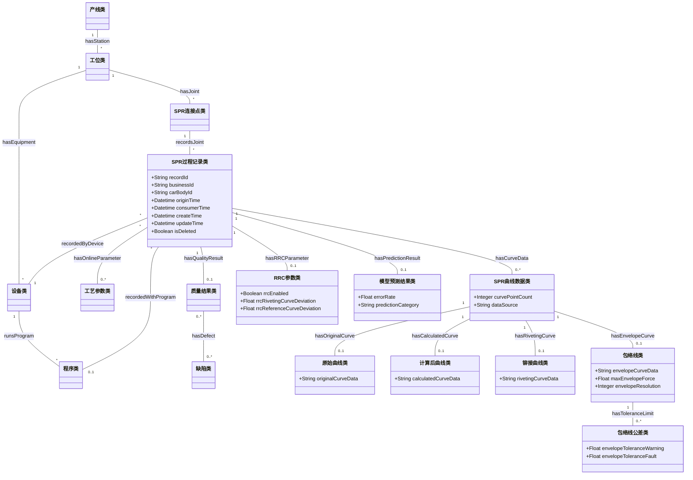

# 蔚来 SPR 工艺本体更新版 v0.3

## 一、更新定位

本版本是在 `工艺本体v2.md` 的基础上，根据当前数据库样例和字段映射结果形成的 SPR 本体更新建议。更新目标不是推翻原 SPR 本体，而是在保持既有主链路稳定的前提下，补充真实数据库中已经出现但原方案未明确建模的 **在线过程记录、曲线数据、包络线、公差阈值、预测判定和系统时间** 等内容。

原 SPR 本体已经覆盖：

- 产线类、工位类、设备类、程序类。
- 零件类、材料类。
- SPR连接点类、SPR铆钉类、铆模类。
- 工艺参数类、检测计划类、质量结果类、缺陷类、根因类。
- 工艺变更类。
- 连接点到工位、设备、程序、零件、材料、铆钉、铆模、参数、质量结果、缺陷、根因、变更的主链路。

本版本新增和补充的重点为：

- 新增 SPR过程记录类，承载数据库每一条在线记录。
- 新增 SPR曲线数据类及其子类，承载原始曲线、计算后曲线、铆接曲线和包络线。
- 新增曲线特征、包络线公差、RRC 参数、PECV2 状态和末端力公差等扩展对象。
- 补充现有类的数据属性，使数据库字段可以逐项落到本体中。
- 明确新增内容与顶层工艺本体的继承或补充建议关系。

## 二、更新原则

1. **主链路不变**：保持原 SPR 本体中“连接点-工位-设备-程序-零件-材料-SPR铆钉-铆模-参数-质量结果-缺陷-根因-变更”的结构。
2. **实例记录单独建模**：数据库主键、业务 ID、采集时间、消费时间、创建时间、更新时间和删除标记统一放入 SPR过程记录类，不污染连接点、设备、程序等主数据类。
3. **在线实测与设计参数分开**：原本的工艺参数类可表示设计参数和参数版本；数据库中的实际力、实际行程等在线数据应作为在线实测参数挂到过程记录。
4. **曲线对象化**：曲线数据不再只作为长字符串属性处理，而作为可被追溯、统计、判定和模型调用的曲线对象。
5. **判定结果保守建模**：`pre`、`error_rate` 和故障代码暂作为预测/判定字段保留，编码未确认前不强行映射为合格、不合格。
6. **顶层稳定、SPR 扩展补专用**：除非新增概念明显跨工艺通用，否则不修改顶层工艺本体主骨架。

## 三、更新后的概念层

### 3.1 保留的核心类

| 类名 | 本版本处理 |
| --- | --- |
| 产线类 | 保留；补充产线名称或线体编码映射 |
| 工位类 | 保留；如果后续能从 `line_name` 或设备编码拆出工位，可补充工位实例 |
| 设备类 | 保留；补充 `deviceName`、设备编码等属性 |
| 程序类 | 保留；补充 `programNumber`、`programName` 等属性 |
| 零件类 | 保留；后续接入点表或零件表时继续使用 |
| 材料类 | 保留；补充钢板厚度等材料属性 |
| SPR连接点类 | 保留；补充 `rivetPointId` |
| SPR铆钉类 | 保留；补充铆钉长度 |
| 铆模类 | 保留；后续可与包络线、铆模参数关联 |
| 工艺参数类 | 保留；补充在线实测参数属性 |
| 检测计划类 | 保留；当前数据库没有检测计划字段，暂不新增 |
| 质量结果类 | 保留；补充误差率、预测类别、故障代码等 |
| 缺陷类 | 保留；补充包络线相关异常模式 |
| 根因类 | 保留；当前数据不直接给出根因，后续由规则或专家确认 |
| 工艺变更类 | 保留；当前数据库不涉及变更记录 |

### 3.2 新增类

| 新增类 | 中文定义 | 顶层父类建议 | 新增原因 |
| --- | --- | --- | --- |
| SPR过程记录类 | 表示一次 SPR 在线铆接过程或数据库采集记录 | 可追溯对象类；也可作为 SPR 扩展层独立类 | 数据库存在 `id`、`biz_id`、时间戳、删除标记和在线结果字段，需要统一承载 |
| SPR曲线数据类 | 表示一次过程记录中关联的曲线数据集合 | 可追溯对象类；建议顶层后续新增过程数据类 | 数据库存在原始曲线、计算后曲线、铆接曲线和包络线 |
| 原始曲线类 | 表示未经处理或缩放前的曲线数据 | SPR曲线数据类 | 对应 `original_data`、`最大力铆接曲线（原始数据）` |
| 计算后曲线类 | 表示处理后、保留精度后的曲线数据 | SPR曲线数据类 | 对应 `calculate_data` |
| 铆接曲线类 | 表示设备导出的实际铆接曲线 | SPR曲线数据类 | 对应 RIP_ROP 的 `铆接曲线` |
| 包络线类 | 表示用于判定铆接曲线是否越界的参考曲线 | 工艺窗口类或约束类的 SPR 扩展 | 对应 `包络线`、包络线最大力、包络线分辨率等字段 |
| 曲线特征类 | 表示曲线最大力、Y 轴刻度、点数、力刻度等特征 | 质量特性类或可追溯对象类 | 支撑曲线级统计、判定和模型输入 |
| 包络线公差类 | 表示包络线警告阈值、故障阈值和行程公差 | 工艺窗口类 / 约束类 | 对应包络线公差警告、故障和行程公差 |
| RRC参数类 | 表示 RRC 启用状态、铆接曲线偏差、基准曲线偏差 | 参数集类的 SPR 扩展 | 对应 RRC 相关字段 |
| PECV2状态类 | 表示 PECV2 功能是否激活及其状态 | 可追溯对象类或参数集扩展 | 对应 `PECV2 activated` |
| 末端力公差类 | 表示末端力上下限和实际末端力 | 工艺窗口类 / 质量特性类 | 对应 End force tolerance 与 Actual end force |
| 模型预测结果类 | 表示模型或算法输出的预测类别、误差率、置信信息 | 输出结果类 / 检测结果类扩展 | 对应 `pre`、`error_rate`，便于与 Action/模型服务衔接 |

### 3.3 更新后的核心结构示意



## 四、更新后的属性层

### 4.1 产线类

| 属性 | 类型 | 来源字段 | 说明 |
| --- | --- | --- | --- |
| `lineName` | String | `line_name` | 产线、线体或工位区域编码，如 RC、UR、UB |

### 4.2 设备类

| 属性 | 类型 | 来源字段 | 说明 |
| --- | --- | --- | --- |
| `deviceName` | String | `device_name`、`Devicename` | 设备名称或设备编号 |

### 4.3 程序类

| 属性 | 类型 | 来源字段 | 说明 |
| --- | --- | --- | --- |
| `programNumber` | Integer/String | `prog_no` | 数据库中的程序号 |
| `programName` | String | `程序` | RIP_ROP 中的程序名称，如 `NietProg.Outlet1` |

### 4.4 SPR连接点类

| 属性 | 类型 | 来源字段 | 说明 |
| --- | --- | --- | --- |
| `rivetPointId` | String | `rivet_id` | 铆点编号或连接点编号 |

### 4.5 材料类

| 属性 | 类型 | 来源字段 | 说明 |
| --- | --- | --- | --- |
| `sheetThickness` | Float | `钢板厚度` | 被连接板材厚度 |

### 4.6 SPR铆钉类

| 属性 | 类型 | 来源字段 | 说明 |
| --- | --- | --- | --- |
| `rivetLength` | Float | `铆钉长度` | 铆钉长度 |

### 4.7 工艺参数类

| 属性 | 类型 | 来源字段 | 说明 |
| --- | --- | --- | --- |
| `maxRivetingForce` | Float | `铆接线最大力` | 在线实测最大力 |
| `pressStroke` | Float | `铆接线冲压行程` | 在线实测冲压行程 |
| `actualEndForce` | Float | `Actual end force` | 实际末端力 |
| `jicDVal` | Float | `JIC dVal` | 业务含义待确认 |

### 4.8 SPR过程记录类

| 属性 | 类型 | 来源字段 | 说明 |
| --- | --- | --- | --- |
| `recordId` | String | `id` | 数据记录主键 ID |
| `businessId` | String | `biz_id` | 业务唯一编号 |
| `physicalRecordId` | String | `实物编号` | RIP_ROP 记录编号或实物编号 |
| `carBodyId` | String | `carbody_id`、`车身标识` | 车身编号或车身标识 |
| `outputCode` | String | `输出` | 输出状态或结果编码，含义待确认 |
| `rivetCounter` | Integer | `铆钉计数器` | 铆钉计数器，暂不等同于铆点编号 |
| `originTime` | Datetime | `origin_time`、`日期/时间` | 设备采集时间或过程发生时间 |
| `consumerTime` | Datetime | `consumer_time` | 数据消费时间 |
| `createTime` | Datetime | `create_time` | 数据创建时间 |
| `updateTime` | Datetime | `update_time` | 数据更新时间 |
| `isDeleted` | Boolean/Integer | `is_deleted` | 删除标记 |

### 4.9 SPR曲线数据类及子类

| 属性 | 类型 | 来源字段 | 说明 |
| --- | --- | --- | --- |
| `curvePointCount` | Integer | 由曲线序列计算 | 曲线点数 |
| `originalCurveData` | String/Array<Float> | `original_data` | 原始曲线数据 |
| `calculatedCurveData` | String/Array<Float> | `calculate_data` | 计算后曲线数据 |
| `rivetingCurveData` | String/Array<Integer> | `铆接曲线` | 铆接曲线数据 |
| `rivetingCurveExists` | Boolean | `铆接曲线存在` | 是否存在铆接曲线 |
| `curveMaxForce` | Float | `铆接曲线最大力` | 铆接曲线最大力 |
| `rawCurveMaxForce` | Float | `最大力铆接曲线（原始数据）` | 原始最大力采样值 |
| `forceScale` | Integer | `最大力刻度铆接曲线` | 最大力刻度 |
| `yScale` | Integer | `铆接曲线Y刻度` | Y 轴刻度 |

### 4.10 包络线类与包络线公差类

| 属性 | 类型 | 来源字段 | 说明 |
| --- | --- | --- | --- |
| `envelopeExists` | Boolean | `包络线存在` | 是否存在包络线 |
| `envelopeCurveData` | String/Array<Integer> | `包络线` | 包络线数据序列 |
| `maxEnvelopeForce` | Float | `包络线最大力` | 包络线最大力 |
| `envelopeResolution` | Integer | `包络线分辨率` | 包络线分辨率 |
| `rawEnvelopeMaxForce` | Float | `最大力包络线（原始数据）` | 包络线最大力原始值 |
| `envelopeYScale` | Integer | `包络线Y刻度` | 包络线 Y 轴刻度 |
| `pressStrokeEnvelope` | Float | `冲压行程包络线` | 冲压行程包络线 |
| `minPressStrokeToleranceEnvelope` | Float | `最小冲压行程公差包络线` | 最小冲压行程公差 |
| `maxPressStrokeToleranceEnvelope` | Float | `最大冲压行程公差包络线` | 最大冲压行程公差 |
| `envelopeToleranceWarning` | Float | `包络线公差警告` | 包络线警告阈值 |
| `envelopeToleranceFault` | Float | `包络线公差故障` | 包络线故障阈值 |
| `envelopeForceScale` | Integer | `最大力刻度包络线` | 包络线最大力刻度 |

### 4.11 质量结果类与模型预测结果类

| 属性 | 类型 | 来源字段 | 说明 |
| --- | --- | --- | --- |
| `errorRate` | Float | `error_rate` | 误差率或异常率 |
| `predictionCategory` | String | `pre` | 预测类别编码 |
| `faultCode` | String | `故障代码` | 原始故障代码文案 |
| `qualityState` | String | 由规则或业务编码推断 | 合格、待复核、不合格等状态，需确认规则 |

### 4.12 RRC、PECV2 与末端力相关类

| 属性 | 类型 | 来源字段 | 说明 |
| --- | --- | --- | --- |
| `rrcEnabled` | Boolean | `RRC启用` | RRC 是否启用 |
| `rrcRivetingCurveDeviation` | Float | `RRC 铆接曲线偏差` | RRC 铆接曲线偏差 |
| `rrcReferenceCurveDeviation` | Float | `RRC基准曲线偏差` | RRC 基准曲线偏差 |
| `pecv2Activated` | Boolean | `PECV2 activated` | PECV2 是否激活 |
| `rivetHeadHeightPositiveLimit` | Float | `Rivet head height positive limit` | 铆钉头高度正向限制 |
| `rivetHeadHeightNegativeLimit` | Float | `Rivet head height negative limit` | 铆钉头高度负向限制 |
| `endForceToleranceMin` | Float | `End force tolerance min.` | 末端力最小公差 |
| `endForceToleranceMax` | Float | `End force tolerance max.` | 末端力最大公差 |

## 五、更新后的关系层

### 5.1 保留关系

以下关系沿用 `工艺本体v2.md`，不做重构：

- `hasStation`
- `belongsToStation`
- `hasEquipment`
- `runsProgram`
- `hasJoint`
- `joinsPart`
- `usesMaterial`
- `usesSPR`
- `usesDie`
- `hasParameter`
- `executedByProgram`
- `hasInspectionPlan`
- `hasQualityResult`
- `hasDefect`
- `causedBy`
- `affectsJoint`
- `impactedByChange`
- `affectsParameter`
- `affectsProgram`
- `nextStation`

### 5.2 新增关系

| 关系名称 | 定义域 | 值域 | 说明 |
| --- | --- | --- | --- |
| `recordsJoint` | SPR过程记录类 | SPR连接点类 | 一条过程记录对应一个 SPR 连接点或铆点 |
| `recordedByDevice` | SPR过程记录类 | 设备类 | 过程记录由某设备采集或产生 |
| `recordedAtLine` | SPR过程记录类 | 产线类 | 过程记录发生于某线体或区域 |
| `recordedWithProgram` | SPR过程记录类 | 程序类 | 过程记录对应某程序 |
| `hasOnlineParameter` | SPR过程记录类 | 工艺参数类 | 过程记录包含在线实测参数 |
| `hasCurveData` | SPR过程记录类 | SPR曲线数据类 | 过程记录包含曲线数据 |
| `hasOriginalCurve` | SPR曲线数据类 | 原始曲线类 | 曲线数据包含原始曲线 |
| `hasCalculatedCurve` | SPR曲线数据类 | 计算后曲线类 | 曲线数据包含计算后曲线 |
| `hasRivetingCurve` | SPR曲线数据类 | 铆接曲线类 | 曲线数据包含实际铆接曲线 |
| `hasEnvelopeCurve` | SPR曲线数据类 | 包络线类 | 曲线数据关联判定用包络线 |
| `hasToleranceLimit` | 包络线类 / 工艺参数类 | 包络线公差类 / 末端力公差类 | 曲线或参数受公差约束 |
| `evaluatedByEnvelope` | 质量结果类 | 包络线类 | 质量结果由包络线判定产生 |
| `hasPredictionResult` | SPR过程记录类 | 模型预测结果类 | 过程记录包含模型预测或算法判定结果 |
| `hasRRCParameter` | SPR过程记录类 | RRC参数类 | 过程记录包含 RRC 相关参数 |
| `hasPECV2State` | SPR过程记录类 | PECV2状态类 | 过程记录包含 PECV2 状态 |

## 六、更新后的约束建议

| 约束对象 | 约束表达式 | 说明 |
| --- | --- | --- |
| SPR过程记录类 | `recordId exactly 1` | 每条在线过程记录必须有唯一记录 ID |
| SPR过程记录类 | `recordsJoint min 0` | 当前数据库可能仅有 `rivet_id`，如能实例化连接点则建议关联 |
| SPR过程记录类 | `recordedByDevice exactly 1` | 当前主数据库每条记录均有设备名称 |
| SPR过程记录类 | `recordedWithProgram min 1` | 当前主数据库每条记录均有程序号 |
| SPR过程记录类 | `originTime min 1` | 设备采集时间应尽量保留 |
| SPR曲线数据类 | `hasOriginalCurve or hasRivetingCurve min 1` | 曲线对象至少应包含一种实际曲线 |
| 计算后曲线类 | `hasOriginalCurve min 0` | 计算后曲线应尽量追溯到原始曲线 |
| 包络线类 | `hasToleranceLimit min 0` | 包络线可绑定警告/故障阈值 |
| 质量结果类 | `hasDefect min 1 when qualityState = 不合格` | 沿用原本质量闭环约束 |
| 模型预测结果类 | `predictionCategory exactly 1` | 当前 `pre` 字段每条记录均有值 |

## 七、规则层补充建议

### 7.1 曲线越界判定规则

当前 RIP_ROP 中故障代码已经出现三类异常：冲压行程过大、铆接曲线高于包络线、铆接曲线低于包络线。建议补充规则：

```swrl
Rule-Curve-High:
SPR过程记录类(?r) ∧ hasCurveData(?r, ?c) ∧ hasEnvelopeCurve(?c, ?e)
∧ 曲线高于包络线(?c, ?e, True)
→ faultCode(?r, "铆接曲线高于包络线")

Rule-Curve-Low:
SPR过程记录类(?r) ∧ hasCurveData(?r, ?c) ∧ hasEnvelopeCurve(?c, ?e)
∧ 曲线低于包络线(?c, ?e, True)
→ faultCode(?r, "铆接曲线低于包络线")
```

其中 `曲线高于包络线` 和 `曲线低于包络线` 需要由具体算法或规则引擎实现。

### 7.2 冲压行程异常规则

```swrl
Rule-Press-Stroke-High:
SPR过程记录类(?r) ∧ hasOnlineParameter(?r, ?p)
∧ pressStroke(?p, ?s) ∧ swrlb:greaterThan(?s, 设定上限)
→ faultCode(?r, "冲压行程过大")
```

当前样例中的“测得得冲压行程过大”建议保留原始文案，同时在标准缺陷模式中规范为“冲压行程过大”。

### 7.3 预测结果复核规则

```swrl
Rule-Prediction-Review:
模型预测结果类(?p) ∧ errorRate(?p, ?e) ∧ swrlb:greaterThan(?e, 0.01)
→ 需要复核(?p, True)
```

该规则仅作为占位建议，具体阈值需结合 `pre` 编码和 `error_rate` 业务含义确认。

## 八、实例层映射建议

### 8.1 主数据库一条记录的实例化路径

对于 `pmc_body_shop_prod-d7lcbg96ulq0qrl37o2g.xlsx` 中的一条记录，建议实例化为：

1. 一个 `SPR过程记录类` 实例，记录 `id`、`biz_id`、`origin_time`、`consumer_time` 等。
2. 一个或复用一个 `设备类` 实例，由 `device_name` 标识。
3. 一个或复用一个 `程序类` 实例，由 `prog_no` 标识。
4. 一个或复用一个 `产线类` 实例，由 `line_name` 标识。
5. 一个或复用一个 `SPR连接点类` 实例，由 `rivet_id` 标识。
6. 一个 `SPR曲线数据类` 实例，关联原始曲线和计算后曲线。
7. 一个 `质量结果类` 或 `模型预测结果类` 实例，承载 `error_rate` 和 `pre`。

### 8.2 RIP_ROP 一条记录的实例化路径

对于 `spr data2(1).xlsx` 中的一条记录，建议实例化为：

1. 一个 `SPR过程记录类` 实例，记录实物编号、日期/时间、输出、流程类型、铆钉计数器。
2. 一个 `工艺参数类` 实例，记录铆接线最大力、冲压行程、钢板厚度、铆钉长度等。
3. 一个 `铆接曲线类` 实例，记录铆接曲线、曲线最大力、刻度和 Y 轴刻度。
4. 一个 `包络线类` 实例，记录包络线、最大力、分辨率、刻度等。
5. 一个 `包络线公差类` 实例，记录公差警告和公差故障。
6. 一个 `质量结果类` 实例，记录故障代码。
7. 一个 `RRC参数类` 和一个 `PECV2状态类` 实例，记录控制/诊断状态。

## 九、顶层继承与补充建议

本版本新增类的顶层归属建议如下：

| SPR 新增类 | 顶层归属建议 | 是否建议进入顶层 |
| --- | --- | --- |
| SPR过程记录类 | 可追溯对象类 / 检测结果类旁路扩展 | 建议顶层新增“在线过程记录类” |
| SPR曲线数据类 | 可追溯对象类 | 建议顶层新增“过程数据类/曲线数据类” |
| 原始曲线类 | 曲线数据类 | 是，作为通用曲线子类 |
| 计算后曲线类 | 曲线数据类 | 是，作为通用曲线子类 |
| 铆接曲线类 | SPR曲线数据类 | 否，SPR 专属 |
| 包络线类 | 工艺窗口类 / 约束类 | 是，点焊、涂胶等也可能使用边界曲线或窗口曲线 |
| 包络线公差类 | 约束类 / 工艺窗口类 | 是 |
| RRC参数类 | 参数集类 | 否，SPR 专属 |
| PECV2状态类 | 参数集类或设备控制状态 | 暂不建议，含义未确认 |
| 模型预测结果类 | 输出结果类 / 检测结果类 | 是，适用于多工艺模型输出 |

## 十、本版本结论

本次更新后，SPR 本体从原来的“主数据 + 工艺参数 + 质量结果”结构，扩展为能够承载 **在线过程记录 + 曲线/包络线 + 预测判定 + 系统时间** 的结构。这样既保留了原本适合工艺知识治理和质量追溯的主链路，也能接入蔚来数据库实际导出的在线记录字段。

后续真正落地为 OWL、RDF 或图数据库 Schema 时，应先完成字段编码确认，再将本文件中的类、属性和关系转换为正式命名空间下的 URI。
