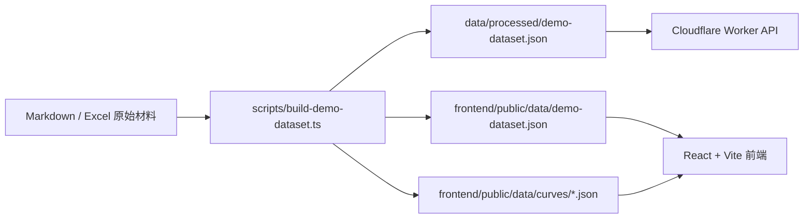
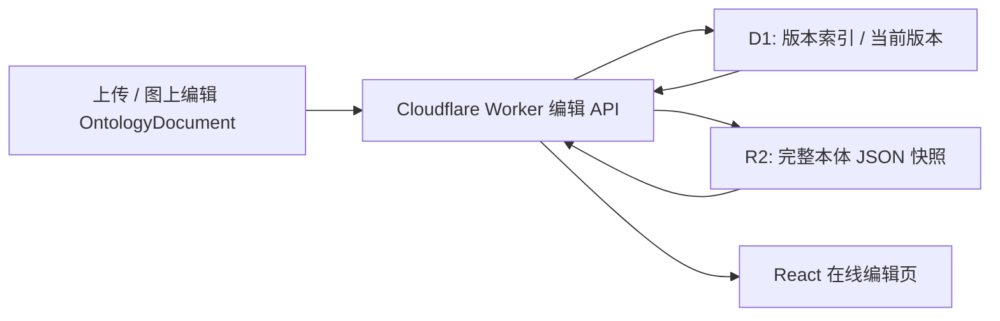

# SPR Demo 架构说明

## 架构选择

Demo 采用“静态预处理数据 + React 前端 + Cloudflare Worker API”的结构。当前数据规模较小，不引入 Neo4j、RDF Store 或完整 OWL 推理器。

在线编辑模式在该结构上增加一层“本体覆盖层”：实例数据和曲线仍来自静态 JSON，本体 JSON 可由 Worker 从 D1/R2 读取当前版本并覆盖静态本体部分。

## 数据流

1. 读取 `pmc_body_shop_prod-d7lcbg96ulq0qrl37o2g.xlsx` 和 `spr data2(1).xlsx`。
2. 标准化为 `ProcessRecord`。
3. 将长曲线字段拆到 `frontend/public/data/curves/{id}.json`。
4. 将索引、统计、本体图谱、字段映射、演示脚本写入 `demo-dataset.json`。
5. 前端默认静态加载数据；设置 `VITE_DATA_MODE=api` 后可切换 Worker API。
6. Worker 如发现云端当前本体版本，会用其覆盖 `top_ontology`、`spr_ontology`、`top_spr_mappings`、`fieldMappings`，并重新派生图谱与层级路径。

## 关键设计

- `SPR过程记录类` 是中心对象。
- 主链路不重构：产线、设备、程序、连接点、参数、质量结果继续保留。
- v0.3 扩展层承载过程记录、曲线、包络线、公差、RRC、PECV2、模型预测结果。
- 规则解释采用轻量函数模拟，不声称完成 OWL 推理。
