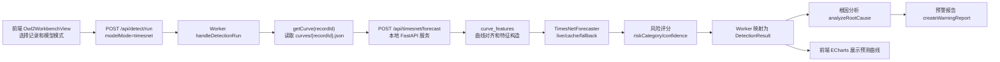
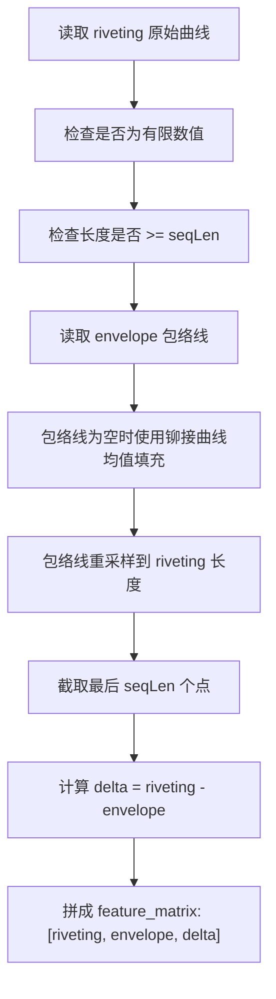
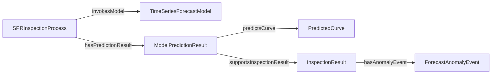

# TimesNet 时序预测模型接入深度说明

本文档说明 TimesNet 时序预测能力如何接入 `spr-ontology-demo`，包括系统架构、模型输入输出、数据处理流程、风险判断逻辑，以及预测结果如何进入本体驱动的“检测、根因、预警”闭环。

## 1. 接入目标

当前 Demo 的目标不是把 PyTorch 模型塞进 Cloudflare Worker，而是在本地 Mac 上跑一个稳定的三进程演示闭环：

1. React 前端负责选择 SPR 过程记录、展示检测结果、预测曲线、本体路径和报告。
2. Cloudflare Worker 本地 dev 服务负责读取过程记录和曲线数据，统一调度检测流程。
3. `timesnet-service` FastAPI 服务负责把铆接曲线转换为时序特征，并返回 TimesNet 风格的短窗预测结果。

核心演示场景是：选择一条 `rip_rop` 铆接记录，Worker 调用 TimesNet 服务预测未来 24 个曲线点，再判断未来曲线是否可能高于包络线。如果预测存在风险，则把风险映射回现有质量异常类别 `curve_above_envelope`，后续继续复用本体根因分析和预警报告流程。

## 2. 系统接入架构



实际代码挂接点：

- 前端检测页：`/Users/xi/hengxiang/spr/spr-ontology-demo/frontend/src/features/owl2-workbench/Owl2WorkbenchView.tsx`
- 前端 API 客户端：`/Users/xi/hengxiang/spr/spr-ontology-demo/frontend/src/lib/data.ts`
- Worker 检测入口：`/Users/xi/hengxiang/spr/spr-ontology-demo/backend/src/index.ts`
- 共享检测类型：`/Users/xi/hengxiang/spr/spr-ontology-demo/shared/ontology-service.ts`
- TimesNet 服务入口：`/Users/xi/hengxiang/spr/timesnet-service/src/app.py`
- 曲线特征处理：`/Users/xi/hengxiang/spr/timesnet-service/src/curve_features.py`
- TimesNet 适配器：`/Users/xi/hengxiang/spr/timesnet-service/src/timesnet_adapter.py`

## 3. 为什么采用独立 Python 服务

TimesNet 来自 `Time-Series-Library`，依赖 PyTorch 和 Python 科研栈。Cloudflare Worker 运行的是 TypeScript/JavaScript 边缘运行时，不适合直接加载 PyTorch、MPS、NumPy 或 Time-Series-Library。

因此系统把职责分开：

- Worker 保持轻量调度、数据读取、降级策略、本体结果组装。
- Python 服务负责模型推理、曲线特征、缓存和本地硬件适配。
- 前端只关心统一的 `DetectionResult` 和 `timeSeriesPrediction`，不需要知道模型内部细节。

这种边界让演示更稳定：即使 TimesNet 服务不可用，Worker 也会降级为本体规则；即使 PyTorch 没装好，FastAPI 服务也可以返回缓存或兜底预测。

## 4. 前端到 Worker 的输入

前端在“检测模型”页选择模型模式。默认模式是 `TimesNet 时序预测`，点击“调用检测 API”后发送：

```json
{
  "recordId": "riprop-2",
  "modelMode": "timesnet",
  "includeCurveSummary": true
}
```

字段含义：

- `recordId`：要检测的过程记录 ID。当前 v1 优先使用 `riprop-*` 记录，因为这些记录带有铆接曲线和包络线。
- `modelMode`：检测模式，可选 `timesnet`、`mock`、`llm`。
- `includeCurveSummary`：是否把曲线摘要纳入检测上下文。TimesNet 路径会进一步读取完整曲线 JSON。

Worker 收到请求后，如果 `modelMode === "timesnet"`，会进入 `runTimesNetDetection`。如果没有配置 `TIMESNET_API_BASE_URL`、曲线缺失、服务超时或服务返回格式不合法，则返回本体规则降级结果，并在 `modelDiagnostics.fallbackReason` 中说明原因。

## 5. Worker 到 TimesNet 服务的输入

Worker 会先读取记录对应的曲线详情：

```text
frontend/public/data/curves/{recordId}.json
```

然后调用：

```http
POST {TIMESNET_API_BASE_URL}/api/timesnet/forecast
```

请求体结构：

```json
{
  "recordId": "riprop-2",
  "curves": {
    "riveting": [819, 820, 817],
    "envelope": [962.875, 959.5, 947.5]
  },
  "horizon": 24,
  "seqLen": 96,
  "useCache": true
}
```

字段含义：

- `recordId`：用于缓存命中和结果追溯。
- `curves.riveting`：原始铆接曲线，来自 RIP_ROP 表的长序列字段。
- `curves.envelope`：包络线曲线，用于比较铆接曲线是否越界。
- `horizon`：预测未来点数，当前默认 24。
- `seqLen`：模型输入历史窗口长度，当前默认 96。
- `useCache`：是否优先读取本地演示缓存。现场演示默认开启。

## 6. 模型服务输出

TimesNet 服务返回统一 JSON：

```json
{
  "recordId": "riprop-2",
  "modelName": "TimesNet",
  "modelVersion": "spr-timesnet-small-v1",
  "mode": "cache",
  "seqLen": 96,
  "horizon": 24,
  "inputCurve": [819, 820, 817],
  "envelopeCurve": [962.875, 959.5, 947.5],
  "predictedCurve": [2160.12, 2184.35],
  "predictedEnvelope": [2144.86, 2144.41],
  "predictedDelta": [15.26, 39.94],
  "anomalyScore": 0.83,
  "riskCategory": "forecast_curve_above_envelope",
  "confidence": 0.86,
  "evidence": [
    "TimesNet 本地兜底预测显示未来曲线存在高于包络线风险"
  ],
  "durationMs": 9,
  "generatedAt": "2026-06-16T10:30:00Z"
}
```

关键字段说明：

- `mode`
  - `live`：成功加载 PyTorch/TimesNet 模型并完成实时推理。
  - `cache`：命中预先生成的演示缓存。
  - `fallback`：未命中缓存或实时模型不可用时，使用轻量趋势外推兜底。
- `inputCurve`：进入模型的历史铆接曲线窗口，长度为 `seqLen`。
- `envelopeCurve`：与 `inputCurve` 对齐后的历史包络线窗口，长度为 `seqLen`。
- `predictedCurve`：未来 `horizon` 个点的预测铆接曲线。
- `predictedEnvelope`：未来 `horizon` 个点的预测包络线。
- `predictedDelta`：`predictedCurve - predictedEnvelope`，是风险判断的核心特征。
- `anomalyScore`：0 到 1 的风险分数。
- `riskCategory`：时序预测风险类别。
- `confidence`：模型服务对该风险判断的置信度。
- `evidence`：用于前端展示和本体检测证据的文字解释。

## 7. 曲线数据处理流程

曲线处理由 `build_curve_features` 完成，流程如下：



### 7.1 数值清洗

服务会把输入曲线逐点转换成 `float`。如果出现以下情况，会抛出可解释错误：

- 曲线里包含 `null`。
- 曲线里包含布尔值。
- 曲线里包含无法转成数值的字符串。
- 曲线里包含 `NaN` 或无穷大。

### 7.2 长度检查

`riveting` 必须至少包含 `seqLen` 个点。当前默认 `seqLen=96`，也就是说铆接曲线至少要有 96 个采样点，才能进入模型特征构造。

如果曲线过短：

- 服务会先尝试读取缓存。
- 如果没有缓存，则返回 `mode: "fallback"` 和 `riskCategory: "forecast_review"`。
- Worker 侧如果调用失败，则降级为本体规则。

### 7.3 包络线对齐

真实数据中，铆接曲线和包络线可能点数不同。例如铆接曲线是 217 个点，包络线是 256 个点。模型不能直接处理两个不同长度的序列，所以服务会把包络线重采样到铆接曲线长度。

重采样方式是线性插值：

1. 把原包络线映射到 0 到 1 的归一化横轴。
2. 把目标长度也映射到 0 到 1。
3. 用 `np.interp` 生成与铆接曲线同长度的包络线。

### 7.4 历史窗口截取

对齐后，只取最后 `seqLen` 个点作为模型输入：

```text
inputCurve = riveting[-seqLen:]
envelopeCurve = envelopeAligned[-seqLen:]
deltaCurve = inputCurve - envelopeCurve
```

这样做有两个原因：

- 时序模型需要固定长度输入。
- 曲线后段通常更接近峰值和结束阶段，更适合判断后续越界趋势。

### 7.5 三通道特征

最终模型输入特征矩阵是三通道：

```text
feature_matrix[t] = [
  riveting[t],
  envelope[t],
  riveting[t] - envelope[t]
]
```

也就是：

- 第 1 通道：实际铆接曲线。
- 第 2 通道：参考包络线。
- 第 3 通道：实际曲线相对包络线的偏差。

这比只输入铆接曲线更适合质量判断，因为模型能直接看到“实际曲线”和“判定边界”的关系。

## 8. TimesNet 推理路径

`TimesNetForecaster` 当前支持三种运行路径。

### 8.1 live 实时推理

如果本地环境安装了 PyTorch，并且 `Time-Series-Library/models/TimesNet.py` 可以加载，则服务构造一个小配置 TimesNet：

```text
task_name = long_term_forecast
seq_len = 96
label_len = 48
pred_len = 24
enc_in = 3
dec_in = 3
c_out = 3
d_model = 32
d_ff = 64
e_layers = 2
d_layers = 1
top_k = 3
num_kernels = 3
dropout = 0.1
```

输入张量：

```text
x_enc:      [1, 96, 3]
x_mark_enc: [1, 96, 5]
x_dec:      [1, 48 + horizon, 3]
x_mark_dec: [1, 48 + horizon, 5]
```

输出张量取前 `horizon` 个点：

```text
output[0, :horizon, :]
```

并拆成：

```text
predictedCurve = output[:, 0]
predictedEnvelope = output[:, 1]
predictedDelta = output[:, 2]
```

### 8.2 cache 演示缓存

现场演示默认 `useCache=true`。服务收到请求后会先根据 `recordId` 查找：

```text
/Users/xi/hengxiang/spr/timesnet-service/artifacts/cache/{recordId}.json
```

如果命中缓存，直接返回 `mode: "cache"`。这保证现场演示不会被模型冷启动、PyTorch 安装、MPS 兼容性或现场网络状态影响。

当前已经生成 177 条 `riprop-*` 缓存，覆盖现有 RIP_ROP 曲线记录。

### 8.3 fallback 轻量兜底

如果没有缓存，且实时 TimesNet 不可用，服务会用最近 12 个历史点做线性趋势外推：

```text
predictedCurve = project(inputCurve[-12:])
predictedEnvelope = project(envelopeCurve[-12:])
predictedDelta = predictedCurve - predictedEnvelope
```

这个兜底不是论文意义上的 TimesNet 精度模型，而是为了保证演示系统在模型依赖不可用时仍能返回结构完整、可解释、可进入本体链路的结果。

## 9. 风险评分逻辑

风险判断主要基于 `predictedDelta`：

```text
predictedDelta = predictedCurve - predictedEnvelope
```

当 `predictedDelta > 0` 时，表示预测曲线高于预测包络线。

当前规则：

1. 计算未来窗口里 `predictedDelta > 0` 的比例。
2. 如果比例大于等于 `0.15`，判定：

```text
riskCategory = forecast_curve_above_envelope
```

3. 计算历史 `deltaCurve` 的标准差。
4. 如果最大预测偏差大于历史标准差的 `1.5` 倍，提高置信度。

输出类别：

- `normal`：未来曲线没有明显越界趋势。
- `forecast_curve_above_envelope`：未来曲线存在高于包络线风险。
- `forecast_review`：模型无法形成稳定判断，需要人工复核。

## 10. Worker 如何映射为本体检测结果

TimesNet 服务返回的是时序预测语义，Worker 要把它转换成现有检测闭环能理解的 `DetectionResult`。

映射关系：

```text
TimesNet riskCategory=forecast_curve_above_envelope
  -> DetectionPrediction.category=curve_above_envelope
  -> severity=warning
  -> anomalyEvent=铆接曲线高于包络线
```

如果 TimesNet 返回 `normal`：

```text
DetectionPrediction.category=normal
severity=normal
anomalyEvent=undefined
```

如果 TimesNet 调用失败：

```text
modelMode=mock
prediction=classifyRecord(record)
modelDiagnostics.attemptedModelMode=timesnet
modelDiagnostics.fallbackReason=具体失败原因
```

这样做的好处是，后续本体流程不用重写：

```text
SPRProcessRecord
-> SPRInspectionProcess
-> DetectionModel
-> ModelPredictionResult
-> InspectionResult
-> AnomalyEvent
```

根因分析和预警报告仍然使用现有规则：

- `analyzeRootCause`
- `createWarningReport`

## 11. 前端如何展示预测结果

前端收到 `DetectionResult.timeSeriesPrediction` 后，会新增 TimesNet 预测图。

图里包含四条曲线：

- 历史铆接曲线：`inputCurve`
- 历史包络线：`envelopeCurve`
- TimesNet 预测曲线：`predictedCurve`
- 预测包络线：`predictedEnvelope`

同时展示：

- 预测窗口：`horizon`
- 风险分数：`anomalyScore`
- 运行模式：实时推理、缓存结果或降级预测
- 置信度：`confidence`
- 证据：`evidence`
- 降级说明：`modelDiagnostics.fallbackReason`

因此用户在页面上既能看到模型结论，也能看到模型结论来自哪段曲线、以什么模式运行、是否发生降级。

## 12. 本体语义扩展

为了承接时序预测，系统在 `model.owl` 里新增了以下类：

- `TimeSeriesForecastModel`：时序预测模型，继承自 `DetectionModel`。
- `ForecastHorizon`：预测窗口。
- `PredictedCurve`：预测曲线，继承自 `CurveData`。
- `ForecastAnomalyEvent`：预测异常事件，继承自 `AnomalyEvent`。

新增关系：

- `hasForecastHorizon`：`ModelInvocation -> ForecastHorizon`
- `predictsCurve`：`ModelPredictionResult -> PredictedCurve`

这表示 TimesNet 不是孤立 API，而是被纳入本体语义：



基础 OWL 校验没有强制要求 TimesNet 类必须存在于所有部署环境中，避免未启用本地模型服务时阻塞基础 Demo。

## 13. 端到端数据流示例

以 `riprop-2` 为例：

1. 用户在前端选择 `riprop-2`。
2. 前端发送：

```json
{
  "recordId": "riprop-2",
  "modelMode": "timesnet",
  "includeCurveSummary": true
}
```

3. Worker 读取：

```text
/data/curves/riprop-2.json
```

4. Worker 调用 TimesNet 服务：

```json
{
  "recordId": "riprop-2",
  "curves": {
    "riveting": ["完整铆接曲线"],
    "envelope": ["完整包络线"]
  },
  "horizon": 24,
  "seqLen": 96,
  "useCache": true
}
```

5. TimesNet 服务返回：

```text
mode=cache
riskCategory=forecast_curve_above_envelope
confidence=0.86
predictedCurve=未来 24 点预测曲线
predictedEnvelope=未来 24 点预测包络线
```

6. Worker 映射为：

```text
prediction.category=curve_above_envelope
severity=warning
anomalyEvent=铆接曲线高于包络线
```

7. 前端展示：

- TimesNet 预测曲线图。
- 风险分数和置信度。
- 证据文本。
- 根因候选。
- 预警报告。
- OWL2 本体路径。

## 14. 当前实现边界

当前 v1 是面向本地现场演示的稳定闭环，有几个明确边界：

- 不在用户点击检测时训练模型。
- 默认优先读取缓存，保证现场速度和稳定性。
- 实时 TimesNet 依赖本地 Python 3.11、PyTorch、Time-Series-Library 和可选 MPS。
- 当前只做单条 SPR 铆接曲线短窗预测，不做跨记录产线质量趋势预测。
- 当前风险规则聚焦“预测曲线高于包络线”，低于包络线和其他复杂风险可在后续扩展。

## 15. 后续可扩展方向

后续如果要从演示版进入更接近生产的版本，可以扩展：

1. 引入真实训练 checkpoint，而不是只依赖缓存和兜底趋势外推。
2. 增加模型元数据管理，包括训练数据版本、checkpoint hash、训练时间和评估指标。
3. 增加多风险类别，包括低于包络线、冲压行程异常、曲线形态突变。
4. 增加跨记录趋势预测，把产线、设备、程序、材料批次等维度纳入时间序列。
5. 把 `PredictedCurve`、`ForecastHorizon`、`ModelCallLog` 实例化进图数据库，形成更完整的模型调用知识图谱。
