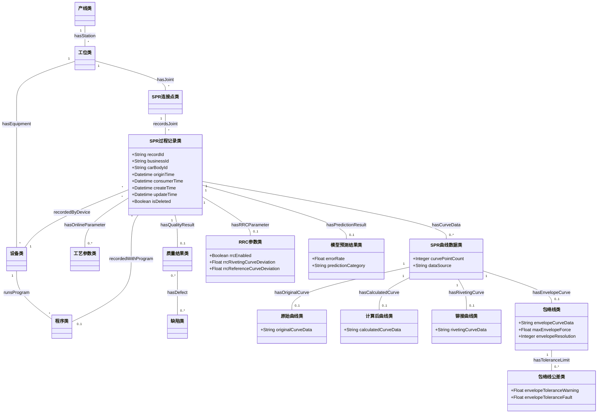

# SPR 本体更新最终交付文档

# 蔚来 SPR 工艺本体更新版 v0.3

## 一、更新定位

本版本是在 `工艺本体v2.md` 的基础上，根据当前数据库样例和字段映射结果形成的 SPR 本体更新建议。更新目标不是推翻原 SPR 本体，而是在保持既有主链路稳定的前提下，补充真实数据库中已经出现但原方案未明确建模的 **在线过程记录、曲线数据、包络线、公差阈值、预测判定和系统时间** 等内容。

原 SPR 本体已经覆盖：

- 产线类、工位类、设备类、程序类。
- 零件类、材料类。
- SPR连接点类、SPR铆钉类、铆模类。
- 工艺参数类、检测计划类、质量结果类、缺陷类、根因类。
- 工艺变更类。
- 连接点到工位、设备、程序、零件、材料、铆钉、铆模、参数、质量结果、缺陷、根因、变更的主链路。

本版本新增和补充的重点为：

- 新增 SPR过程记录类，承载数据库每一条在线记录。
- 新增 SPR曲线数据类及其子类，承载原始曲线、计算后曲线、铆接曲线和包络线。
- 新增曲线特征、包络线公差、RRC 参数、PECV2 状态和末端力公差等扩展对象。
- 补充现有类的数据属性，使数据库字段可以逐项落到本体中。
- 明确新增内容与顶层工艺本体的继承或补充建议关系。

## 二、更新原则

1. **主链路不变**：保持原 SPR 本体中“连接点-工位-设备-程序-零件-材料-SPR铆钉-铆模-参数-质量结果-缺陷-根因-变更”的结构。
2. **实例记录单独建模**：数据库主键、业务 ID、采集时间、消费时间、创建时间、更新时间和删除标记统一放入 SPR过程记录类，不污染连接点、设备、程序等主数据类。
3. **在线实测与设计参数分开**：原本的工艺参数类可表示设计参数和参数版本；数据库中的实际力、实际行程等在线数据应作为在线实测参数挂到过程记录。
4. **曲线对象化**：曲线数据不再只作为长字符串属性处理，而作为可被追溯、统计、判定和模型调用的曲线对象。
5. **判定结果保守建模**：`pre`、`error_rate` 和故障代码暂作为预测/判定字段保留，编码未确认前不强行映射为合格、不合格。
6. **顶层稳定、SPR 扩展补专用**：除非新增概念明显跨工艺通用，否则不修改顶层工艺本体主骨架。

## 三、更新后的概念层

### 3.1 保留的核心类

| 类名 | 本版本处理 |
| --- | --- |
| 产线类 | 保留；补充产线名称或线体编码映射 |
| 工位类 | 保留；如果后续能从 `line_name` 或设备编码拆出工位，可补充工位实例 |
| 设备类 | 保留；补充 `deviceName`、设备编码等属性 |
| 程序类 | 保留；补充 `programNumber`、`programName` 等属性 |
| 零件类 | 保留；后续接入点表或零件表时继续使用 |
| 材料类 | 保留；补充钢板厚度等材料属性 |
| SPR连接点类 | 保留；补充 `rivetPointId` |
| SPR铆钉类 | 保留；补充铆钉长度 |
| 铆模类 | 保留；后续可与包络线、铆模参数关联 |
| 工艺参数类 | 保留；补充在线实测参数属性 |
| 检测计划类 | 保留；当前数据库没有检测计划字段，暂不新增 |
| 质量结果类 | 保留；补充误差率、预测类别、故障代码等 |
| 缺陷类 | 保留；补充包络线相关异常模式 |
| 根因类 | 保留；当前数据不直接给出根因，后续由规则或专家确认 |
| 工艺变更类 | 保留；当前数据库不涉及变更记录 |

### 3.2 新增类

| 新增类 | 中文定义 | 顶层父类建议 | 新增原因 |
| --- | --- | --- | --- |
| SPR过程记录类 | 表示一次 SPR 在线铆接过程或数据库采集记录 | 可追溯对象类；也可作为 SPR 扩展层独立类 | 数据库存在 `id`、`biz_id`、时间戳、删除标记和在线结果字段，需要统一承载 |
| SPR曲线数据类 | 表示一次过程记录中关联的曲线数据集合 | 可追溯对象类；建议顶层后续新增过程数据类 | 数据库存在原始曲线、计算后曲线、铆接曲线和包络线 |
| 原始曲线类 | 表示未经处理或缩放前的曲线数据 | SPR曲线数据类 | 对应 `original_data`、`最大力铆接曲线（原始数据）` |
| 计算后曲线类 | 表示处理后、保留精度后的曲线数据 | SPR曲线数据类 | 对应 `calculate_data` |
| 铆接曲线类 | 表示设备导出的实际铆接曲线 | SPR曲线数据类 | 对应 RIP_ROP 的 `铆接曲线` |
| 包络线类 | 表示用于判定铆接曲线是否越界的参考曲线 | 工艺窗口类或约束类的 SPR 扩展 | 对应 `包络线`、包络线最大力、包络线分辨率等字段 |
| 曲线特征类 | 表示曲线最大力、Y 轴刻度、点数、力刻度等特征 | 质量特性类或可追溯对象类 | 支撑曲线级统计、判定和模型输入 |
| 包络线公差类 | 表示包络线警告阈值、故障阈值和行程公差 | 工艺窗口类 / 约束类 | 对应包络线公差警告、故障和行程公差 |
| RRC参数类 | 表示 RRC 启用状态、铆接曲线偏差、基准曲线偏差 | 参数集类的 SPR 扩展 | 对应 RRC 相关字段 |
| PECV2状态类 | 表示 PECV2 功能是否激活及其状态 | 可追溯对象类或参数集扩展 | 对应 `PECV2 activated` |
| 末端力公差类 | 表示末端力上下限和实际末端力 | 工艺窗口类 / 质量特性类 | 对应 End force tolerance 与 Actual end force |
| 模型预测结果类 | 表示模型或算法输出的预测类别、误差率、置信信息 | 输出结果类 / 检测结果类扩展 | 对应 `pre`、`error_rate`，便于与 Action/模型服务衔接 |

### 3.3 更新后的核心结构示意



## 四、更新后的属性层

### 4.1 产线类

| 属性 | 类型 | 来源字段 | 说明 |
| --- | --- | --- | --- |
| `lineName` | String | `line_name` | 产线、线体或工位区域编码，如 RC、UR、UB |

### 4.2 设备类

| 属性 | 类型 | 来源字段 | 说明 |
| --- | --- | --- | --- |
| `deviceName` | String | `device_name`、`Devicename` | 设备名称或设备编号 |

### 4.3 程序类

| 属性 | 类型 | 来源字段 | 说明 |
| --- | --- | --- | --- |
| `programNumber` | Integer/String | `prog_no` | 数据库中的程序号 |
| `programName` | String | `程序` | RIP_ROP 中的程序名称，如 `NietProg.Outlet1` |

### 4.4 SPR连接点类

| 属性 | 类型 | 来源字段 | 说明 |
| --- | --- | --- | --- |
| `rivetPointId` | String | `rivet_id` | 铆点编号或连接点编号 |

### 4.5 材料类

| 属性 | 类型 | 来源字段 | 说明 |
| --- | --- | --- | --- |
| `sheetThickness` | Float | `钢板厚度` | 被连接板材厚度 |

### 4.6 SPR铆钉类

| 属性 | 类型 | 来源字段 | 说明 |
| --- | --- | --- | --- |
| `rivetLength` | Float | `铆钉长度` | 铆钉长度 |

### 4.7 工艺参数类

| 属性 | 类型 | 来源字段 | 说明 |
| --- | --- | --- | --- |
| `maxRivetingForce` | Float | `铆接线最大力` | 在线实测最大力 |
| `pressStroke` | Float | `铆接线冲压行程` | 在线实测冲压行程 |
| `actualEndForce` | Float | `Actual end force` | 实际末端力 |
| `jicDVal` | Float | `JIC dVal` | 业务含义待确认 |

### 4.8 SPR过程记录类

| 属性 | 类型 | 来源字段 | 说明 |
| --- | --- | --- | --- |
| `recordId` | String | `id` | 数据记录主键 ID |
| `businessId` | String | `biz_id` | 业务唯一编号 |
| `physicalRecordId` | String | `实物编号` | RIP_ROP 记录编号或实物编号 |
| `carBodyId` | String | `carbody_id`、`车身标识` | 车身编号或车身标识 |
| `outputCode` | String | `输出` | 输出状态或结果编码，含义待确认 |
| `rivetCounter` | Integer | `铆钉计数器` | 铆钉计数器，暂不等同于铆点编号 |
| `originTime` | Datetime | `origin_time`、`日期/时间` | 设备采集时间或过程发生时间 |
| `consumerTime` | Datetime | `consumer_time` | 数据消费时间 |
| `createTime` | Datetime | `create_time` | 数据创建时间 |
| `updateTime` | Datetime | `update_time` | 数据更新时间 |
| `isDeleted` | Boolean/Integer | `is_deleted` | 删除标记 |

### 4.9 SPR曲线数据类及子类

| 属性 | 类型 | 来源字段 | 说明 |
| --- | --- | --- | --- |
| `curvePointCount` | Integer | 由曲线序列计算 | 曲线点数 |
| `originalCurveData` | String/Array<Float> | `original_data` | 原始曲线数据 |
| `calculatedCurveData` | String/Array<Float> | `calculate_data` | 计算后曲线数据 |
| `rivetingCurveData` | String/Array<Integer> | `铆接曲线` | 铆接曲线数据 |
| `rivetingCurveExists` | Boolean | `铆接曲线存在` | 是否存在铆接曲线 |
| `curveMaxForce` | Float | `铆接曲线最大力` | 铆接曲线最大力 |
| `rawCurveMaxForce` | Float | `最大力铆接曲线（原始数据）` | 原始最大力采样值 |
| `forceScale` | Integer | `最大力刻度铆接曲线` | 最大力刻度 |
| `yScale` | Integer | `铆接曲线Y刻度` | Y 轴刻度 |

### 4.10 包络线类与包络线公差类

| 属性 | 类型 | 来源字段 | 说明 |
| --- | --- | --- | --- |
| `envelopeExists` | Boolean | `包络线存在` | 是否存在包络线 |
| `envelopeCurveData` | String/Array<Integer> | `包络线` | 包络线数据序列 |
| `maxEnvelopeForce` | Float | `包络线最大力` | 包络线最大力 |
| `envelopeResolution` | Integer | `包络线分辨率` | 包络线分辨率 |
| `rawEnvelopeMaxForce` | Float | `最大力包络线（原始数据）` | 包络线最大力原始值 |
| `envelopeYScale` | Integer | `包络线Y刻度` | 包络线 Y 轴刻度 |
| `pressStrokeEnvelope` | Float | `冲压行程包络线` | 冲压行程包络线 |
| `minPressStrokeToleranceEnvelope` | Float | `最小冲压行程公差包络线` | 最小冲压行程公差 |
| `maxPressStrokeToleranceEnvelope` | Float | `最大冲压行程公差包络线` | 最大冲压行程公差 |
| `envelopeToleranceWarning` | Float | `包络线公差警告` | 包络线警告阈值 |
| `envelopeToleranceFault` | Float | `包络线公差故障` | 包络线故障阈值 |
| `envelopeForceScale` | Integer | `最大力刻度包络线` | 包络线最大力刻度 |

### 4.11 质量结果类与模型预测结果类

| 属性 | 类型 | 来源字段 | 说明 |
| --- | --- | --- | --- |
| `errorRate` | Float | `error_rate` | 误差率或异常率 |
| `predictionCategory` | String | `pre` | 预测类别编码 |
| `faultCode` | String | `故障代码` | 原始故障代码文案 |
| `qualityState` | String | 由规则或业务编码推断 | 合格、待复核、不合格等状态，需确认规则 |

### 4.12 RRC、PECV2 与末端力相关类

| 属性 | 类型 | 来源字段 | 说明 |
| --- | --- | --- | --- |
| `rrcEnabled` | Boolean | `RRC启用` | RRC 是否启用 |
| `rrcRivetingCurveDeviation` | Float | `RRC 铆接曲线偏差` | RRC 铆接曲线偏差 |
| `rrcReferenceCurveDeviation` | Float | `RRC基准曲线偏差` | RRC 基准曲线偏差 |
| `pecv2Activated` | Boolean | `PECV2 activated` | PECV2 是否激活 |
| `rivetHeadHeightPositiveLimit` | Float | `Rivet head height positive limit` | 铆钉头高度正向限制 |
| `rivetHeadHeightNegativeLimit` | Float | `Rivet head height negative limit` | 铆钉头高度负向限制 |
| `endForceToleranceMin` | Float | `End force tolerance min.` | 末端力最小公差 |
| `endForceToleranceMax` | Float | `End force tolerance max.` | 末端力最大公差 |

## 五、更新后的关系层

### 5.1 保留关系

以下关系沿用 `工艺本体v2.md`，不做重构：

- `hasStation`
- `belongsToStation`
- `hasEquipment`
- `runsProgram`
- `hasJoint`
- `joinsPart`
- `usesMaterial`
- `usesSPR`
- `usesDie`
- `hasParameter`
- `executedByProgram`
- `hasInspectionPlan`
- `hasQualityResult`
- `hasDefect`
- `causedBy`
- `affectsJoint`
- `impactedByChange`
- `affectsParameter`
- `affectsProgram`
- `nextStation`

### 5.2 新增关系

| 关系名称 | 定义域 | 值域 | 说明 |
| --- | --- | --- | --- |
| `recordsJoint` | SPR过程记录类 | SPR连接点类 | 一条过程记录对应一个 SPR 连接点或铆点 |
| `recordedByDevice` | SPR过程记录类 | 设备类 | 过程记录由某设备采集或产生 |
| `recordedAtLine` | SPR过程记录类 | 产线类 | 过程记录发生于某线体或区域 |
| `recordedWithProgram` | SPR过程记录类 | 程序类 | 过程记录对应某程序 |
| `hasOnlineParameter` | SPR过程记录类 | 工艺参数类 | 过程记录包含在线实测参数 |
| `hasCurveData` | SPR过程记录类 | SPR曲线数据类 | 过程记录包含曲线数据 |
| `hasOriginalCurve` | SPR曲线数据类 | 原始曲线类 | 曲线数据包含原始曲线 |
| `hasCalculatedCurve` | SPR曲线数据类 | 计算后曲线类 | 曲线数据包含计算后曲线 |
| `hasRivetingCurve` | SPR曲线数据类 | 铆接曲线类 | 曲线数据包含实际铆接曲线 |
| `hasEnvelopeCurve` | SPR曲线数据类 | 包络线类 | 曲线数据关联判定用包络线 |
| `hasToleranceLimit` | 包络线类 / 工艺参数类 | 包络线公差类 / 末端力公差类 | 曲线或参数受公差约束 |
| `evaluatedByEnvelope` | 质量结果类 | 包络线类 | 质量结果由包络线判定产生 |
| `hasPredictionResult` | SPR过程记录类 | 模型预测结果类 | 过程记录包含模型预测或算法判定结果 |
| `hasRRCParameter` | SPR过程记录类 | RRC参数类 | 过程记录包含 RRC 相关参数 |
| `hasPECV2State` | SPR过程记录类 | PECV2状态类 | 过程记录包含 PECV2 状态 |

## 六、更新后的约束建议

| 约束对象 | 约束表达式 | 说明 |
| --- | --- | --- |
| SPR过程记录类 | `recordId exactly 1` | 每条在线过程记录必须有唯一记录 ID |
| SPR过程记录类 | `recordsJoint min 0` | 当前数据库可能仅有 `rivet_id`，如能实例化连接点则建议关联 |
| SPR过程记录类 | `recordedByDevice exactly 1` | 当前主数据库每条记录均有设备名称 |
| SPR过程记录类 | `recordedWithProgram min 1` | 当前主数据库每条记录均有程序号 |
| SPR过程记录类 | `originTime min 1` | 设备采集时间应尽量保留 |
| SPR曲线数据类 | `hasOriginalCurve or hasRivetingCurve min 1` | 曲线对象至少应包含一种实际曲线 |
| 计算后曲线类 | `hasOriginalCurve min 0` | 计算后曲线应尽量追溯到原始曲线 |
| 包络线类 | `hasToleranceLimit min 0` | 包络线可绑定警告/故障阈值 |
| 质量结果类 | `hasDefect min 1 when qualityState = 不合格` | 沿用原本质量闭环约束 |
| 模型预测结果类 | `predictionCategory exactly 1` | 当前 `pre` 字段每条记录均有值 |

## 七、规则层补充建议

### 7.1 曲线越界判定规则

当前 RIP_ROP 中故障代码已经出现三类异常：冲压行程过大、铆接曲线高于包络线、铆接曲线低于包络线。建议补充规则：

```swrl
Rule-Curve-High:
SPR过程记录类(?r) ∧ hasCurveData(?r, ?c) ∧ hasEnvelopeCurve(?c, ?e)
∧ 曲线高于包络线(?c, ?e, True)
→ faultCode(?r, "铆接曲线高于包络线")

Rule-Curve-Low:
SPR过程记录类(?r) ∧ hasCurveData(?r, ?c) ∧ hasEnvelopeCurve(?c, ?e)
∧ 曲线低于包络线(?c, ?e, True)
→ faultCode(?r, "铆接曲线低于包络线")
```

其中 `曲线高于包络线` 和 `曲线低于包络线` 需要由具体算法或规则引擎实现。

### 7.2 冲压行程异常规则

```swrl
Rule-Press-Stroke-High:
SPR过程记录类(?r) ∧ hasOnlineParameter(?r, ?p)
∧ pressStroke(?p, ?s) ∧ swrlb:greaterThan(?s, 设定上限)
→ faultCode(?r, "冲压行程过大")
```

当前样例中的“测得得冲压行程过大”建议保留原始文案，同时在标准缺陷模式中规范为“冲压行程过大”。

### 7.3 预测结果复核规则

```swrl
Rule-Prediction-Review:
模型预测结果类(?p) ∧ errorRate(?p, ?e) ∧ swrlb:greaterThan(?e, 0.01)
→ 需要复核(?p, True)
```

该规则仅作为占位建议，具体阈值需结合 `pre` 编码和 `error_rate` 业务含义确认。

## 八、实例层映射建议

### 8.1 主数据库一条记录的实例化路径

对于 `pmc_body_shop_prod-d7lcbg96ulq0qrl37o2g.xlsx` 中的一条记录，建议实例化为：

1. 一个 `SPR过程记录类` 实例，记录 `id`、`biz_id`、`origin_time`、`consumer_time` 等。
2. 一个或复用一个 `设备类` 实例，由 `device_name` 标识。
3. 一个或复用一个 `程序类` 实例，由 `prog_no` 标识。
4. 一个或复用一个 `产线类` 实例，由 `line_name` 标识。
5. 一个或复用一个 `SPR连接点类` 实例，由 `rivet_id` 标识。
6. 一个 `SPR曲线数据类` 实例，关联原始曲线和计算后曲线。
7. 一个 `质量结果类` 或 `模型预测结果类` 实例，承载 `error_rate` 和 `pre`。

### 8.2 RIP_ROP 一条记录的实例化路径

对于 `spr data2(1).xlsx` 中的一条记录，建议实例化为：

1. 一个 `SPR过程记录类` 实例，记录实物编号、日期/时间、输出、流程类型、铆钉计数器。
2. 一个 `工艺参数类` 实例，记录铆接线最大力、冲压行程、钢板厚度、铆钉长度等。
3. 一个 `铆接曲线类` 实例，记录铆接曲线、曲线最大力、刻度和 Y 轴刻度。
4. 一个 `包络线类` 实例，记录包络线、最大力、分辨率、刻度等。
5. 一个 `包络线公差类` 实例，记录公差警告和公差故障。
6. 一个 `质量结果类` 实例，记录故障代码。
7. 一个 `RRC参数类` 和一个 `PECV2状态类` 实例，记录控制/诊断状态。

## 

---

# 数据库字段到本体映射表


# SPR 数据库字段到本体映射表

## 1. 映射原则

本映射表遵循以下原则：

1. **保持现有 SPR 本体主链路不变**：不重构 `工艺本体v2.md` 中已有的产线、工位、设备、程序、零件、材料、SPR连接点、SPR铆钉、铆模、工艺参数、质量结果、缺陷、根因和工艺变更等核心实体。
2. **优先复用已有类**：数据库字段能挂载到现有类时，优先作为已有类的数据属性或实例标识。
3. **为在线数据新增扩展层**：数据库中的在线过程记录、曲线、包络线、预测判定、系统时间等字段，现有本体没有明确承载对象，需要新增 SPR 扩展类。
4. **区分 SPR 专属与顶层通用**：曲线数据、包络线、在线过程记录、模型预测结果等如果后续其他工艺也会使用，应记录为顶层工艺本体候选补充项。
5. **不强行解释未知编码**：`pre`、`error_rate` 异常大值、`JIC dVal`、`RRC`、`PECV2` 等字段含义未完全确认时，只做保守建模并列入待确认问题。

## 2. 状态说明

| 状态 | 含义 |
| --- | --- |
| 已覆盖 | 现有 SPR 本体已有对应类和语义，可直接映射 |
| 需补属性 | 现有类可承载，但需要补充新的数据属性 |
| 需新增扩展类 | 现有本体缺少明确承载对象，需要在 SPR 扩展层新增类 |
| 需确认 | 字段含义、编码或业务口径不清，暂不做强语义判断 |
| 暂不纳入核心 | 字段更偏数据库管理或样例占位，可保留在记录层，不进入核心工艺语义 |

## 3. 主数据库导出表字段映射

数据源：`pmc_body_shop_prod-d7lcbg96ulq0qrl37o2g.xlsx`  
数据规模：666 条记录，16 个字段。

| 原始字段 | 字段含义 | 数据特征 | 对应本体类 | 建议属性/关系 | 状态 | 处理建议 |
| --- | --- | --- | --- | --- | --- | --- |
| `id` | 数据记录主键 ID | 666 条非空，666 个唯一值 | SPR过程记录类 | `recordId` | 需新增扩展类 | 新增 SPR过程记录类，用于承载每条在线数据记录；`id` 作为记录主键，不建议放入 SPR连接点类 |
| `biz_id` | 业务唯一编号 | 666 条非空，666 个唯一值 | SPR过程记录类 | `businessId` | 需新增扩展类 | 作为业务侧唯一编号，与 `recordId` 区分；可用于跨系统追溯 |
| `prog_no` | 程序号 | 49 种取值，示例 4、5、6、10、11 | 程序类 | `programNumber`；SPR过程记录类 `recordedWithProgram` 程序类 | 需补属性 | 现有本体已有程序类，补充程序号属性，并通过过程记录关联程序实例 |
| `rivet_id` | 铆点编号 / 铆钉点位编号 | 44 种取值，常见 1、2、31、32、3 | SPR连接点类 | `rivetPointId`；SPR过程记录类 `recordsJoint` SPR连接点类 | 需补属性 | 作为 SPR连接点类的点位标识；不要与 RIP_ROP 的铆钉计数器直接等同 |
| `carbody_id` | 车身 ID / 车身编号 | 56 种取值，649 条非空，17 条空值 | 产品类 / 车身对象 / SPR过程记录类 | `carBodyId` | 需确认 | 现有 SPR 本体无车身类。建议先作为过程记录属性保留，后续确认是否新增车身对象或映射到产品/总成 |
| `line_name` | 产线 / 线体 / 工位区域 | 9 类：RC、UR、UB、HD、AFO、AFI、MC、AHD、FI | 产线类 / 工位类 | `lineName`；SPR过程记录类 `recordedAtLine` 产线类 | 已覆盖 | 现有产线/工位类可承载；需确认编码是否代表产线、工位区域还是车间段 |
| `device_name` | 设备名称 | 53 种取值，示例 UR060R03、AFO160R05-SPR01、AFI110R05-SPR01 | 设备类 | `deviceName`；SPR过程记录类 `recordedByDevice` 设备类 | 已覆盖 | 现有设备类可承载，建议实例化为设备对象 |
| `original_data` | 原始曲线数据 | 666 条非空且均不同；浮点序列；长度约 192-235，均值约 217.62 | 原始曲线类 / SPR曲线数据类 | `originalCurveData`；`hasOriginalCurve` | 需新增扩展类 | 新增 SPR曲线数据类和原始曲线类；不建议只存为普通字符串，应记录点数、数据来源和单位口径 |
| `calculate_data` | 计算后曲线数据 | 666 条非空且均不同；长度与原始曲线一致；通常保留 3 位小数 | 计算后曲线类 / SPR曲线数据类 | `calculatedCurveData`；`hasCalculatedCurve` | 需新增扩展类 | 新增计算后曲线类；与原始曲线建立处理前后关系，计算方式待确认 |
| `error_rate` | 误差率 / 异常率 | 7 种取值；0.000 为 599 条，0.010 为 62 条，另有 0.120、0.040、88.040、99.990、95.700 | 质量结果类 | `errorRate` | 需补属性 | 作为质量结果或预测结果属性；异常大值需确认是否为异常编码 |
| `pre` | 预测结果 / 预判类别 | 3 种取值；1.000 为 548 条，3.000 为 115 条，0.000 为 3 条 | 质量结果类 / 模型预测结果类 | `predictionCategory` | 需确认 | 暂作为预测类别编码，不直接定义为合格/不合格；建议新增模型预测结果属性 |
| `consumer_time` | 数据消费时间 | 666 条非空，约 2026-04-24 09:16:05 至 09:22:07 | SPR过程记录类 | `consumerTime` | 需新增扩展类 | 属于数据流转元数据，放在过程记录层，不作为工艺发生时间 |
| `origin_time` | 原始数据时间 / 设备采集时间 | 666 条非空，约 2026-04-24 09:15:01 至 09:22:05 | SPR过程记录类 / 质量结果类 | `originTime` | 需新增扩展类 | 优先作为设备采集时间或过程发生时间 |
| `is_deleted` | 是否删除 / 删除标记 | 当前样例均为 0 | SPR过程记录类 | `isDeleted` | 暂不纳入核心 | 保留为数据库记录状态，不进入核心工艺语义 |
| `create_time` | 创建时间 | 666 条非空 | SPR过程记录类 | `createTime` | 需新增扩展类 | 数据库记录创建时间，放在可追溯元数据中 |
| `update_time` | 更新时间 | 666 条非空 | SPR过程记录类 | `updateTime` | 需新增扩展类 | 数据库记录更新时间，放在可追溯元数据中 |

## 4. RIP_ROP 明细表字段映射

数据源：`spr data2(1).xlsx`，工作表 `RIP_ROP`  
数据规模：177 条记录，42 个字段。该表主要用于补充 SPR 过程参数、曲线、包络线、公差、故障和 RRC/PECV2 信息。

### 4.1 过程上下文字段

| 原始字段 | 字段含义 | 数据特征 | 对应本体类 | 建议属性/关系 | 状态 | 处理建议 |
| --- | --- | --- | --- | --- | --- | --- |
| `实物编号` | 记录序号或实物编号 | 177 条非空，177 个唯一值，范围 1-177 | SPR过程记录类 | `physicalRecordId` | 需补属性 | 暂作为明细表记录序号；需确认是否代表实物件编号 |
| `Devicename` | 设备名 | 样例均为占位符 `--------------------------------` | 设备类 | `deviceName` | 已覆盖 | 字段应映射到设备类，但当前样例值不可用于实例化真实设备 |
| `车身标识` | 车身标识 | 样例均为占位符 `----------------` | 产品类 / 车身对象 / SPR过程记录类 | `carBodyIdentifier` | 需确认 | 与 `carbody_id` 同类语义，需确认车身对象建模口径 |
| `日期/时间` | 工艺发生时间 | 177 条非空，177 个唯一值 | SPR过程记录类 | `originTime` | 需新增扩展类 | 可作为过程记录发生时间 |
| `输出` | 输出状态或设备输出结果 | 样例均为 1 | 质量结果类 / SPR过程记录类 | `outputCode` | 需确认 | 需确认 1 是否代表正常输出、合格或设备状态 |
| `程序` | 程序名称 | 样例均为 `NietProg.Outlet1` | 程序类 | `programName` | 已覆盖 | 映射到程序类；与 `prog_no` 需要建立同义或对应关系 |
| `流程类型` | 工艺流程类型 | 样例均为“冲铆” | 工艺类 / 铆接工艺类 | `processType` | 已覆盖 | 可映射为 SPR 所属铆接工艺或工步类型 |
| `铆钉计数器` | 铆钉计数或过程计数 | 177 个唯一值，范围 5899-6077 | SPR过程记录类 / SPR连接点类 | `rivetCounter` | 需确认 | 暂作为过程计数字段；不能直接等同于 `rivet_id` |

### 4.2 过程参数与材料字段

| 原始字段 | 字段含义 | 数据特征 | 对应本体类 | 建议属性/关系 | 状态 | 处理建议 |
| --- | --- | --- | --- | --- | --- | --- |
| `铆接线最大力` | 实际铆接线最大力 | 155 种取值，约 38.63-66.39 | 工艺参数类 / 质量特性类 | `maxRivetingForce` | 需补属性 | 可作为在线实测参数，挂到过程记录关联的工艺参数 |
| `包络线最大力` | 包络线最大力 | 样例均为 52.23 | 包络线类 | `maxEnvelopeForce` | 需新增扩展类 | 与包络线对象绑定，作为判定阈值或参考值 |
| `铆接线冲压行程` | 实际冲压行程 | 19 种取值，约 -0.55 至 0.31 | 工艺参数类 / 质量特性类 | `pressStroke` | 需补属性 | 可用于参数越界和质量异常判定 |
| `包络线冲压行程` | 包络线冲压行程 | 样例均为 0 | 包络线类 | `envelopePressStroke` | 需新增扩展类 | 与包络线参数绑定 |
| `钢板厚度` | 被连接钢板厚度 | 45 种取值，约 3.60-4.67 | 材料类 / 材料属性类 | `sheetThickness` | 需补属性 | 映射到材料厚度属性，也可参与 SPR 选型规则 |
| `铆钉长度` | 铆钉长度 | 74 种取值，约 4.23-5.63 | SPR铆钉类 | `rivetLength` | 需补属性 | 映射到 SPR 铆钉规格属性 |
| `JIC dVal` | JIC 偏差值或设备指标 | 样例均为 0 | 工艺参数类 / RRC参数类 | `jicDVal` | 需确认 | 业务含义不明，先作为可选参数保留 |

### 4.3 曲线与包络线字段

| 原始字段 | 字段含义 | 数据特征 | 对应本体类 | 建议属性/关系 | 状态 | 处理建议 |
| --- | --- | --- | --- | --- | --- | --- |
| `铆接曲线存在` | 是否存在铆接曲线 | 样例均为“是” | SPR曲线数据类 | `rivetingCurveExists` | 需新增扩展类 | 作为曲线完整性标识 |
| `铆接曲线` | 铆接曲线数据序列 | 177 条均不同；长度约 190-255，均值约 237.86 | 铆接曲线类 / SPR曲线数据类 | `rivetingCurveData` | 需新增扩展类 | 新增铆接曲线类，记录序列、点数、刻度和来源 |
| `铆接曲线最大力` | 铆接曲线最大力 | 9 种取值，约 41-49 | 曲线特征类 / 质量特性类 | `curveMaxForce` | 需新增扩展类 | 作为曲线特征值，注意与 `铆接线最大力` 的量纲关系需确认 |
| `最大力铆接曲线（原始数据）` | 铆接曲线最大力原始值 | 155 种取值，约 1582-2719 | 曲线特征类 | `rawCurveMaxForce` | 需新增扩展类 | 可能是原始采样值或缩放前值，需确认 |
| `最大力刻度铆接曲线` | 铆接曲线最大力刻度 | 样例均为 80 | 曲线特征类 | `forceScale` | 需新增扩展类 | 作为曲线显示或采样刻度属性 |
| `铆接曲线Y刻度` | 铆接曲线 Y 轴刻度 | 样例均为 4095 | 曲线特征类 | `yScale` | 需新增扩展类 | 作为曲线坐标刻度属性 |
| `包络线存在` | 是否存在包络线 | 样例均为“是” | 包络线类 | `envelopeExists` | 需新增扩展类 | 作为包络线完整性标识 |
| `包络线` | 包络线数据序列 | 177 条均相同；长度 256 | 包络线类 | `envelopeCurveData` | 需新增扩展类 | 新增包络线类，作为质量判定参考曲线 |
| `包络线分辨率` | 包络线分辨率 | 样例均为 45 | 包络线类 | `envelopeResolution` | 需新增扩展类 | 包络线采样或分辨率属性 |
| `最大力包络线（原始数据）` | 包络线最大力原始值 | 样例均为 2139 | 包络线类 / 曲线特征类 | `rawEnvelopeMaxForce` | 需新增扩展类 | 与最大力缩放关系需确认 |
| `包络线Y刻度` | 包络线 Y 轴刻度 | 样例均为 4095 | 包络线类 / 曲线特征类 | `envelopeYScale` | 需新增扩展类 | 坐标或采样刻度属性 |
| `冲压行程包络线` | 冲压行程包络线 | 样例均为 0 | 包络线类 | `pressStrokeEnvelope` | 需新增扩展类 | 作为行程判定参考 |
| `最小冲压行程公差包络线` | 最小冲压行程公差包络线 | 样例均为 0 | 包络线公差类 | `minPressStrokeToleranceEnvelope` | 需新增扩展类 | 与包络线公差绑定 |
| `最大冲压行程公差包络线` | 最大冲压行程公差包络线 | 样例均为 0 | 包络线公差类 | `maxPressStrokeToleranceEnvelope` | 需新增扩展类 | 与包络线公差绑定 |

### 4.4 公差、故障与质量判定字段

| 原始字段 | 字段含义 | 数据特征 | 对应本体类 | 建议属性/关系 | 状态 | 处理建议 |
| --- | --- | --- | --- | --- | --- | --- |
| `故障代码` | 故障或判定原因 | 4 种：冲压行程过大 100 条，曲线高于包络线 68 条，曲线低于包络线 8 条，`-` 1 条 | 质量结果类 / 缺陷类 | `faultCode`；`hasDefect` | 需补属性 | 将原文保留为故障代码，同时抽象为缺陷模式：行程过大、曲线高于包络线、曲线低于包络线 |
| `包络线公差警告` | 包络线公差警告阈值 | 样例均为 10 | 包络线公差类 / 工艺窗口类 | `envelopeToleranceWarning` | 需新增扩展类 | 可作为预警阈值，支持规则触发 |
| `包络线公差故障` | 包络线公差故障阈值 | 样例均为 10 | 包络线公差类 / 工艺窗口类 | `envelopeToleranceFault` | 需新增扩展类 | 可作为故障阈值，支持质量判定 |
| `最大力刻度包络线` | 包络线最大力刻度 | 样例均为 80 | 包络线类 / 曲线特征类 | `envelopeForceScale` | 需新增扩展类 | 与包络线显示/采样刻度关联 |
| `End force tolerance min.` | 末端力最小公差 | 样例均为 0 | 末端力公差类 / 工艺窗口类 | `endForceToleranceMin` | 需新增扩展类 | 当前样例未体现有效阈值，先保留 |
| `End force tolerance max.` | 末端力最大公差 | 样例均为 0 | 末端力公差类 / 工艺窗口类 | `endForceToleranceMax` | 需新增扩展类 | 当前样例未体现有效阈值，先保留 |
| `Actual end force` | 实际末端力 | 样例均为 0 | 工艺参数类 / 质量特性类 | `actualEndForce` | 需补属性 | 当前样例无有效变化，后续有真实值时进入过程参数 |

### 4.5 控制与诊断字段

| 原始字段 | 字段含义 | 数据特征 | 对应本体类 | 建议属性/关系 | 状态 | 处理建议 |
| --- | --- | --- | --- | --- | --- | --- |
| `RRC启用` | RRC 是否启用 | 样例均为“是” | RRC参数类 | `rrcEnabled` | 需新增扩展类 | 新增 RRC参数类，作为 SPR 专有质量控制/补偿参数 |
| `RRC 铆接曲线偏差` | RRC 铆接曲线偏差 | 74 种取值，约 423-563 | RRC参数类 | `rrcRivetingCurveDeviation` | 需新增扩展类 | 与曲线质量评价或补偿功能相关，含义需确认 |
| `RRC基准曲线偏差` | RRC 基准曲线偏差 | 样例均为 535 | RRC参数类 | `rrcReferenceCurveDeviation` | 需新增扩展类 | 作为基准偏差参数 |
| `PECV2 activated` | PECV2 是否激活 | 样例均为“否” | PECV2状态类 | `pecv2Activated` | 需新增扩展类 | 新增 PECV2 状态属性，具体功能需确认 |
| `Rivet head height positive limit` | 铆钉头高度正向限制 | 样例均为 0 | 质量特性类 / 工艺窗口类 | `rivetHeadHeightPositiveLimit` | 需补属性 | 可作为铆钉头高度质量约束，当前样例无有效阈值 |
| `Rivet head height negative limit` | 铆钉头高度负向限制 | 样例均为 0 | 质量特性类 / 工艺窗口类 | `rivetHeadHeightNegativeLimit` | 需补属性 | 可作为铆钉头高度质量约束，当前样例无有效阈值 |

## 5. 覆盖结论

本次字段映射结果可以概括为：

- 主数据库导出表 16 个字段均可纳入映射，其中 `line_name`、`device_name`、`prog_no`、`rivet_id` 可由现有本体主链路承载。
- `id`、`biz_id`、时间字段、删除标记等需要新增 **SPR过程记录类** 统一承载。
- `original_data`、`calculate_data`、`铆接曲线`、`包络线` 等需要新增 **SPR曲线数据类、原始曲线类、计算后曲线类、包络线类**。
- `error_rate`、`pre`、`故障代码` 可接入质量结果类，但编码含义需要确认。
- RIP_ROP 的 42 个字段中，大部分能映射到过程记录、工艺参数、曲线数据、包络线、公差、质量结果或控制诊断扩展类。
- 当前最需要业务确认的是：`pre` 编码、`error_rate` 异常大值、车身对象口径、RRC/PECV2 含义、曲线原始值与缩放值的换算关系。

---

# 本体变更记录

> 来源文件：`SPR本体变更记录.md`

# SPR 本体变更记录

## 1. 变更概览

本次变更基于 `工艺本体v2.md`，对照 `pmc_body_shop_prod-d7lcbg96ulq0qrl37o2g.xlsx` 和 `spr data2(1).xlsx` 的真实字段，形成 SPR 本体 v0.3 更新建议。

本次变更遵循 `顶层工艺本体建设方案_v0.2.md` 中“保持现有 SPR 本体不变，仅补充父类归属关系”的原则，因此不对原有主链路做重构，只做以下补充：

- 新增在线过程记录承载层。
- 新增曲线、包络线、公差和控制诊断扩展层。
- 对现有类补充数据库字段对应的数据属性。
- 对质量结果类补充预测、误差和故障代码相关属性。
- 记录可上升为顶层工艺本体的通用补充项。

## 2. 新增类清单

| 序号 | 新增类 | 新增原因 | 来源字段 | 建议顶层归属 | 变更类型 |
| --- | --- | --- | --- | --- | --- |
| 1 | SPR过程记录类 | 数据库每一行是一次在线采集或铆接过程记录，原本体无统一承载类 | `id`、`biz_id`、`origin_time`、`consumer_time`、`create_time`、`update_time`、`is_deleted` | 可追溯对象类；建议顶层新增在线过程记录类 | 新增 SPR 扩展类 |
| 2 | SPR曲线数据类 | 原本体未明确表达曲线对象 | `original_data`、`calculate_data`、`铆接曲线`、`包络线` | 可追溯对象类；建议顶层新增曲线数据类 | 新增 SPR 扩展类 |
| 3 | 原始曲线类 | 区分未经处理的曲线数据 | `original_data`、`最大力铆接曲线（原始数据）` | 曲线数据类 | 新增子类 |
| 4 | 计算后曲线类 | 区分处理后或保留精度后的曲线数据 | `calculate_data` | 曲线数据类 | 新增子类 |
| 5 | 铆接曲线类 | 表示设备导出的实际铆接曲线 | `铆接曲线`、`铆接曲线存在` | SPR曲线数据类 | 新增 SPR 专属子类 |
| 6 | 包络线类 | 表示判定铆接曲线是否越界的参考曲线 | `包络线`、`包络线最大力`、`包络线分辨率` | 工艺窗口类 / 约束类 | 新增扩展类 |
| 7 | 曲线特征类 | 承载曲线最大力、刻度、点数等特征值 | `铆接曲线最大力`、`最大力刻度铆接曲线`、`铆接曲线Y刻度` | 质量特性类 | 新增扩展类 |
| 8 | 包络线公差类 | 表示包络线警告阈值和故障阈值 | `包络线公差警告`、`包络线公差故障` | 工艺窗口类 / 约束类 | 新增扩展类 |
| 9 | RRC参数类 | 承载 RRC 启用状态和偏差指标 | `RRC启用`、`RRC 铆接曲线偏差`、`RRC基准曲线偏差` | 参数集类 | 新增 SPR 专属类 |
| 10 | PECV2状态类 | 承载 PECV2 激活状态 | `PECV2 activated` | 参数集类或设备控制状态 | 新增 SPR 专属类 |
| 11 | 末端力公差类 | 表示末端力上下限和实际末端力 | `End force tolerance min.`、`End force tolerance max.`、`Actual end force` | 工艺窗口类 / 质量特性类 | 新增扩展类 |
| 12 | 模型预测结果类 | 承载模型或算法输出 | `pre`、`error_rate` | 输出结果类 / 检测结果类 | 新增扩展类 |

## 3. 现有类属性补充清单

| 现有类 | 新增/补充属性 | 来源字段 | 说明 |
| --- | --- | --- | --- |
| 产线类 | `lineName` | `line_name` | 产线、线体或工位区域名称 |
| 设备类 | `deviceName` | `device_name`、`Devicename` | 设备名称或设备编号 |
| 程序类 | `programNumber` | `prog_no` | 程序号 |
| 程序类 | `programName` | `程序` | 程序名称 |
| SPR连接点类 | `rivetPointId` | `rivet_id` | 铆点编号或连接点编号 |
| 材料类 | `sheetThickness` | `钢板厚度` | 被连接钢板厚度 |
| SPR铆钉类 | `rivetLength` | `铆钉长度` | 铆钉长度 |
| 工艺参数类 | `maxRivetingForce` | `铆接线最大力` | 在线实测最大力 |
| 工艺参数类 | `pressStroke` | `铆接线冲压行程` | 在线实测冲压行程 |
| 工艺参数类 | `actualEndForce` | `Actual end force` | 实际末端力 |
| 工艺参数类 | `jicDVal` | `JIC dVal` | 业务含义待确认 |
| 质量结果类 | `errorRate` | `error_rate` | 误差率或异常率 |
| 质量结果类 | `predictionCategory` | `pre` | 预测类别编码 |
| 质量结果类 | `faultCode` | `故障代码` | 原始故障代码文案 |
| 缺陷类 | `defectType` 候选值扩展 | `故障代码` | 新增“冲压行程过大”“铆接曲线高于包络线”“铆接曲线低于包络线” |

## 4. 新增关系清单

| 新增关系 | 定义域 | 值域 | 新增原因 |
| --- | --- | --- | --- |
| `recordsJoint` | SPR过程记录类 | SPR连接点类 | 将在线记录关联到铆点或连接点 |
| `recordedByDevice` | SPR过程记录类 | 设备类 | 将在线记录关联到产生数据的设备 |
| `recordedAtLine` | SPR过程记录类 | 产线类 | 将在线记录关联到线体或区域 |
| `recordedWithProgram` | SPR过程记录类 | 程序类 | 将在线记录关联到程序号/程序名称 |
| `hasOnlineParameter` | SPR过程记录类 | 工艺参数类 | 表达记录中的实测力、行程等参数 |
| `hasCurveData` | SPR过程记录类 | SPR曲线数据类 | 表达记录包含曲线数据 |
| `hasOriginalCurve` | SPR曲线数据类 | 原始曲线类 | 表达曲线数据包含原始曲线 |
| `hasCalculatedCurve` | SPR曲线数据类 | 计算后曲线类 | 表达曲线数据包含计算后曲线 |
| `hasRivetingCurve` | SPR曲线数据类 | 铆接曲线类 | 表达曲线数据包含实际铆接曲线 |
| `hasEnvelopeCurve` | SPR曲线数据类 | 包络线类 | 表达曲线数据关联判定包络线 |
| `evaluatedByEnvelope` | 质量结果类 | 包络线类 | 表达质量结果由包络线判定支撑 |
| `hasToleranceLimit` | 包络线类 / 工艺参数类 | 包络线公差类 / 末端力公差类 | 表达包络线或参数受公差约束 |
| `hasPredictionResult` | SPR过程记录类 | 模型预测结果类 | 表达在线记录包含预测结果 |
| `hasRRCParameter` | SPR过程记录类 | RRC参数类 | 表达在线记录包含 RRC 参数 |
| `hasPECV2State` | SPR过程记录类 | PECV2状态类 | 表达在线记录包含 PECV2 状态 |

## 5. 规则补充清单

| 规则 | 新增原因 | 关联字段 | 状态 |
| --- | --- | --- | --- |
| 曲线高于包络线判定规则 | RIP_ROP 故障代码中出现该异常 | `故障代码`、`铆接曲线`、`包络线` | 建议新增，具体算法待实现 |
| 曲线低于包络线判定规则 | RIP_ROP 故障代码中出现该异常 | `故障代码`、`铆接曲线`、`包络线` | 建议新增，具体算法待实现 |
| 冲压行程过大判定规则 | RIP_ROP 故障代码中高频出现 | `铆接线冲压行程`、`故障代码` | 建议新增，阈值待确认 |
| 预测结果复核规则 | 主数据库存在 `pre` 和 `error_rate` | `pre`、`error_rate` | 建议新增，编码含义待确认 |
| 包络线公差预警规则 | 存在包络线警告/故障阈值 | `包络线公差警告`、`包络线公差故障` | 建议新增，阈值口径待确认 |

## 6. 不变内容

以下内容保持 `工艺本体v2.md` 原方案不变：

- 原有核心实体不删除、不改名。
- 原有主关系不删除。
- 原有选型规则、参数校核规则、质量判定规则和变更影响分析规则继续保留。
- 原有应用场景和 Action 设计继续保留。
- 顶层继承方案中已给出的 SPR 核心实体到顶层父类的映射继续保留。

## 7. 变更影响

本次变更带来的主要影响：

1. **数据库接入能力增强**：16 个主数据库字段可完整映射，RIP_ROP 42 个字段可按类别接入。
2. **质量追溯链路增强**：质量结果可以追溯到具体在线记录、设备、程序、曲线和包络线。
3. **曲线级分析能力增强**：后续可以基于曲线点数、最大力、包络线、公差阈值进行异常识别。
4. **模型输出承载能力增强**：`pre` 和 `error_rate` 可以进入模型预测结果类，为后续 Action/模型服务留下接口。
5. **顶层复用建议更明确**：在线过程记录、曲线数据、包络线、公差阈值、模型预测结果可以作为顶层本体候选补充项。


---

# 顶层工艺本体补充建议

> 来源文件：`顶层工艺本体补充建议.md`

# 顶层工艺本体补充建议

## 1. 背景

`顶层工艺本体建设方案_v0.2.md` 已经定义了基础元层、组织与职责域、产品与结构域、物料域、资源与设备域、工艺域、质量域、知识与规则域、事件与变更域、能力与 Action 域以及工艺扩展层。

本次 SPR 数据库字段映射发现，现有顶层工艺本体已经能很好承载产线、工位、设备、程序、连接特征、连接件、参数集、检测结果、缺陷模式、根因、Action 等概念。但数据库中的在线过程记录、曲线数据、包络线、模型预测结果等对象具有跨工艺复用潜力，建议作为顶层本体后续补充项。

## 2. 建议一：新增在线过程记录类

| 项目 | 内容 |
| --- | --- |
| 建议类名 | 在线过程记录类 |
| 建议父类 | 可追溯对象类 |
| 定义 | 表示设备、系统或数据平台采集到的一次工艺执行过程记录 |
| 适用工艺 | SPR、点焊、FDS、涂胶、滚边、激光焊等 |
| 典型属性 | 记录ID、业务ID、采集时间、消费时间、创建时间、更新时间、数据来源、删除标记 |
| 典型关系 | 关联工艺特征、设备、工步、程序、参数集、检测结果、过程数据 |

新增原因：

- SPR 主数据库每一行不是单纯的质量结果，而是一次在线记录。
- 其他工艺也会有类似设备采集记录，如点焊电流曲线、涂胶流量记录、FDS 扭矩转角记录。
- 将在线记录作为顶层类，可以统一承载工业数据平台导出的时序/过程数据。

## 3. 建议二：新增过程数据类 / 曲线数据类

| 项目 | 内容 |
| --- | --- |
| 建议类名 | 过程数据类、曲线数据类 |
| 建议父类 | 可追溯对象类 |
| 定义 | 表示工艺执行过程中形成的时序数据、曲线数据或数组型采样数据 |
| 适用工艺 | SPR、点焊、FDS、涂胶、激光焊、检测工艺等 |
| 典型属性 | 数据序列、点数、采样频率、采样单位、数据来源、处理方式、是否原始数据 |
| 典型子类 | 原始曲线类、计算后曲线类、力位移曲线类、电流曲线类、压力曲线类、流量曲线类 |

新增原因：

- 顶层本体当前有参数集、质量特性和检测结果，但没有明确的数组型过程数据承载类。
- SPR 的 `original_data`、`calculate_data`、`铆接曲线`、`包络线` 都是曲线/序列数据。
- 点焊、涂胶、FDS 等工艺也常见曲线数据，适合作为顶层通用抽象。

## 4. 建议三：新增参考曲线 / 包络线类

| 项目 | 内容 |
| --- | --- |
| 建议类名 | 参考曲线类、包络线类 |
| 建议父类 | 工艺窗口类 / 约束类 / 曲线数据类 |
| 定义 | 表示用于判定实际过程曲线是否满足工艺窗口或质量要求的参考曲线 |
| 适用工艺 | SPR、涂胶、焊接、检测类工艺 |
| 典型属性 | 包络线数据、上限曲线、下限曲线、最大值、分辨率、坐标刻度、公差阈值 |
| 典型关系 | 约束过程数据、产生质量状态、支撑异常识别 |

新增原因：

- SPR 数据中包络线是质量判定的重要依据。
- 顶层已有工艺窗口类，但窗口不一定只用上下限数值表示，也可能用曲线表示。
- 包络线可以作为工艺窗口的曲线化表达。

## 5. 建议四：扩展工艺窗口与公差表达

| 项目 | 内容 |
| --- | --- |
| 建议类名 | 公差阈值类、窗口阈值类 |
| 建议父类 | 约束类 / 工艺窗口类 |
| 定义 | 表示参数、曲线、质量特性允许范围、警告阈值和故障阈值 |
| 适用工艺 | 所有需要参数校核或质量判定的工艺 |
| 典型属性 | 最小值、最大值、警告阈值、故障阈值、单位、适用对象、版本 |
| 典型关系 | constrainedByWindow、hasToleranceLimit、governedByRule |

新增原因：

- SPR 的包络线公差警告、包络线公差故障、末端力上下限都属于阈值约束。
- 顶层已有约束类和工艺窗口类，但可进一步细化阈值表达。
- 有助于规则引擎统一处理参数越界、曲线越界和质量异常。

## 6. 建议五：新增模型预测结果类

| 项目 | 内容 |
| --- | --- |
| 建议类名 | 模型预测结果类 |
| 建议父类 | 输出结果类 / 检测结果类 |
| 定义 | 表示由模型、算法或规则引擎输出的预测类别、异常概率、误差率、置信度等结果 |
| 适用工艺 | 所有接入模型识别、质量预测、异常检测的工艺 |
| 典型属性 | 预测类别、误差率、置信度、模型版本、推理时间、输入数据引用 |
| 典型关系 | invokesModel、producesOutput、hasPredictionResult、supportedByDocument |

新增原因：

- SPR 主数据库存在 `pre` 和 `error_rate`，显然来自预测或判定逻辑。
- 顶层已有模型服务类和输出结果类，但可以补充专门的模型预测结果类，便于质量结果和模型输出分离。
- 未来点焊、涂胶、FDS 的 AI 检测或质量预测也能复用。

## 7. 建议六：新增数据处理过程类

| 项目 | 内容 |
| --- | --- |
| 建议类名 | 数据处理过程类 |
| 建议父类 | 事件类 / 可追溯对象类 |
| 定义 | 表示从原始数据到计算后数据的处理过程，如滤波、缩放、归一化、取整、特征提取 |
| 适用工艺 | 所有存在原始数据和处理后数据的工艺 |
| 典型属性 | 处理方法、处理版本、输入数据、输出数据、精度、执行时间 |
| 典型关系 | hasInputData、hasOutputData、generatedByProcess |

新增原因：

- SPR 数据中同时存在 `original_data` 和 `calculate_data`。
- 当前无法解释 `calculate_data` 的计算方式，若后续要保证可追溯，应记录数据处理过程。

