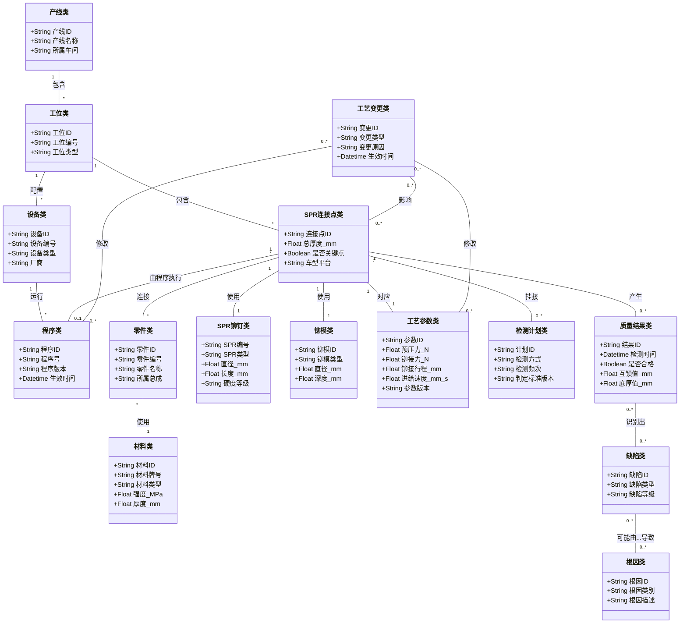

# 蔚来 SPR 工艺本体建设方案 v0.2


## 一、项目背景与建设定位

本项目面向蔚来新能源汽车车身装配中的 SPR（自冲铆）工艺场景，建设生产侧工艺本体，作为课题二“跨域跨尺度异构数据表征与推理”在制造场景中的业务试点。

SPR 工艺本体不应仅被理解为一份“实体关系表”，而应作为连接工艺知识、主数据、工艺规则、质量结果与现场经验的**统一语义底座**。它的核心价值不在于单纯存储数据，而在于支撑后续的治理、检索、追溯、推理、预警和智能问答。

### 1.1 当前业务痛点

1. 连接点、零件、材料、SPR 铆钉、铆模、设备程序、检测结果等数据分散在不同表格、系统与文档中，命名不统一、语义不一致。
2. 工艺知识大量沉淀在专家经验、SOP 文档和口头沟通中，难以结构化复用，也难以支撑新车型或新工位快速继承。
3. 质量问题追溯通常停留在单表或单批次分析，难以形成“连接点-工艺参数-设备程序-材料-缺陷-整改”的全链路关联。
4. 工艺变更发生后，影响范围主要依赖人工判断，缺少对受影响连接点、工位、检测计划和历史不良风险的系统化分析。
5. 现有工艺数据规模未必很大，但其跨对象、跨阶段、跨知识源的关联复杂度高，适合通过本体来沉淀“关系”和“规则”。

### 1.2 建设定位

SPR 工艺本体建议定位为以下三类能力的统一底座：

1. **语义治理底座**：统一主数据定义、命名规范、对象边界和关联关系。
2. **工艺推理底座**：固化选型逻辑、参数约束、质量判定规则和变更联动逻辑。
3. **智能应用底座**：支撑工艺查询、质量追溯、方案推荐、异常诊断和知识问答。

### 1.3 设计目标

1. 建立 SPR 工艺全链路统一语义模型，解决多源异构工艺数据难以贯通的问题。
2. 面向真实业务场景建设可落地的应用能力，而不是停留在概念展示层。
3. 将专家经验从文档和个人经验中抽离出来，沉淀为可计算、可复用、可追溯的规则体系。
4. 为点焊、螺柱、FDS、涂胶等其他连接工艺提供可复用的建模模板。
5. 为后续知识图谱、规则引擎、智能问答和工艺 Copilot 提供统一知识底座。


---

## 二、本体架构设计

### 2.1 总体架构

在原有“概念层-关系层-规则层-实例层”的四层结构基础上，建议补充一个轻量的“应用动作层”，形成“**四层主体 + 应用编排**”的设计方式。

| 分层 | 核心内容 | 直接支撑的能力 |
|------|----------|----------------|
| 概念层（Class） | 核心实体定义、对象边界、属性标准 | 统一语义、统一命名 |
| 关系层（ObjectProperty） | 实体间关联、上下游链路、引用关系 | 数据贯通、链路检索 |
| 规则层（Rule/SWRL） | 选型规则、参数约束、质量判定、变更联动 | 推理、校核、预警 |
| 实例层（Individual） | 实际工位、连接点、零件、程序、检测结果映射 | 落地应用、图谱构建 |
| 应用动作层（Action/Event） | 主动分析动作、事件触发动作、闭环流程 | 查询、推荐、预警、追溯 |

### 2.2 概念层：核心实体定义

为更好支撑应用，建议在原方案基础上补充“设备/程序/检测/变更”四类实体。



### 2.3 关系层：关联关系定义

| 关系名称 | 定义域 | 值域 | 说明 |
|----------|--------|------|------|
| hasStation | 产线类 | 工位类 | 产线包含工位 |
| belongsToStation | SPR连接点类 | 工位类 | 连接点归属工位 |
| hasEquipment | 工位类 | 设备类 | 工位配置设备 |
| runsProgram | 设备类 | 程序类 | 设备运行程序 |
| hasJoint | 工位类 | SPR连接点类 | 工位包含连接点 |
| joinsPart | SPR连接点类 | 零件类 | 连接点连接零件 |
| usesMaterial | 零件类 | 材料类 | 零件使用材料 |
| usesSPR | SPR连接点类 | SPR铆钉类 | 连接点使用铆钉 |
| usesDie | SPR连接点类 | 铆模类 | 连接点使用铆模 |
| hasParameter | SPR连接点类 | 工艺参数类 | 连接点对应工艺参数 |
| executedByProgram | SPR连接点类 | 程序类 | 连接点由某程序执行 |
| hasInspectionPlan | SPR连接点类 | 检测计划类 | 连接点挂接检测计划 |
| hasQualityResult | SPR连接点类 | 质量结果类 | 连接点产生质量结果 |
| hasDefect | 质量结果类 | 缺陷类 | 不合格结果关联缺陷 |
| causedBy | 缺陷类 | 根因类 | 缺陷可能根因 |
| affectsJoint | 工艺变更类 | SPR连接点类 | 变更直接影响连接点 |
| impactedByChange | SPR连接点类 | 工艺变更类 | 连接点受变更影响 |
| affectsParameter | 工艺变更类 | 工艺参数类 | 变更影响参数 |
| affectsProgram | 工艺变更类 | 程序类 | 变更影响程序 |
| nextStation | 工位类 | 工位类 | 工位先后顺序 |

### 2.4 核心约束规则


| 约束对象 | 约束表达式 | 说明 |
|----------|------------|------|
| SPR连接点类 | belongsToStation exactly 1 | 每个连接点必须唯一归属一个工位 |
| SPR连接点类 | usesSPR exactly 1 | 每个连接点必须对应一个 SPR 型号 |
| SPR连接点类 | usesDie exactly 1 | 每个连接点必须对应一个铆模 |
| SPR连接点类 | hasParameter min 1 | 每个连接点至少一组有效参数 |
| SPR连接点类（关键点） | hasInspectionPlan min 1 | 关键连接点必须挂接检测计划 |
| 零件类 | usesMaterial exactly 1 | 零件必须能追溯到材料定义 |
| 质量结果类（不合格） | hasDefect min 1 | 不合格结果必须标注缺陷 |
| 缺陷类 | causedBy min 1 | 已闭环缺陷至少应沉淀一个根因 |
| 工艺变更类 | affectsParameter or affectsProgram or affectsJoint min 1 | 变更必须明确影响对象 |
| 程序类 | hasVersion exactly 1 | 程序必须可版本追溯 |

### 2.5 规则层：业务逻辑固化

#### 2.5.1 SPR 选型规则

```swrl
Rule1: 材料类(?m) ∧ 材料类型(?m, "超高强钢") → 候选SPR类型(?m, "U-Typ")
Rule2: 材料类(?m) ∧ 材料类型(?m, "钢铝组合") → 候选SPR类型(?m, "P-Typ")
Rule3: SPR连接点类(?j) ∧ 总厚度_mm(?j, ?t) ∧ swrlb:greaterThan(?t, 4.0) → 候选长度等级(?j, "长铆钉")
Rule4: 候选SPR类型(?j, ?s) ∧ 候选长度等级(?j, ?l) → 推荐SPR方案(?j, ?s, ?l)
```

#### 2.5.2 参数校核规则

```swrl
Rule5: 工艺参数类(?p) ∧ 铆接力_N(?p, ?f) ∧ swrlb:lessThan(?f, 设定下限) → 参数状态(?p, "低于窗口")
Rule6: 工艺参数类(?p) ∧ 铆接行程_mm(?p, ?s) ∧ swrlb:greaterThan(?s, 设定上限) → 参数状态(?p, "高于窗口")
Rule7: 参数状态(?p, "低于窗口") ∨ 参数状态(?p, "高于窗口") → 需要复核(?p, True)
```

#### 2.5.3 质量判定规则

```swrl
Rule8: 质量结果类(?q) ∧ 互锁值_mm(?q, ?v) ∧ swrlb:lessThan(?v, 0.10) → 缺陷类型(?q, "互锁不足") ∧ 是否合格(?q, False)
Rule9: 质量结果类(?q) ∧ 底厚值_mm(?q, ?v) ∧ swrlb:lessThan(?v, 0.20) → 缺陷类型(?q, "刺穿") ∧ 是否合格(?q, False)
Rule10: 质量结果类(?q) ∧ 是否合格(?q, False) → 需要根因分析(?q, True)
```

#### 2.5.4 变更影响分析规则

```swrl
Rule11: 工艺变更类(?c) ∧ affectsProgram(?c, ?prog) ∧ executedByProgram(?j, ?prog) → 受影响连接点(?c, ?j)
Rule12: 工艺变更类(?c) ∧ affectsParameter(?c, ?p) ∧ hasParameter(?j, ?p) → 受影响连接点(?c, ?j)
Rule13: 受影响连接点(?c, ?j) ∧ 是否关键点(?j, True) → 变更风险等级(?c, "高")
```

---

## 三、工艺本体的应用体系

### 3.1 应用总体定位

SPR 工艺本体的价值，不在于把现有 Excel 原样搬到图数据库，而在于把“对象、关系、规则、事件、结论”组织成一个可查询、可推理、可触发的知识网络。建议将其应用分为六类核心场景。

### 3.2 核心应用场景总览

| 场景编号 | 应用场景 | 典型业务问题 | 本体语义链路 | 输出价值 |
|----------|----------|--------------|--------------|----------|
| A1 | 工艺主数据治理与标准化 | 同一连接点、零件、SPR、程序在不同表中命名不一致 | 连接点-工位-零件-材料-SPR-铆模-程序 | 统一编码、统一口径、减少歧义 |
| A2 | SPR 选型与方案复用 | 新车型/新连接点如何快速找到相似工艺方案 | 材料-厚度-强度-防腐要求-SPR-铆模-参数 | 选型建议、相似案例复用 |
| A3 | 参数发布校核与变更影响分析 | 参数、程序、材料变化后会影响哪些点位和检测计划 | 变更-程序/参数-连接点-关键点-检测计划-历史不良 | 影响范围识别、风险分级 |
| A4 | 质量追溯与根因定位 | 某类缺陷来自材料、参数、设备还是程序 | 缺陷-质量结果-连接点-参数-设备-程序-材料 | 根因定位、整改建议 |
| A5 | 现场异常诊断与经验复用 | 互锁不足、刺穿、屈服等异常如何快速定位和借鉴经验 | 异常现象-历史案例-连接点结构-参数窗口-整改动作 | 缩短诊断时间、提升首轮修复率 |
| A6 | 工艺知识服务与智能问答 | 工艺工程师如何用自然语言查询工艺知识 | 术语-对象-规则-案例-结论 | 支撑问答、培训和工艺 Copilot |

### 3.3 重点应用场景展开

#### 3.3.1 工艺主数据治理与标准化

本体在该场景中的核心作用，不是做简单字段映射，而是形成一套统一语义边界：

1. 明确“连接点、零件、材料、SPR、铆模、程序、检测计划、质量结果”各自的定义与边界。
2. 将 `连接点ID`、`工位编号`、`程序号`、`设备ID`、`检测记录号` 等主键建立统一关联关系。
3. 统一别名、缩写、字段语义和命名规范，减少跨团队沟通偏差。
4. 对关键对象增加完整性校验，例如关键连接点必须有检测计划，程序必须有版本，质量不合格必须有关联缺陷。

这类应用的直接成果是：后续无论做追溯、报表还是问答，都会基于同一套工艺对象定义，而不是基于不同团队各自理解。

#### 3.3.2 SPR 选型与工艺方案复用

这是最适合本体发挥价值的场景之一，因为该场景天然依赖“多因素组合 + 规则判断 + 历史案例复用”。

建议形成如下能力链路：

1. 输入条件：上层零件材料、下层零件材料、强度等级、板厚组合、防腐要求、结构位置、是否关键点。
2. 本体推理：根据材料类型、总厚度、强度区间和历史可行方案，推荐候选 SPR 型号、长度等级、铆模组合和参数窗口。
3. 案例复用：沿着“相似材料组合-相似总厚度-相似车型结构-历史合格率”检索相似连接点案例。
4. 方案解释：不仅给出推荐结果，还能说明“为什么推荐该方案”，例如因为同类钢铝组合在过去车型中已验证通过，且缺陷率较低。

这使得本体不只是“查已有答案”，而是支持“带解释的工艺推荐”。

#### 3.3.3 参数发布校核与变更影响分析

当以下对象发生变化时：

1. 工艺参数版本变更。
2. 设备程序版本变更。
3. 上下层零件材料变更。
4. SPR 型号或铆模切换。

本体可以自动分析：

1. 哪些连接点受到影响。
2. 这些连接点是否为关键点。
3. 是否挂接了专项检测计划。
4. 历史上这些连接点是否出现过缺陷高发。
5. 是否需要重新验证参数窗口、更新 SOP 或补充试验。

这类应用的关键不在“变更记录”，而在“变更影响对象网络”。本体能够把变更与连接点、程序、参数、检测计划、质量风险统一挂接，从而支撑更可靠的变更审批与发布。

#### 3.3.4 质量追溯与根因定位

SPR 质量问题往往不是单一因素导致，而是“结构条件 + 材料特性 + 工艺参数 + 设备状态 + 程序版本”共同作用的结果。本体的优势在于支持多跳追溯。

建议重点支撑以下追溯链路：

1. **缺陷到连接点**：某批次出现“互锁不足”，快速定位对应连接点、工位、车型、结构位置。
2. **连接点到参数/程序**：追溯当时使用的参数版本、程序版本和设备资源。
3. **连接点到材料/结构**：查看上下层零件材料、厚度组合、总厚度、历史同类案例。
4. **缺陷到根因**：基于既有规则与历史经验，将异常归因为参数偏离、材料偏差、模具磨损、设备波动或方案不匹配。
5. **根因到整改动作**：关联已验证的整改措施，如提升铆接力、更换铆模、调整程序窗口、追加检测频次等。

相比传统表格追溯，本体更适合处理“一个缺陷对应多条可能路径”的复杂诊断问题。

#### 3.3.5 现场异常诊断与经验复用

现场工程师真正高频的需求，往往不是“看全量模型”，而是“遇到问题时能不能快速找到相似案例和建议动作”。

本体可以将以下知识结构化沉淀：

1. 异常现象：互锁不足、刺穿、头部下沉、无互锁、偏位等。
2. 可能根因：材料异常、总厚度偏离、参数越界、程序版本问题、模具磨损、设备状态异常。
3. 诊断步骤：先看哪几个参数，先排查哪个程序或设备，再看哪些检测结果。
4. 整改动作：参数调整建议、更换资源建议、复检建议、加严监控建议。
5. 经验适用范围：在哪类材料组合、厚度区间、车型平台中有效。

沉淀后，可将“专家经验”从个人脑中转移到组织知识底座中，减少经验断层。

#### 3.3.6 工艺知识服务与智能问答

当本体具备统一对象定义、规则和案例后，可以很自然地支撑后续智能问答。相比纯文档检索，基于本体的问答可以提供更强的结构化检索、路径解释和结果追溯能力。

### 3.4 主动 Action 设计

| Action ID | 名称 | 触发条件 | 核心处理逻辑 | 输出 |
|-----------|------|----------|--------------|------|
| ACT-001 | 连接点语义校验 | 新点表导入/数据更新 | 校验命名、归属、必填关系、编码规范 | 校验报告 |
| ACT-002 | SPR 方案推荐 | 新连接点设计/新车型导入 | 按材料、厚度、历史合格案例推荐 SPR/铆模/参数窗口 | 候选方案清单 |
| ACT-003 | 参数窗口校核 | 程序或参数发布前 | 检查参数是否落在已批准窗口内 | 发布校核结果 |
| ACT-004 | 变更影响分析 | 参数/程序/材料/资源变更 | 自动识别受影响连接点、关键点、检测计划和高风险案例 | 影响分析报告 |
| ACT-005 | 质量异常根因分析 | 缺陷批量出现/单点异常 | 沿本体关系追溯参数、材料、程序、设备和历史案例 | 根因候选与处置建议 |
| ACT-006 | 相似工艺复用检索 | 新平台工艺设计 | 检索相似材料组合、总厚度和历史通过案例 | 复用案例集 |
| ACT-007 | 工艺知识问答 | 工程师发起查询 | 基于对象关系和规则进行结构化检索 | 问答结果 |

### 3.5 反应式规则设计


| 规则ID | 名称 | 触发条件（WHEN） | 执行动作（THEN） |
|--------|------|------------------|------------------|
| R001 | 关键点完整性校验 | 新增关键连接点且无检测计划 | 阻止发布并创建补录任务 |
| R002 | 参数越界预警 | 参数值超出批准窗口 | 创建预警并通知工艺工程师 |
| R003 | 质量异常升级 | 同类缺陷在同工位连续超阈值 | 自动升级为质量专题问题 |
| R004 | 变更联动分析 | 程序版本或参数版本更新 | 自动生成受影响连接点清单 |
| R005 | 选型复核触发 | 材料或总厚度发生变化 | 重新触发 SPR/铆模推荐 |
| R006 | 缺陷闭环约束 | 不合格结果无缺陷与根因信息 | 阻止问题关闭 |
| R007 | 经验沉淀提醒 | 某类异常重复出现且已有处理记录 | 生成知识卡片沉淀任务 |
| R008 | 相似案例推荐 | 新连接点创建完成 | 自动推荐相似结构历史案例 |

---

## 四、数据映射方案

### 4.1 现有数据可映射范围

| 蔚来提供文件 | 映射到本体实体 | 对应字段 | 当前价值 |
|--------------|----------------|----------|----------|
| `die_dims.xlsx` | 铆模类 | 铆模编号、类型、直径、深度、容积 | 形成铆模主数据 |
| `rivet_dims.xlsx` | SPR铆钉类 | SPR 型号、长度、直径、硬度等级 | 形成 SPR 主数据 |
| `material_strength.xlsx` | 零件类、材料类 | 材料牌号、强度值、零件类型 | 形成材料约束基础 |
| `点表数据.xlsx` | SPR连接点类、工位类、产线类 | 连接点 ID、坐标、工位、产线、总厚度 | 形成点位骨架 |
| `连接数据命名规范.xlsx` | 全实体通用 | 命名规则、字段语义、编码规范 | 支撑语义治理 |

### 4.2 为支撑应用，建议新增接入的数据

| 数据主题 | 映射实体 | 关键字段 | 主要支撑场景 |
|----------|----------|----------|--------------|
| 设备台账 | 设备类 | 设备编号、类型、厂商、安装工位 | 追溯、变更分析 |
| 程序版本数据 | 程序类 | 程序号、版本、生效时间、适用工位 | 变更、追溯、问答 |
| 参数下发记录 | 工艺参数类 | 参数值、版本、发布时间、生效范围 | 参数校核、追溯 |
| 检测计划/抽检规则 | 检测计划类 | 检测方式、频次、判定标准版本 | 关键点治理、质量闭环 |
| 质量检测结果 | 质量结果类、缺陷类 | 互锁值、底厚值、是否合格、缺陷类型 | 质量追溯、根因分析 |
| 异常与整改记录 | 根因类、工艺变更类 | 问题描述、原因、整改动作、验证结果 | 经验复用、知识沉淀 |
| SOP/调试文档 | 规则层与知识卡片 | 适用条件、步骤、边界、禁忌项 | 工艺问答、专家经验沉淀 |
