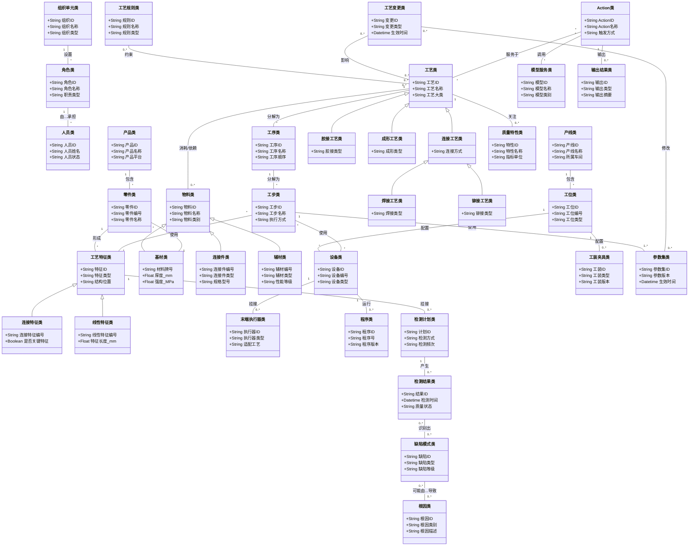

# 顶层工艺本体建设方案 v0.2

## 一、建设目标与定位

本方案用于在现有 SPR 工艺本体之上，抽象出一套**可复用、可扩展、可继承**的顶层工艺本体。其目标不是替代现有 SPR 本体，而是为不同制造工艺提供统一的语义骨架，使 SPR、点焊、FDS、涂胶、滚边、螺接、激光焊等工艺都能够在同一框架下自然继承和扩展。

### 1.1 建设目标

1. 建立跨工艺共享的顶层概念层，避免每引入一种新工艺就重新设计一套本体。
2. 为不同工艺提供统一的实体类型、关系类型、规则承载方式和 Action 承载方式。
3. 支撑工艺主数据治理、工艺知识沉淀、质量追溯、异常诊断、变更分析、模型调用和智能问答。
4. 保持顶层本体稳定，将具体工艺的专有知识下沉到各工艺扩展层中。
5. 保证现有 SPR 本体可以在不改变其内部定义的前提下，整体继承到顶层工艺本体之下。

### 1.2 设计定位

顶层工艺本体建议定位为“**制造工艺统一语义骨架**”，主要承担以下三类职责：

1. **统一语义底座**：统一工艺相关对象、资源、质量、规则、事件和 Action 的抽象定义。
2. **统一继承底座**：为不同工艺提供公共父类和公共关系，支持新工艺快速接入。
3. **统一应用底座**：支撑工艺查询、工艺推荐、质量分析、模型编排和知识问答等应用。

### 1.3 设计原则

1. **顶层稳定、领域扩展**：顶层只定义稳定概念，不写死某一具体工艺语义。
2. **对象与动作分层**：实体类、关系类、规则类、事件类、Action 类分开建模。
3. **工艺无关抽象优先**：优先抽象为“工艺特征、工序、资源、质量特性”等通用概念。
4. **兼容现有 SPR 本体**：保持 SPR 本体内部实体、关系、规则与 Action 定义不变，仅补充继承关系。
5. **便于新工艺接入**：新工艺只需新增专有子类、专有规则和专有 Action，不需要推翻顶层结构。

---

## 二、顶层工艺本体总体结构

### 2.1 总体结构

顶层工艺本体采用“**基础元层 + 九大核心域 + 工艺扩展层**”的结构设计方式。

| 层级/域 | 核心内容 | 作用 |
|--------|----------|------|
| 基础元层 | 实体、版本、追溯、事件、规则、文档等通用抽象 | 为所有领域提供统一元语义 |
| 组织与职责域 | 组织、角色、人员、资质、责任 | 描述谁提出、谁执行、谁审批、谁维护 |
| 产品与结构域 | 产品、总成、零件、工艺特征、结构位置 | 描述工艺作用对象 |
| 物料域 | 基材、连接件、辅材、消耗件、材料属性 | 描述工艺相关物料 |
| 资源与设备域 | 产线、工位、设备、工装、程序、传感器 | 描述工艺执行资源 |
| 工艺域 | 工艺类型、工艺路线、工序、工步、参数集、工艺方案 | 描述工艺如何执行 |
| 质量域 | 质量特性、检测计划、检测结果、缺陷、根因、措施 | 描述质量闭环 |
| 知识与规则域 | 标准、SOP、规则、约束、案例、术语、知识卡片 | 描述知识沉淀与约束逻辑 |
| 事件与变更域 | 变更、发布、异常、预警、审批、验证、批次 | 描述动态演化过程 |
| 能力与 Action 域 | 模型服务、Action、触发器、输入输出模板、工作流 | 描述主动分析与模型调用 |
| 工艺扩展层 | SPR、点焊、FDS、涂胶、滚边等具体工艺扩展 | 承接专有知识与专有能力 |

### 2.2 顶层本体的建模主轴

顶层工艺本体围绕以下四条主轴组织：

1. **工艺作用对象主轴**：产品 → 零件/结构 → 工艺特征
2. **工艺执行主轴**：工艺类型 → 工艺路线 → 工序/工步 → 参数集/程序/设备
3. **质量闭环主轴**：质量特性 → 检测计划 → 检测结果 → 缺陷 → 根因 → 措施
4. **主动能力主轴**：事件/触发条件 → Action → 模型/规则 → 输出结果

### 2.3 工艺扩展层的定位

顶层工艺本体只定义跨工艺共享的父类和公共关系。  
具体工艺（如 SPR、点焊、FDS、涂胶、滚边等）作为扩展层，继承顶层本体中的相关父类，并补充：

1. 工艺专有特征类；
2. 工艺专有资源类；
3. 工艺专有参数类；
4. 工艺专有质量特性和缺陷类；
5. 工艺专有规则与 Action。

---

## 三、概念层：核心实体定义

为更直观展示顶层工艺本体的主干结构，下面给出概念层示意图。该图重点呈现顶层本体中的关键类、继承关系和主关联链路；完整类目与定义仍以下表为准。

> 说明：该图是顶层工艺本体的主干示意图，重点展示“产品/特征—工艺执行—资源设备—质量闭环—规则/变更—Action/模型”六条主链路。具体完整类目、父类关系和定义以本章后续表格为准。

> 说明：下列表格中的“父类”用于体现继承关系。对于顶层本体中的最高层类，父类留空。
### 3.1 基础元层

| 类名 | 说明 | 父类 |
|------|------|------|
| 实体类 | 所有可命名、可标识、可管理对象的统一父类 |  |
| 版本化对象类 | 具有版本号、生效时间、失效时间等属性的对象 | 实体类 |
| 可追溯对象类 | 具有来源、责任主体、更新时间、数据来源等信息的对象 | 实体类 |
| 事件类 | 描述状态变化、业务发生、触发分析的对象 | 实体类 |
| 规则类 | 描述约束、判断逻辑、推理逻辑的对象 | 实体类 |
| 文档类 | 描述标准、SOP、报告、记录等文档对象 | 可追溯对象类 |

### 3.2 组织与职责域

| 类名 | 说明 | 父类 |
|------|------|------|
| 组织单元类 | 表示工厂、车间、研究院、班组等组织单元 | 实体类 |
| 角色类 | 表示工艺工程师、质量工程师、设备工程师、操作员等岗位角色 | 实体类 |
| 人员类 | 表示具体自然人或账号主体 | 实体类 |
| 资质类 | 表示上岗资质、检测资质、工艺授权等 | 实体类 |
| 责任类 | 表示发布责任、审批责任、维护责任、整改责任等职责定义 | 实体类 |

### 3.3 产品与结构域

| 类名 | 说明 | 父类 |
|------|------|------|
| 产品类 | 表示车型、产品平台、产品对象的统一抽象 | 实体类 |
| 总成类 | 表示产品下的总成对象 | 产品类 |
| 分总成类 | 表示总成下的分总成对象 | 总成类 |
| 零件类 | 表示参与制造与装配的零部件对象 | 实体类 |
| 结构位置类 | 表示前后左右上下、区域、部位、坐标等结构位置信息 | 实体类 |
| 工艺特征类 | 表示工艺作用的最小特征对象的统一父类 | 实体类 |
| 连接特征类 | 表示连接点、焊点、螺接点、FDS 点等离散连接特征 | 工艺特征类 |
| 线性特征类 | 表示胶路、焊缝、包边线等线性工艺特征 | 工艺特征类 |
| 面特征类 | 表示涂覆区域、压装区域等面状工艺特征 | 工艺特征类 |
| 边缘特征类 | 表示滚边边缘、翻边边缘等边界型特征 | 工艺特征类 |

### 3.4 物料域

| 类名 | 说明 | 父类 |
|------|------|------|
| 物料类 | 所有与工艺相关的材料、连接件、辅材、消耗件的统一抽象 | 实体类 |
| 基材类 | 表示钢板、铝板、复合材料板等基体材料 | 物料类 |
| 连接件类 | 表示 SPR 铆钉、FDS 螺钉、螺柱、螺栓、螺母等连接件 | 物料类 |
| 辅材类 | 表示胶、密封剂、焊丝、保护气等辅助材料 | 物料类 |
| 消耗件类 | 表示电极帽、喷嘴、刀头等易耗类资源 | 物料类 |
| 材料属性类 | 表示厚度、强度、硬度、表面状态、防腐要求等材料属性对象 | 实体类 |

### 3.5 资源与设备域

| 类名 | 说明 | 父类 |
|------|------|------|
| 资源类 | 所有执行工艺所需资源的统一抽象 | 实体类 |
| 工厂资源类 | 表示产线、工位、工区等制造空间资源 | 资源类 |
| 产线类 | 表示制造产线 | 工厂资源类 |
| 工位类 | 表示工位、工位段、工位单元 | 工厂资源类 |
| 设备类 | 表示制造设备的统一父类 | 资源类 |
| 主机设备类 | 表示铆接主机、焊接主机、涂胶主机等 | 设备类 |
| 机器人类 | 表示工业机器人等自动化执行设备 | 设备类 |
| 检测设备类 | 表示 UT 检测仪、视觉检测仪、尺寸检测设备等 | 设备类 |
| 末端执行器类 | 表示 SPR 枪、点焊钳、涂胶枪、滚边头等末端装置 | 资源类 |
| 工装夹具类 | 表示铆模、定位夹具、支撑模、压紧装置等工装资源 | 资源类 |
| 传感器类 | 表示力、位移、温度、视觉、振动等传感器对象 | 资源类 |
| 数字资源类 | 表示程序、参数文件、控制配方、模型接口等数字资源 | 资源类 |
| 程序类 | 表示控制程序、机器人程序、工艺程序等 | 数字资源类 |
| 参数文件类 | 表示参数包、参数文件、配方文件等 | 数字资源类 |

### 3.6 工艺域

| 类名 | 说明 | 父类 |
|------|------|------|
| 工艺类 | 所有制造工艺类型的统一父类 | 实体类 |
| 连接工艺类 | 表示以连接为目的的工艺大类 | 工艺类 |
| 焊接工艺类 | 表示点焊、激光焊、弧焊等焊接类工艺 | 连接工艺类 |
| 铆接工艺类 | 表示 SPR、自冲铆、半空心铆接等铆接类工艺 | 连接工艺类 |
| 螺接工艺类 | 表示拧紧、螺柱、FDS 等螺接类工艺 | 连接工艺类 |
| 胶接工艺类 | 表示结构胶连接、密封、涂胶等工艺 | 连接工艺类 |
| 成形工艺类 | 表示滚边、翻边、压装、整形等成形类工艺 | 工艺类 |
| 检测工艺类 | 表示 UT 检测、视觉检测、尺寸检测、破坏试验等检测类工艺 | 工艺类 |
| 工艺路线类 | 表示产品或分总成执行的一条完整工艺路线 | 实体类 |
| 工序类 | 表示工艺路线中的工序阶段 | 实体类 |
| 工步类 | 表示工序下的细分执行步骤 | 实体类 |
| 参数集类 | 表示工艺执行时所需参数集合 | 版本化对象类 |
| 工艺窗口类 | 表示参数允许范围、工艺窗口、能力边界 | 版本化对象类 |
| 工艺方案类 | 表示某工艺在特定场景下的完整方案定义 | 版本化对象类 |

### 3.7 质量域

| 类名 | 说明 | 父类 |
|------|------|------|
| 质量特性类 | 表示互锁值、底厚值、焊核直径、扭矩、胶宽等质量评价特征 | 实体类 |
| 检测计划类 | 表示抽检、全检、巡检等检测计划 | 版本化对象类 |
| 检测方法类 | 表示 UT、视觉、破检、尺寸测量等检测方法 | 实体类 |
| 检测结果类 | 表示检测后形成的数据和结论 | 可追溯对象类 |
| 质量状态类 | 表示合格、待复核、不合格等状态 | 实体类 |
| 缺陷模式类 | 表示互锁不足、刺穿、虚焊、漏胶、偏位等缺陷模式 | 实体类 |
| 根因类 | 表示参数偏离、设备波动、材料异常、模具磨损等根因 | 实体类 |
| 纠正措施类 | 表示针对异常已执行的纠正动作 | 实体类 |
| 预防措施类 | 表示为避免重复问题而制定的预防动作 | 实体类 |

### 3.8 知识与规则域

| 类名 | 说明 | 父类 |
|------|------|------|
| 标准规范类 | 表示国家标准、企业标准、工艺标准等 | 文档类 |
| SOP类 | 表示标准作业指导书、调试说明、操作规范等 | 文档类 |
| 工艺规则类 | 表示选型规则、参数规则、判定规则、影响分析规则等 | 规则类 |
| 约束类 | 表示完整性约束、唯一性约束、基数约束、值域约束等 | 规则类 |
| 经验案例类 | 表示历史工艺案例、问题案例、整改案例等 | 可追溯对象类 |
| 术语字典类 | 表示对象别名、缩写、字段语义、术语映射等 | 实体类 |
| 知识卡片类 | 表示沉淀后的经验条目、诊断卡片、推荐卡片等 | 可追溯对象类 |

### 3.9 事件与变更域

| 类名 | 说明 | 父类 |
|------|------|------|
| 工艺变更类 | 表示参数、程序、材料、资源等发生的工艺变更 | 事件类 |
| 版本发布类 | 表示程序、参数、SOP、规则等对象的版本发布 | 事件类 |
| 异常事件类 | 表示质量异常、设备异常、数据异常等事件 | 事件类 |
| 预警事件类 | 表示越界、缺失、风险升高等触发预警的事件 | 事件类 |
| 审批事件类 | 表示工艺审批、变更审批、发布审批等事件 | 事件类 |
| 验证事件类 | 表示试验验证、工艺验证、复核验证等事件 | 事件类 |
| 批次类 | 表示批次、班次、时间段、车型批号等批处理对象 | 实体类 |

### 3.10 能力与 Action 域

| 类名 | 说明 | 父类 |
|------|------|------|
| 能力服务类 | 表示可被调用的识别、诊断、推荐、预测、问答等能力 | 实体类 |
| 模型服务类 | 表示具体模型、小模型或服务接口 | 能力服务类 |
| Action类 | 表示可主动执行的语义动作、分析动作、模型调用动作 | 实体类 |
| 触发器类 | 表示定时、事件、人工发起、规则触发等触发方式 | 实体类 |
| 输入模板类 | 表示 Action 所需的标准化输入结构 | 实体类 |
| 输出结果类 | 表示 Action 的输出对象、分析结果、建议结果 | 实体类 |
| 工作流类 | 表示多个 Action 组合形成的流程编排 | 实体类 |

---

## 四、关系层：关联关系定义

| 关系名称 | 定义域 | 值域 | 说明 |
|----------|--------|------|------|
| partOf | 实体类 | 实体类 | 表示组成、隶属、从属关系 |
| belongsToOrg | 人员类/角色类 | 组织单元类 | 表示人员或角色归属组织 |
| hasRole | 人员类 | 角色类 | 表示人员具备的角色 |
| hasQualification | 人员类/角色类 | 资质类 | 表示人员或角色具备的资质 |
| ownsResponsibility | 角色类/组织单元类 | 责任类 | 表示角色或组织承担的责任 |
| hasSubAssembly | 产品类/总成类 | 总成类/分总成类 | 表示产品的装配层级关系 |
| hasPart | 总成类/分总成类 | 零件类 | 表示总成或分总成包含零件 |
| locatedAt | 零件类/工艺特征类/设备类 | 结构位置类 | 表示对象所在位置 |
| hasFeature | 产品类/总成类/分总成类/零件类 | 工艺特征类 | 表示对象包含工艺特征 |
| joinsPart | 连接特征类 | 零件类 | 表示连接特征连接哪些零件 |
| usesMaterial | 零件类 | 基材类 | 表示零件使用的基材 |
| hasMaterialProperty | 基材类/连接件类/辅材类 | 材料属性类 | 表示物料具备的属性 |
| consumesMaterial | 工艺类/工步类 | 物料类 | 表示工艺执行时消耗或依赖物料 |
| executedAtLine | 工艺路线类/工序类/工步类 | 产线类 | 表示工艺在产线层面执行 |
| executedAtStation | 工序类/工步类/Action类 | 工位类 | 表示工序、工步或 Action 在工位执行 |
| usesResource | 工艺类/工序类/工步类/检测方法类 | 资源类 | 表示工艺或检测使用资源 |
| hasEquipment | 工位类 | 设备类 | 表示工位配置设备 |
| hasEndEffector | 设备类/机器人类 | 末端执行器类 | 表示设备挂接末端执行器 |
| hasTooling | 工位类/设备类/工步类 | 工装夹具类 | 表示工位、设备或工步使用工装 |
| hasSensor | 设备类/工位类 | 传感器类 | 表示设备或工位配置传感器 |
| runsProgram | 设备类/工步类 | 程序类 | 表示设备或工步运行程序 |
| usesParameterFile | 工步类/程序类 | 参数文件类 | 表示工步或程序使用参数文件 |
| appliesProcess | 工序类/工步类 | 工艺类 | 表示工序或工步执行某类工艺 |
| appliedToFeature | 工艺类/工步类 | 工艺特征类 | 表示工艺作用于特征对象 |
| hasParameterSet | 工艺类/工序类/工步类 | 参数集类 | 表示对象具备参数集 |
| constrainedByWindow | 参数集类 | 工艺窗口类 | 表示参数集受工艺窗口约束 |
| hasQualityCharacteristic | 工艺类/工艺特征类 | 质量特性类 | 表示工艺或特征关注的质量特性 |
| hasInspectionPlan | 工艺特征类/工步类 | 检测计划类 | 表示对象挂接检测计划 |
| usesInspectionMethod | 检测计划类 | 检测方法类 | 表示计划采用的检测方法 |
| producesInspectionResult | 工艺特征类/工步类 | 检测结果类 | 表示产生的检测结果 |
| hasQualityState | 检测结果类 | 质量状态类 | 表示检测结果对应的质量状态 |
| hasDefect | 检测结果类 | 缺陷模式类 | 表示结果识别出的缺陷 |
| causedBy | 缺陷模式类 | 根因类 | 表示缺陷可能由某类根因导致 |
| correctedBy | 缺陷模式类/根因类 | 纠正措施类 | 表示缺陷或根因对应的纠正措施 |
| preventedBy | 缺陷模式类/根因类 | 预防措施类 | 表示缺陷或根因对应的预防措施 |
| governedByRule | 工艺类/工艺方案类/Action类 | 工艺规则类 | 表示对象受哪些规则约束 |
| constrainedBy | 实体类 | 约束类 | 表示对象受何种约束 |
| supportedByDocument | 实体类/规则类/Action类 | 文档类 | 表示对象可追溯到的文档依据 |
| hasCase | 工艺类/缺陷模式类/根因类 | 经验案例类 | 表示对象关联的案例 |
| triggeredByEvent | Action类/工作流类 | 事件类/触发器类 | 表示 Action 的触发条件 |
| invokesCapability | Action类 | 能力服务类 | 表示 Action 调用的能力服务 |
| invokesModel | Action类 | 模型服务类 | 表示 Action 调用的具体模型 |
| usesInputTemplate | Action类 | 输入模板类 | 表示 Action 的输入模板 |
| producesOutput | Action类 | 输出结果类 | 表示 Action 的输出对象 |
| affectedByChange | 实体类 | 工艺变更类 | 表示对象受工艺变更影响 |
| affectsEntity | 工艺变更类 | 实体类 | 表示工艺变更影响的对象 |
| releasedBy | 版本化对象类 | 版本发布类 | 表示对象通过版本发布生效 |
| requiresApproval | 工艺变更类/版本发布类 | 审批事件类 | 表示变更或发布需要审批 |
| requiresValidation | 工艺变更类/工艺方案类 | 验证事件类 | 表示对象需要验证 |
| belongsToBatch | 检测结果类/异常事件类/工艺变更类 | 批次类 | 表示对象归属的批次或时段 |

---

## 五、核心约束建议

| 约束对象 | 约束表达式 | 说明 |
|----------|------------|------|
| 工艺特征类 | partOf min 1 | 每个工艺特征至少归属一个上层产品/结构对象 |
| 工序类 | appliesProcess min 1 | 每个工序至少执行一种工艺 |
| 工步类 | appliesProcess exactly 1 | 每个工步应明确唯一主工艺 |
| 参数集类 | constrainedByWindow min 1 | 每组参数至少有一套工艺窗口约束 |
| 检测结果类 | hasQualityState exactly 1 | 每个检测结果必须对应一个质量状态 |
| 检测结果类（不合格） | hasDefect min 1 | 不合格结果至少标注一个缺陷 |
| 缺陷模式类（闭环） | causedBy min 1 | 已闭环缺陷至少沉淀一个根因 |
| 工艺变更类 | affectsEntity min 1 | 每次工艺变更必须明确影响对象 |
| Action类 | invokesCapability min 1 | 每个 Action 至少对应一个能力服务 |
| 模型服务类 | usesInputTemplate min 0 | 模型服务可绑定标准输入模板 |
| 版本化对象类 | releasedBy min 0 | 版本化对象可追溯到其发布动作 |

---

## 六、主动 Action 设计

| Action ID | 名称 | 触发条件 | 核心处理逻辑 | 输出 |
|-----------|------|----------|--------------|------|
| ACT-001 | 主数据语义校验 | 新对象导入、字段变更、主数据更新 | 校验编码规范、命名规范、父子关系、必填属性和引用完整性 | 语义校验报告 |
| ACT-002 | 工艺方案推荐 | 新工艺特征创建、新车型导入、新结构设计 | 根据材料、结构、历史案例、规则库推荐候选工艺方案 | 候选工艺方案清单 |
| ACT-003 | 参数窗口校核 | 参数发布前、程序更新前、工艺复核时 | 检查参数是否落入已批准工艺窗口，识别越界和风险项 | 参数校核结果 |
| ACT-004 | 程序与资源一致性检查 | 程序版本更新、设备切换、工位变更 | 校验程序、设备、末端执行器、工装之间的匹配关系 | 一致性检查报告 |
| ACT-005 | 变更影响分析 | 材料、参数、程序、设备、规则发生变更 | 沿本体关系识别受影响的工艺特征、工位、检测计划和历史高风险对象 | 影响分析报告 |
| ACT-006 | 检测计划生成/复核 | 新增关键特征、质量要求变化、工艺切换 | 根据关键性、历史缺陷、法规要求自动生成或复核检测计划 | 检测计划建议 |
| ACT-007 | 质量异常识别 | 检测结果导入、在线监测触发、异常阈值触发 | 调用识别模型或规则引擎，识别异常状态和潜在缺陷模式 | 异常识别结果 |
| ACT-008 | 根因诊断分析 | 缺陷出现、质量状态不合格、连续异常发生 | 结合参数、程序、设备、材料、案例进行多跳诊断 | 根因候选列表 |
| ACT-009 | 整改与优化建议生成 | 根因诊断完成、缺陷重复发生、人工发起分析 | 输出参数调整、资源替换、检测加严、方案替换等建议 | 纠正/优化建议 |
| ACT-010 | 相似案例检索 | 新工艺设计、问题复盘、工程师查询 | 按材料组合、结构相似性、缺陷相似性检索历史案例 | 相似案例集 |
| ACT-011 | 风险预警生成 | 参数越界、缺陷连续超阈、关键对象缺失信息 | 触发预警规则，生成风险等级和责任对象 | 风险预警单 |
| ACT-012 | 规则合规审查 | 方案评审、参数审批、发布审批 | 对照标准、SOP、工艺规则、约束检查工艺方案合规性 | 合规审查报告 |
| ACT-013 | 知识卡片沉淀 | 问题闭环完成、经验稳定形成、专家确认后 | 将案例、根因、措施和适用条件沉淀为知识卡片 | 知识卡片 |
| ACT-014 | 工艺知识问答 | 工程师自然语言提问、系统查询调用 | 基于本体、规则、案例、文档进行结构化检索与回答 | 问答结果 |
| ACT-015 | 多 Action 工作流编排 | 复杂问题处置、批量分析、闭环管理 | 串联多个 Action 与模型，形成从识别到建议到闭环的流程 | 工作流执行结果 |

---

## 七、新工艺接入机制

### 7.1 接入原则

新工艺接入顶层工艺本体时，应遵循“**顶层不改骨架、领域扩展补专用**”的原则。  
除非出现跨工艺共享的新抽象，否则不应直接修改顶层类和顶层关系，而应通过新增子类方式接入。

### 7.2 新工艺接入的标准步骤

| 步骤 | 内容 | 说明 |
|------|------|------|
| Step-1 | 识别工艺归属 | 判断该工艺属于连接工艺、成形工艺、胶接工艺还是检测工艺 |
| Step-2 | 定义工艺专有特征 | 明确该工艺作用对象属于连接特征、线性特征、面特征还是边缘特征，必要时新增子类 |
| Step-3 | 定义专有资源 | 补充该工艺的专用设备、末端执行器、工装夹具、传感器、程序资源 |
| Step-4 | 定义专有物料 | 补充该工艺所依赖的基材、连接件、辅材、消耗件 |
| Step-5 | 定义专有参数与窗口 | 补充参数集、参数窗口、工艺方案及其版本机制 |
| Step-6 | 定义质量特性与缺陷 | 补充该工艺的关键质量特性、检测方法、缺陷模式、根因类型 |
| Step-7 | 定义专有规则 | 补充选型规则、参数规则、判定规则、变更规则 |
| Step-8 | 定义专有 Action | 补充识别、推荐、诊断、优化、问答等 Action |
| Step-9 | 映射实例数据 | 将点表、程序表、质量表、设备表、SOP 等映射为实例层对象 |
| Step-10 | 验证继承正确性 | 检查新工艺是否仅通过新增子类完成接入，避免破坏顶层结构稳定性 |

### 7.3 新工艺接入后的最小扩展包

| 扩展包类别 | 需要补充的内容 | 是否必须 |
|------------|----------------|----------|
| 工艺扩展包 | 工艺子类、工艺路线/工序/工步模板 | 是 |
| 特征扩展包 | 工艺专有特征子类 | 是 |
| 资源扩展包 | 专有设备、工装、程序、检测设备 | 是 |
| 物料扩展包 | 专有连接件、辅材、消耗件 | 视工艺而定 |
| 参数扩展包 | 参数集、参数窗口、工艺方案 | 是 |
| 质量扩展包 | 质量特性、检测方法、缺陷模式、根因 | 是 |
| 规则扩展包 | 选型、校核、判定、影响分析规则 | 是 |
| Action扩展包 | 模型调用、推荐、诊断、问答等能力 | 建议补充 |

### 7.4 新工艺接入示例说明

1. **点焊接入**：可继承“焊接工艺类、连接特征类、末端执行器类、质量特性类、缺陷模式类”等父类，并扩展焊点、电极帽、焊核直径、虚焊等专有对象。
2. **涂胶接入**：可继承“胶接工艺类、线性特征类、辅材类、末端执行器类、质量特性类”等父类，并扩展胶路、胶宽、胶高、断胶、漏胶等专有对象。
3. **滚边接入**：可继承“成形工艺类、边缘特征类、工装夹具类、质量特性类”等父类，并扩展滚边边缘、滚边头、包边高度、开裂等专有对象。
4. **FDS 接入**：可继承“螺接工艺类、连接特征类、连接件类、参数集类、缺陷模式类”等父类，并扩展 FDS 点、FDS 螺钉、扭矩/转角等专有对象。

---

## 八、SPR 本体继承方案（保持现有 SPR 本体不变）

### 8.1 继承原则

现有 SPR 本体中的实体、关系、约束规则和 Action 定义均**保持原方案不变**。  
本章节仅在顶层工艺本体之上补充其父类归属关系，使其成为“顶层工艺本体下的一个工艺扩展层”。

### 8.2 现有 SPR 本体核心实体（保持原定义）

以下实体名称及其内部定义与现有 SPR 本体方案保持一致：

- 产线类
- 工位类
- 设备类
- 程序类
- 零件类
- 材料类
- SPR连接点类
- SPR铆钉类
- 铆模类
- 工艺参数类
- 检测计划类
- 质量结果类
- 缺陷类
- 根因类
- 工艺变更类

### 8.3 SPR 实体到顶层工艺本体的继承映射

| SPR 实体类 | 顶层父类 | 说明 |
|------------|----------|------|
| 产线类 | 产线类 | SPR 本体中的产线类直接继承顶层产线类 |
| 工位类 | 工位类 | SPR 本体中的工位类直接继承顶层工位类 |
| 设备类 | 设备类 | SPR 本体中的设备类直接继承顶层设备类 |
| 程序类 | 程序类 | SPR 本体中的程序类直接继承顶层程序类 |
| 零件类 | 零件类 | SPR 本体中的零件类直接继承顶层零件类 |
| 材料类 | 基材类 | SPR 本体中的材料类可作为顶层基材类的工艺域子类 |
| SPR连接点类 | 连接特征类 | SPR 连接点是离散连接特征的一种具体子类 |
| SPR铆钉类 | 连接件类 | SPR 铆钉是连接件类的一种具体子类 |
| 铆模类 | 工装夹具类 | 铆模是工装夹具类的一种具体子类 |
| 工艺参数类 | 参数集类 | SPR 工艺参数是参数集类的一种具体子类 |
| 检测计划类 | 检测计划类 | SPR 检测计划直接继承顶层检测计划类 |
| 质量结果类 | 检测结果类 | SPR 质量结果可视为检测结果类的一种具体子类 |
| 缺陷类 | 缺陷模式类 | SPR 缺陷是缺陷模式类的一种工艺专有子类 |
| 根因类 | 根因类 | SPR 根因直接继承顶层根因类 |
| 工艺变更类 | 工艺变更类 | SPR 工艺变更直接继承顶层工艺变更类 |

### 8.4 SPR 工艺归属关系

| SPR 对象 | 顶层归属 | 说明 |
|----------|----------|------|
| SPR 工艺 | 铆接工艺类 | SPR 是连接工艺中的铆接类工艺 |
| SPR 方案推荐 | 工艺方案推荐 Action | 作为铆接工艺的专有推荐 Action |
| SPR 参数校核 | 参数窗口校核 Action | 作为铆接工艺的专有参数校核 Action |
| SPR 质量判定 | 质量异常识别/规则合规审查 Action | 作为连接质量判定的一种工艺扩展 |
| SPR 根因分析 | 根因诊断分析 Action | 作为连接工艺异常诊断的一种工艺扩展 |
| SPR 变更分析 | 变更影响分析 Action | 作为工艺变更分析的一种工艺扩展 |

### 8.5 SPR 原有关系与规则保持不变

SPR 本体内部原有关系保持原方案定义，包括但不限于：

- hasStation
- belongsToStation
- hasEquipment
- runsProgram
- hasJoint
- joinsPart
- usesMaterial
- usesSPR
- usesDie
- hasParameter
- executedByProgram
- hasInspectionPlan
- hasQualityResult
- hasDefect
- causedBy
- affectsJoint
- impactedByChange
- affectsParameter
- affectsProgram
- nextStation

SPR 本体内部原有约束规则、选型规则、参数校核规则、质量判定规则、变更影响分析规则和原有 Action 设计，也均保持原方案定义不变，仅在顶层语义中获得统一父类归属。

---

## 九、建议的落地方式

### 9.1 模式层落地建议

1. 先固化顶层类、顶层关系和顶层 Action 模板。
2. 再将现有 SPR 本体映射到顶层父类下。
3. 随后为其他工艺按“扩展包”方式逐步接入。
4. 顶层本体一经稳定，不建议频繁修改主骨架。

### 9.2 实例层落地建议

1. 先接入结构最清晰、数据最完整的工艺（如 SPR）。
2. 再将设备、程序、参数、质量、规则和案例逐步实例化。
3. Action 与模型服务建议采用“本体中登记 + 系统中调用”的方式实现。
4. 规则可先用结构化表述，后续再逐步转化为可执行规则。

### 9.3 维护建议

1. 顶层本体由统一架构负责人维护。
2. 各工艺扩展包由对应工艺团队维护。
3. 新工艺接入必须经过继承审查，确保优先复用顶层类和关系。
4. 规则、Action 和模型服务要有版本治理和变更追溯机制。

